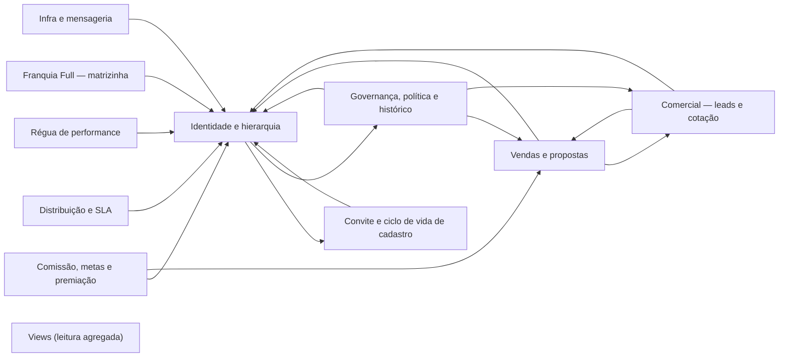
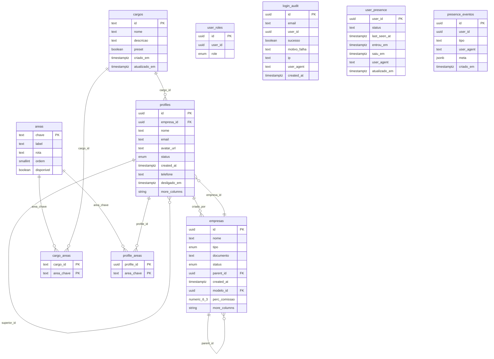
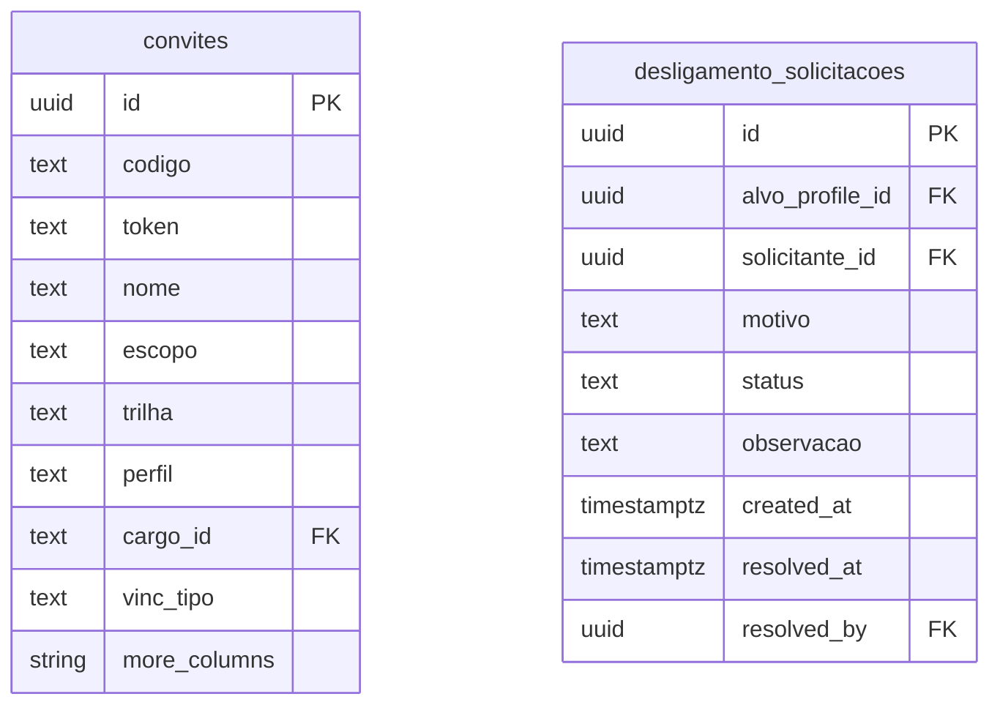
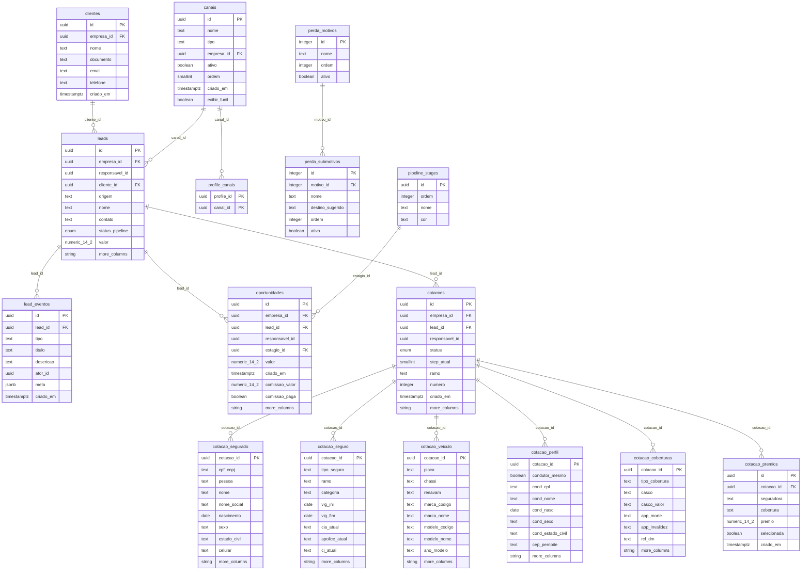
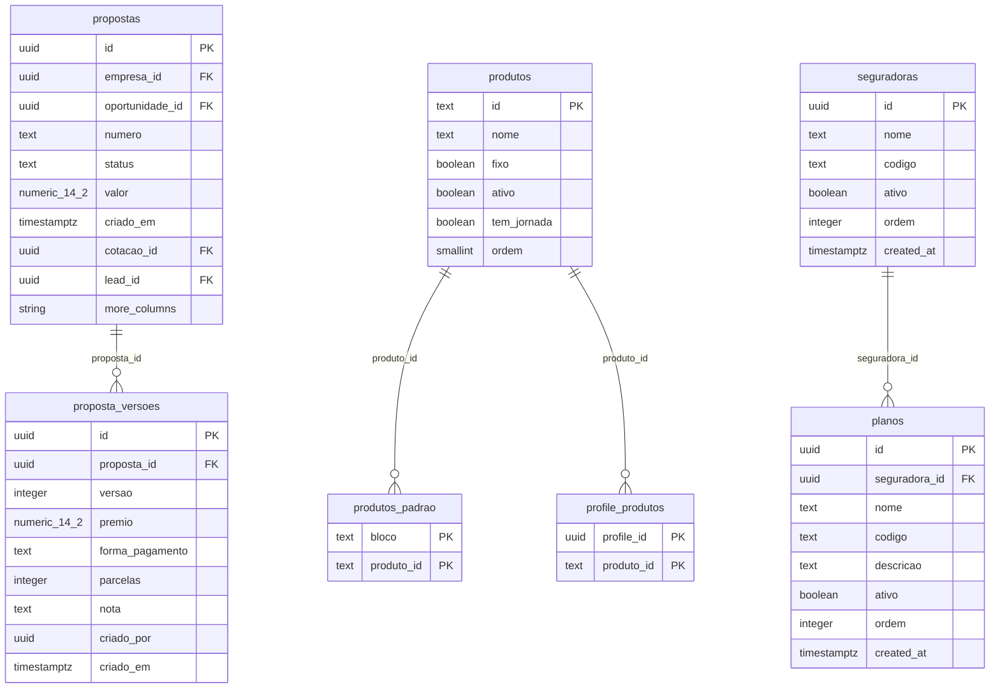
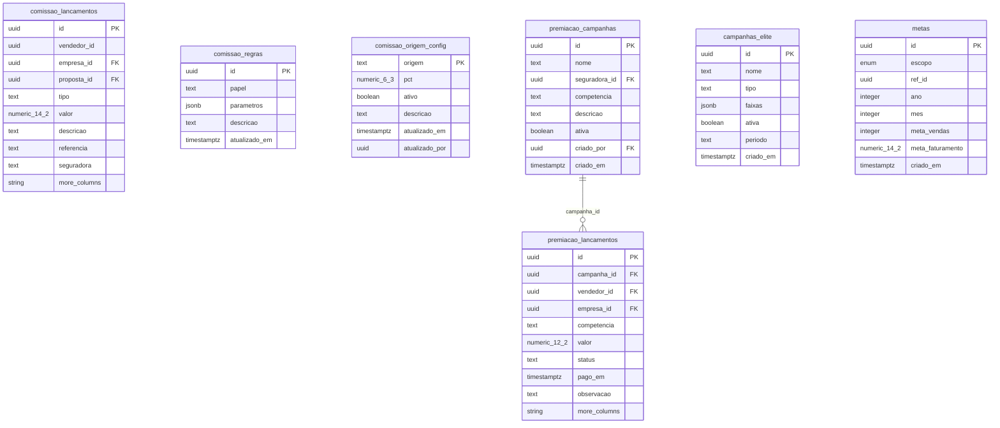
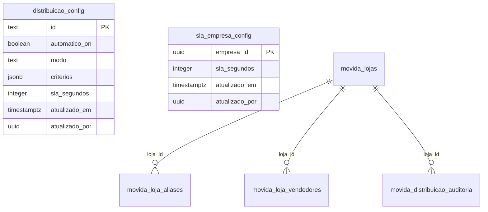
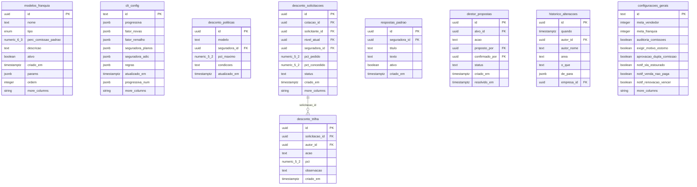
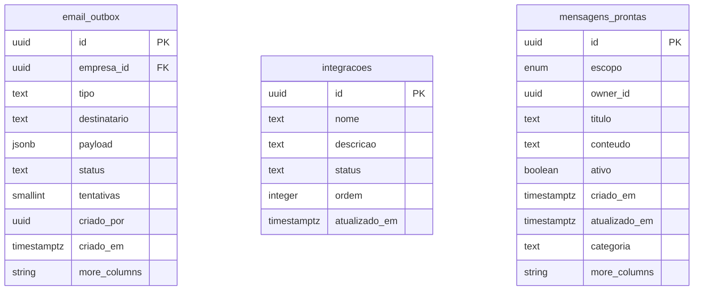
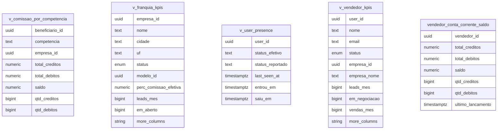

# Documentação do Banco — CoteCerto V11

> Snapshot original gerado por introspecção direta do Postgres local em
> 04/08/2026. Atualizado em 14/08/2026 contra as **152 migrations versionadas**
> do checkout, `database.types.ts` e testes DB. O reset local contém exatamente
> as mesmas 152 versões. Isto documenta o schema versionado, não comprova
> aplicação nem configuração em produção.

**Resumo:** 66 tabelas · 5 views · 121 policies RLS · 157 funções (RPCs e funções internas) · 8 enums · 3 jobs `pg_cron`.

## Sumário

- [Como ler este documento](#como-ler-este-documento)
- [Visão geral dos domínios](#visão-geral-dos-domínios)
- [Enums](#enums)
- [Identidade e hierarquia](#identidade-e-hierarquia)
- [Convite e ciclo de vida de cadastro](#convite-e-ciclo-de-vida-de-cadastro)
- [Comercial — leads e cotação](#comercial-leads-e-cotação)
- [Vendas e propostas](#vendas-e-propostas)
- [Comissão, metas e premiação](#comissão-metas-e-premiação)
- [Distribuição e SLA](#distribuição-e-sla)
- [Régua de performance](#régua-de-performance)
- [Franquia Full — matrizinha](#franquia-full-matrizinha)
- [Governança, política e histórico](#governança-política-e-histórico)
- [Infra e mensageria](#infra-e-mensageria)
- [Views (leitura agregada)](#views-leitura-agregada)
- [Funções e RPCs por domínio](#funções-e-rpcs-por-domínio)
- [Jobs periódicos (pg_cron)](#jobs-periódicos-pg_cron)
- [Convenções de RLS](#convenções-de-rls)

## Como ler este documento

- Cada domínio tem um diagrama **ER (mermaid)** com as tabelas do domínio e as
  relações internas a ele — relações que cruzam domínios aparecem na tabela de
  referência (coluna FK), não nos diagramas, pra cada diagrama ficar legível.
- `PK` = chave primária, `FK` = chave estrangeira (a tabela de referência abaixo do
  diagrama traz a coluna e a tabela referenciada de cada FK, mesmo as que cruzam
  domínio).
- RLS (`Row Level Security`) está ativo em praticamente todas as tabelas de negócio.
  Cada tabela lista se RLS está `enabled` e o resumo de cada policy — a leitura
  completa (`qual`) fica truncada quando muito longa; para o texto exato, ver a
  migration original em `supabase/migrations/`.
- Escrita em tabelas sensíveis (governança, régua, comissão) normalmente é **negada
  por policy** e só acontece via RPC (`security definer`) — isso aparece na coluna
  de comentário da tabela e na lista de funções.
- Evidência versionada das atualizações de 06–13/08: migrations
  `20260806025742`–`20260814000000`, tipos gerados e testes DB
  `franquia-full-v11-5c.test.ts`, `emails-acesso-v11.test.ts`,
  `gotrue-criar-senha.test.ts`, `ingerir-lead-externo.test.ts` e
  `distribuicao-permite-area-mdist.test.ts` e `distribuicao-movida.test.ts`.
  Isto não afirma execução em produção.

## Visão geral dos domínios

| Domínio | Tabelas | Descrição |
| --- | --- | --- |
| Identidade e hierarquia | 10 | Quem é quem: perfis, cargos, áreas de escopo, empresas (Matriz/Master/franquias) e trilhas de acesso. |
| Convite e ciclo de vida de cadastro | 3 | Entrada, emissão/reenvio de acesso e desligamento. |
| Comercial — leads e cotação | 16 | Captação, taxonomia de canais e o wizard de cotação (uma tabela por etapa). |
| Vendas e propostas | 7 | Da cotação até a apólice emitida: propostas, versões, catálogo de produtos/seguradoras. |
| Comissão, metas e premiação | 7 | Fechamento financeiro: comissão por competência, metas, campanhas e premiações. |
| Distribuição e SLA | 2 | Regras de atribuição automática de leads e prazo de atendimento, com override por empresa. |
| Régua de performance | 1 | Classificação Ativo/Atenção/Travado por bloco (interno/rede/full), calculada por job periódico. |
| Franquia Full — matrizinha | 4 | Personalização, integridade Full→Master e gestão direta do próprio time. |
| Governança, política e histórico | 9 | Tudo que exige senha de diretor pra alterar, e o registro append-only de quem alterou o quê. |
| Infra e mensageria | 3 | Outbox de e-mail, integrações externas e biblioteca de mensagens prontas. |
| Views (leitura agregada) | 5 | Views só de leitura, usadas por telas de relatório/KPI — não têm RLS própria nem PK; a segurança vem das policies das tabelas-base que elas consultam (`security_invoker` quando aplicável). |

## Enums

| Enum | Valores |
| --- | --- |
| `cotacao_status` | `rascunho`, `calculada`, `proposta`, `aceita`, `perdida`, `enviada_quiver`, `erro_quiver` |
| `empresa_status` | `pendente`, `aprovada`, `recusada`, `suspensa` |
| `empresa_tipo` | `pj`, `pf`, `matriz` |
| `lead_status` | `novo`, `contato`, `qualificado`, `cotacao`, `proposta`, `negociacao`, `ganho`, `perdido`, `tarefa_hoje`, `qualificando`, `cotando`, `proposta_enviada`, `em_negociacao`, `fechado` |
| `meta_escopo` | `empresa`, `usuario` |
| `modelo_tipo` | `franqueada`, `clt` |
| `msg_escopo` | `global`, `pessoal` |
| `perfil` | `matriz`, `master`, `vendedor`, `franqueado`, `supervisor`, `coordenador`, `interno` |

## Identidade e hierarquia

Quem é quem: perfis, cargos, áreas de escopo, empresas (Matriz/Master/franquias) e trilhas de acesso.

### `profiles`

**RLS:** ✅ enabled  ·  **PK:** `id`

| Coluna | Tipo | Nulo? | Default | FK |
| --- | --- | --- | --- | --- |
| `id` | uuid | **não** |  |  |
| `empresa_id` | uuid | sim |  | → `empresas.id` (set null) |
| `nome` | text | **não** | `''::text` |  |
| `email` | text | **não** | `''::text` |  |
| `avatar_url` | text | sim |  |  |
| `status` | enum | **não** | `'pendente'::empresa_status` |  |
| `created_at` | timestamptz | **não** | `now()` |  |
| `telefone` | text | sim |  |  |
| `desligado_em` | timestamptz | sim |  |  |
| `desligado_motivo` | text | sim |  |  |
| `aprovada_em` | timestamptz | sim |  |  |
| `superior_id` | uuid | sim |  | → `profiles.id` (set null) |
| `leads_dia` | integer | sim |  |  |
| `salario_base` | numeric(12,2) | sim |  |  |
| `bonus_campanha` | numeric(12,2) | sim |  |  |
| `dia_pagamento` | integer | sim |  |  |
| `faixa_elite_valor` | numeric(12,2) | sim |  |  |
| `faixa_elite_pct` | numeric(5,2) | sim |  |  |
| `comissao_modelo` | numeric(5,2) | sim |  |  |
| `royalties` | numeric(12,2) | sim |  |  |
| `equipe` | text | sim |  |  |
| `cargo_id` | text | sim |  | → `cargos.id` (set null) |
| `diretor` | boolean | **não** | `false` |  |
| `cpf` | text | sim |  |  |
| `sobrenome` | text | sim |  |  |
| `data_nascimento` | date | sim |  |  |
| `sexo` | text | sim |  |  |
| `funcao` | text | sim |  |  |
| `estado_civil` | text | sim |  |  |
| `telefone_residencial` | text | sim |  |  |
| `telefone_comercial` | text | sim |  |  |
| `email_pessoal` | text | sim |  |  |
| `dias_acesso` | ARRAY | sim |  |  |
| `hora_inicio` | time without time zone | sim |  |  |
| `hora_fim` | time without time zone | sim |  |  |
| `periodo_inicio` | date | sim |  |  |
| `periodo_fim` | date | sim |  |  |
| `performance_status` | text | sim |  |  |
| `performance_motivo` | jsonb | sim |  |  |
| `performance_calculado_em` | timestamptz | sim |  |  |
| `performance_revisado_em` | timestamptz | sim |  |  |
| `performance_revisado_por` | uuid | sim |  | → `profiles.id` (no action) |
| `performance_revisao_motivo` | text | sim |  |  |

**Checks:**
- `profiles_avatar_url_tamanho`: `CHECK ((char_length(avatar_url) <= 2000))`
- `profiles_bonus_campanha_nao_neg`: `CHECK (((bonus_campanha IS NULL) OR (bonus_campanha >= (0)::numeric)))`
- `profiles_comissao_modelo_faixa`: `CHECK (((comissao_modelo IS NULL) OR ((comissao_modelo >= (0)::numeric) AND (comissao_modelo <= (100)::numeric))))`
- `profiles_cpf_check`: `CHECK ((char_length(cpf) <= 20))`
- `profiles_desligado_motivo_tamanho`: `CHECK ((char_length(desligado_motivo) <= 2000))`
- `profiles_desligamento_motivo_obrigatorio`: `CHECK (((status <> 'suspensa'::empresa_status) OR (desligado_motivo IS NOT NULL)))`
- `profiles_dia_pagamento_faixa`: `CHECK (((dia_pagamento IS NULL) OR ((dia_pagamento >= 1) AND (dia_pagamento <= 31))))`
- `profiles_dias_acesso_check`: `CHECK (((dias_acesso IS NULL) OR (dias_acesso <@ ARRAY['Seg'::text, 'Ter'::text, 'Qua'::text, 'Qui'::text, 'Sex'::text, 'Sáb'::text, 'Dom'::text])))`
- `profiles_email_formato`: `CHECK (((email IS NULL) OR (email = ''::text) OR (email ~* '^[^@[:space:]]+@[^@[:space:]]+\.[^@[:space:]]+$'::text)))`
- `profiles_email_pessoal_check`: `CHECK ((char_length(email_pessoal) <= 254))`
- `profiles_email_tamanho`: `CHECK ((char_length(email) <= 254))`
- `profiles_equipe_tam`: `CHECK (((equipe IS NULL) OR (char_length(equipe) <= 120)))`
- `profiles_estado_civil_check`: `CHECK (((estado_civil IS NULL) OR (estado_civil = ANY (ARRAY['Casado(a)'::text, 'Solteiro(a)'::text, 'Viúvo(a)'::text, 'Divorciado(a)'::text, 'União estável'::text]))))`
- `profiles_faixa_elite_pct_faixa`: `CHECK (((faixa_elite_pct IS NULL) OR ((faixa_elite_pct >= (0)::numeric) AND (faixa_elite_pct <= (100)::numeric))))`
- `profiles_faixa_elite_valor_nao_neg`: `CHECK (((faixa_elite_valor IS NULL) OR (faixa_elite_valor >= (0)::numeric)))`
- `profiles_funcao_check`: `CHECK ((char_length(funcao) <= 120))`
- `profiles_leads_dia_nao_neg`: `CHECK (((leads_dia IS NULL) OR (leads_dia >= 0)))`
- `profiles_nome_tamanho`: `CHECK ((char_length(nome) <= 150))`
- `profiles_performance_revisao_motivo_tamanho`: `CHECK ((char_length(performance_revisao_motivo) <= 2000))`
- `profiles_performance_status_check`: `CHECK ((performance_status = ANY (ARRAY['ativo'::text, 'atencao'::text, 'travado'::text])))`
- `profiles_royalties_nao_neg`: `CHECK (((royalties IS NULL) OR (royalties >= (0)::numeric)))`
- `profiles_salario_base_nao_neg`: `CHECK (((salario_base IS NULL) OR (salario_base >= (0)::numeric)))`
- `profiles_sexo_check`: `CHECK (((sexo IS NULL) OR (sexo = ANY (ARRAY['Masculino'::text, 'Feminino'::text]))))`
- `profiles_sobrenome_check`: `CHECK ((char_length(sobrenome) <= 120))`
- `profiles_superior_id_nao_self`: `CHECK ((superior_id IS DISTINCT FROM id))`
- `profiles_telefone_comercial_check`: `CHECK ((char_length(telefone_comercial) <= 30))`
- `profiles_telefone_residencial_check`: `CHECK ((char_length(telefone_residencial) <= 30))`

**Triggers:**
- `trg_bloquear_autoedicao_dados_matriz` (BEFORE UPDATE): `EXECUTE FUNCTION fn_bloquear_autoedicao_dados_matriz()`
- `trg_bloquear_escrita_direta_performance` (BEFORE UPDATE): `EXECUTE FUNCTION fn_bloquear_escrita_direta_performance()`
- `trg_minimo_dois_diretores` (BEFORE UPDATE): `EXECUTE FUNCTION fn_minimo_dois_diretores()`
- `trg_minimo_dois_diretores` (BEFORE DELETE): `EXECUTE FUNCTION fn_minimo_dois_diretores()`

**Policies RLS:**
| Nome | Comando | Roles | Condição (qual) | Com verificação (with check) |
| --- | --- | --- | --- | --- |
| `profiles insert self` | INSERT | {authenticated} |  | (id = auth.uid()) |
| `profiles select self or rede` | SELECT | {authenticated} | ((id = auth.uid()) OR has_role(auth.uid(), 'matriz'::perfil) OR (empresa_id IN ( SELECT empresas_visiveis.empresa_id FROM empresas_visiveis(auth.uid())… |  |
| `profiles update self` | UPDATE | {authenticated} | ((id = auth.uid()) OR has_role(auth.uid(), 'matriz'::perfil)) | ((id = auth.uid()) OR has_role(auth.uid(), 'matriz'::perfil)) |
| `profiles_matriz_admin` | ALL | {authenticated} | has_role(auth.uid(), 'matriz'::perfil) | has_role(auth.uid(), 'matriz'::perfil) |
| `profiles_select` | SELECT | {authenticated} | ((id = auth.uid()) OR has_role(auth.uid(), 'matriz'::perfil) OR (has_role(auth.uid(), 'master'::perfil) AND (empresa_id IN ( SELECT… |  |
| `profiles_update_self` | UPDATE | {authenticated} | ((id = auth.uid()) OR has_role(auth.uid(), 'matriz'::perfil)) | ((id = auth.uid()) OR has_role(auth.uid(), 'matriz'::perfil)) |

### `empresas`

**RLS:** ✅ enabled  ·  **PK:** `id`

| Coluna | Tipo | Nulo? | Default | FK |
| --- | --- | --- | --- | --- |
| `id` | uuid | **não** | `gen_random_uuid()` |  |
| `nome` | text | **não** |  |  |
| `tipo` | enum | **não** |  |  |
| `documento` | text | **não** |  |  |
| `status` | enum | **não** | `'pendente'::empresa_status` |  |
| `parent_id` | uuid | sim |  | → `empresas.id` (set null) |
| `created_at` | timestamptz | **não** | `now()` |  |
| `modelo_id` | uuid | sim |  | → `modelos_franquia.id` (no action) |
| `perc_comissao` | numeric(6,3) | sim |  |  |
| `cidade` | text | sim |  |  |
| `uf` | text | sim |  |  |
| `email` | text | sim |  |  |
| `telefone` | text | sim |  |  |
| `aprovada_em` | timestamptz | sim |  |  |
| `recusada_em` | timestamptz | sim |  |  |
| `recusa_motivo` | text | sim |  |  |
| `endereco` | text | sim |  |  |
| `celular` | text | sim |  |  |
| `telefone_recado` | text | sim |  |  |
| `data_nascimento` | date | sim |  |  |
| `socio_nome` | text | sim |  |  |
| `socio_cpf` | text | sim |  |  |
| `socio_rg` | text | sim |  |  |
| `contato_emergencia` | text | sim |  |  |
| `pix_chave` | text | sim |  |  |
| `dados_bancarios` | text | sim |  |  |
| `rg` | text | sim |  |  |
| `dados_cadastro` | jsonb | **não** | `'{}'::jsonb` |  |
| `isenta` | boolean | sim |  |  |
| `leads_dia` | integer | sim |  |  |
| `perc_equipe` | numeric(5,2) | sim |  |  |
| `royalties_fpp` | numeric(12,2) | sim |  |  |
| `dia_pagamento` | integer | sim |  |  |
| `bonus_campanha` | numeric(12,2) | sim |  |  |
| `faixa_elite_valor` | numeric(12,2) | sim |  |  |
| `faixa_elite_pct` | numeric(5,2) | sim |  |  |
| `convite_id` | uuid | sim |  | → `convites.id` (set null) |
| `reclassificado_em` | timestamptz | sim |  |  |
| `reclassificacao_motivo` | text | sim |  |  |
| `pendencia_motivo` | text | sim |  |  |
| `pendencia_em` | timestamptz | sim |  |  |
| `criado_por` | uuid | sim |  | → `profiles.id` (set null) |

**Checks:**
- `empresas_bonus_campanha_nao_neg`: `CHECK (((bonus_campanha IS NULL) OR (bonus_campanha >= (0)::numeric)))`
- `empresas_celular_formato`: `CHECK (((celular IS NULL) OR (celular = ''::text) OR ((char_length(celular) >= 10) AND (char_length(celular) <= 11))))`
- `empresas_celular_tamanho`: `CHECK ((char_length(celular) <= 20))`
- `empresas_cidade_tamanho`: `CHECK ((char_length(cidade) <= 150))`
- `empresas_contato_emergencia_tamanho`: `CHECK ((char_length(contato_emergencia) <= 2000))`
- `empresas_dados_bancarios_tamanho`: `CHECK ((char_length(dados_bancarios) <= 2000))`
- `empresas_dados_cadastro_object`: `CHECK ((jsonb_typeof(dados_cadastro) = 'object'::text))`
- `empresas_dia_pagamento_faixa`: `CHECK (((dia_pagamento IS NULL) OR ((dia_pagamento >= 1) AND (dia_pagamento <= 31))))`
- `empresas_documento_formato`: `CHECK (((documento IS NULL) OR (documento = ''::text) OR (char_length(documento) = ANY (ARRAY[11, 14]))))`
- `empresas_documento_tamanho`: `CHECK ((char_length(documento) <= 20))`
- `empresas_email_formato`: `CHECK (((email IS NULL) OR (email = ''::text) OR (email ~* '^[^@[:space:]]+@[^@[:space:]]+\.[^@[:space:]]+$'::text)))`
- `empresas_email_tamanho`: `CHECK ((char_length(email) <= 254))`
- `empresas_endereco_tamanho`: `CHECK ((char_length(endereco) <= 2000))`
- `empresas_faixa_elite_pct_faixa`: `CHECK (((faixa_elite_pct IS NULL) OR ((faixa_elite_pct >= (0)::numeric) AND (faixa_elite_pct <= (100)::numeric))))`
- `empresas_faixa_elite_valor_nao_neg`: `CHECK (((faixa_elite_valor IS NULL) OR (faixa_elite_valor >= (0)::numeric)))`
- `empresas_leads_dia_nao_neg`: `CHECK (((leads_dia IS NULL) OR (leads_dia >= 0)))`
- `empresas_nome_tamanho`: `CHECK ((char_length(nome) <= 150))`
- `empresas_pendencia_motivo_check`: `CHECK (((pendencia_motivo IS NULL) OR ((char_length(TRIM(BOTH FROM pendencia_motivo)) >= 3) AND (char_length(TRIM(BOTH FROM pendencia_motivo)) <= 1000))))`
- `empresas_perc_comissao_faixa`: `CHECK (((perc_comissao >= (0)::numeric) AND (perc_comissao <= (100)::numeric)))`
- `empresas_perc_equipe_faixa`: `CHECK (((perc_equipe IS NULL) OR ((perc_equipe >= (0)::numeric) AND (perc_equipe <= (100)::numeric))))`
- `empresas_pix_chave_tamanho`: `CHECK ((char_length(pix_chave) <= 150))`
- `empresas_reclassificacao_motivo_check`: `CHECK (((reclassificacao_motivo IS NULL) OR ((char_length(reclassificacao_motivo) >= 3) AND (char_length(reclassificacao_motivo) <= 400))))`
- `empresas_recusa_motivo_tamanho`: `CHECK ((char_length(recusa_motivo) <= 2000))`
- `empresas_rg_tamanho`: `CHECK ((char_length(rg) <= 20))`
- `empresas_royalties_fpp_nao_neg`: `CHECK (((royalties_fpp IS NULL) OR (royalties_fpp >= (0)::numeric)))`
- `empresas_socio_cpf_formato`: `CHECK (((socio_cpf IS NULL) OR (socio_cpf = ''::text) OR (char_length(socio_cpf) = 11)))`
- `empresas_socio_cpf_tamanho`: `CHECK ((char_length(socio_cpf) <= 14))`
- `empresas_socio_nome_tamanho`: `CHECK ((char_length(socio_nome) <= 150))`
- `empresas_socio_rg_tamanho`: `CHECK ((char_length(socio_rg) <= 20))`
- `empresas_telefone_formato`: `CHECK (((telefone IS NULL) OR (telefone = ''::text) OR ((char_length(telefone) >= 10) AND (char_length(telefone) <= 11))))`
- `empresas_telefone_recado_formato`: `CHECK (((telefone_recado IS NULL) OR (telefone_recado = ''::text) OR ((char_length(telefone_recado) >= 10) AND (char_length(telefone_recado) <= 11))))`
- `empresas_telefone_recado_tamanho`: `CHECK ((char_length(telefone_recado) <= 20))`
- `empresas_telefone_tamanho`: `CHECK ((char_length(telefone) <= 20))`
- `empresas_uf_tamanho`: `CHECK ((char_length(uf) <= 2))`

**Triggers:**
- `trg_normalizar_documentos_empresas` (BEFORE UPDATE): `EXECUTE FUNCTION normalizar_documentos_empresas()`
- `trg_normalizar_documentos_empresas` (BEFORE INSERT): `EXECUTE FUNCTION normalizar_documentos_empresas()`

**Policies RLS:**
| Nome | Comando | Roles | Condição (qual) | Com verificação (with check) |
| --- | --- | --- | --- | --- |
| `empresas update matriz` | UPDATE | {authenticated} | (has_role(auth.uid(), 'matriz'::perfil) AND (NOT ((status = 'pendente'::empresa_status) AND (fn_destino_pedido(id) = 'franquia'::text)))) |  |
| `empresas_admin` | ALL | {authenticated} | (has_role(auth.uid(), 'matriz'::perfil) AND (NOT ((status = 'pendente'::empresa_status) AND (fn_destino_pedido(id) = 'franquia'::text)))) | (has_role(auth.uid(), 'matriz'::perfil) AND (NOT ((status = 'pendente'::empresa_status) AND (fn_destino_pedido(id) = 'franquia'::text)))) |
| `empresas_fila_da_franquia` | SELECT | {authenticated} | ((status = 'pendente'::empresa_status) AND (fn_destino_pedido(id) = 'franquia'::text) AND fn_pode_aprovar_pedido(auth.uid(), id)) |  |
| `empresas_fila_da_franquia_update` | UPDATE | {authenticated} | ((status = 'pendente'::empresa_status) AND (fn_destino_pedido(id) = 'franquia'::text) AND fn_pode_aprovar_pedido(auth.uid(), id)) |  |
| `empresas_select` | SELECT | {authenticated} | ((has_role(auth.uid(), 'matriz'::perfil) OR (id IN ( SELECT empresas_visiveis(auth.uid()) AS empresas_visiveis))) AND (NOT ((status =… |  |

### `cargos`

> H3: cargos do time interno da Matriz. Os 7 do protótipo V11 nascem com
>    preset=true; a tela Configuracoes > Cargos cria/duplica os demais (preset=false).
>    Vendedor Matriz (Modelo CLT) NÃO é cargo — é opção à parte de convite/cadastro.

**RLS:** ✅ enabled  ·  **PK:** `id`

| Coluna | Tipo | Nulo? | Default | FK |
| --- | --- | --- | --- | --- |
| `id` | text | **não** |  |  |
| `nome` | text | **não** |  |  |
| `descricao` | text | sim |  |  |
| `preset` | boolean | **não** | `false` |  |
| `criado_em` | timestamptz | **não** | `now()` |  |
| `atualizado_em` | timestamptz | **não** | `now()` |  |

**Checks:**
- `cargos_descricao_check`: `CHECK (((descricao IS NULL) OR (char_length(descricao) <= 300)))`
- `cargos_id_check`: `CHECK (((char_length(id) >= 2) AND (char_length(id) <= 40)))`
- `cargos_nome_check`: `CHECK (((char_length(nome) >= 2) AND (char_length(nome) <= 60)))`

**Policies RLS:**
| Nome | Comando | Roles | Condição (qual) | Com verificação (with check) |
| --- | --- | --- | --- | --- |
| `cargos_escrita_matriz` | ALL | {authenticated} | (has_role(auth.uid(), 'matriz'::perfil) OR has_role(auth.uid(), 'coordenador'::perfil)) | (has_role(auth.uid(), 'matriz'::perfil) OR has_role(auth.uid(), 'coordenador'::perfil)) |
| `cargos_select_autenticado` | SELECT | {authenticated} | true |  |

### `areas`

> H2: catálogo de áreas do sistema (unidade de recorte de menu/escopo do time
>    interno). Chaves iguais ao protótipo V11 (MATRIZ_AREAS). disponivel=false são
>    as áreas "em breve" (Marketing/Financeiro/Compras/Facilities) — existem para
>    um cargo poder referenciá-las antes de a tela existir.

**RLS:** ✅ enabled  ·  **PK:** `chave`

| Coluna | Tipo | Nulo? | Default | FK |
| --- | --- | --- | --- | --- |
| `chave` | text | **não** |  |  |
| `label` | text | **não** |  |  |
| `rota` | text | sim |  |  |
| `ordem` | smallint | **não** |  |  |
| `disponivel` | boolean | **não** | `true` |  |

**Checks:**
- `areas_chave_check`: `CHECK (((char_length(chave) >= 2) AND (char_length(chave) <= 40)))`
- `areas_label_check`: `CHECK (((char_length(label) >= 2) AND (char_length(label) <= 60)))`
- `areas_ordem_check`: `CHECK ((ordem >= 0))`
- `areas_rota_check`: `CHECK (((rota IS NULL) OR (char_length(rota) <= 120)))`

**Policies RLS:**
| Nome | Comando | Roles | Condição (qual) | Com verificação (with check) |
| --- | --- | --- | --- | --- |
| `areas_select_autenticado` | SELECT | {authenticated} | true |  |

### `cargo_areas`

> H3: áreas que compõem o preset de um cargo. É ponto de partida — o escopo
>    efetivo da pessoa pode ser sobrescrito em profile_areas (H4).

**RLS:** ✅ enabled  ·  **PK:** `cargo_id`, `area_chave`

| Coluna | Tipo | Nulo? | Default | FK |
| --- | --- | --- | --- | --- |
| `cargo_id` | text | **não** |  | → `cargos.id` (cascade) |
| `area_chave` | text | **não** |  | → `areas.chave` (cascade) |

**Policies RLS:**
| Nome | Comando | Roles | Condição (qual) | Com verificação (with check) |
| --- | --- | --- | --- | --- |
| `cargo_areas_escrita_matriz` | ALL | {authenticated} | (has_role(auth.uid(), 'matriz'::perfil) OR has_role(auth.uid(), 'coordenador'::perfil)) | (has_role(auth.uid(), 'matriz'::perfil) OR has_role(auth.uid(), 'coordenador'::perfil)) |
| `cargo_areas_select_autenticado` | SELECT | {authenticated} | true |  |

### `profile_areas`

> H4: escopo próprio da pessoa, definido na aprovação ("cargo + áreas
>    ajustáveis"). Presença de QUALQUER linha aqui substitui o preset do cargo
>    por completo — não é união. Ausência total = usa o preset.

**RLS:** ✅ enabled  ·  **PK:** `profile_id`, `area_chave`

| Coluna | Tipo | Nulo? | Default | FK |
| --- | --- | --- | --- | --- |
| `profile_id` | uuid | **não** |  | → `profiles.id` (cascade) |
| `area_chave` | text | **não** |  | → `areas.chave` (cascade) |

**Policies RLS:**
| Nome | Comando | Roles | Condição (qual) | Com verificação (with check) |
| --- | --- | --- | --- | --- |
| `profile_areas_escrita_matriz` | ALL | {authenticated} | (has_role(auth.uid(), 'matriz'::perfil) OR has_role(auth.uid(), 'coordenador'::perfil)) | (has_role(auth.uid(), 'matriz'::perfil) OR has_role(auth.uid(), 'coordenador'::perfil)) |
| `profile_areas_select_proprio_ou_gestor` | SELECT | {authenticated} | ((profile_id = auth.uid()) OR has_role(auth.uid(), 'matriz'::perfil) OR has_role(auth.uid(), 'coordenador'::perfil)) |  |

### `user_roles`

**RLS:** ✅ enabled  ·  **PK:** `id`

| Coluna | Tipo | Nulo? | Default | FK |
| --- | --- | --- | --- | --- |
| `id` | uuid | **não** | `gen_random_uuid()` |  |
| `user_id` | uuid | **não** |  |  |
| `role` | enum | **não** |  |  |

**Policies RLS:**
| Nome | Comando | Roles | Condição (qual) | Com verificação (with check) |
| --- | --- | --- | --- | --- |
| `user_roles select self or rede` | SELECT | {authenticated} | ((user_id = auth.uid()) OR has_role(auth.uid(), 'matriz'::perfil) OR (EXISTS ( SELECT 1 FROM profiles p WHERE ((p.id = user_roles.user_id) AND (p.empresa_id… |  |
| `user_roles_matriz_admin` | ALL | {authenticated} | has_role(auth.uid(), 'matriz'::perfil) | has_role(auth.uid(), 'matriz'::perfil) |

### `login_audit`

**RLS:** ✅ enabled  ·  **PK:** `id`

| Coluna | Tipo | Nulo? | Default | FK |
| --- | --- | --- | --- | --- |
| `id` | uuid | **não** | `gen_random_uuid()` |  |
| `email` | text | **não** |  |  |
| `user_id` | uuid | sim |  |  |
| `sucesso` | boolean | **não** |  |  |
| `motivo_falha` | text | sim |  |  |
| `ip` | text | sim |  |  |
| `user_agent` | text | sim |  |  |
| `created_at` | timestamptz | **não** | `now()` |  |

**Checks:**
- `login_audit_email_tamanho`: `CHECK ((char_length(email) <= 254))`
- `login_audit_ip_tamanho`: `CHECK ((char_length(ip) <= 45))`
- `login_audit_motivo_falha_tamanho`: `CHECK ((char_length(motivo_falha) <= 500))`
- `login_audit_user_agent_tamanho`: `CHECK ((char_length(user_agent) <= 500))`

**Policies RLS:**
| Nome | Comando | Roles | Condição (qual) | Com verificação (with check) |
| --- | --- | --- | --- | --- |
| `login_audit_select_matriz` | SELECT | {authenticated} | (has_role(auth.uid(), 'matriz'::perfil) OR (has_role(auth.uid(), 'master'::perfil) AND (EXISTS ( SELECT 1 FROM profiles p WHERE ((p.id = login_audit.user_id)… |  |

### `user_presence`

**RLS:** ✅ enabled  ·  **PK:** `user_id`

| Coluna | Tipo | Nulo? | Default | FK |
| --- | --- | --- | --- | --- |
| `user_id` | uuid | **não** |  |  |
| `status` | text | **não** | `'offline'::text` |  |
| `last_seen_at` | timestamptz | **não** | `now()` |  |
| `entrou_em` | timestamptz | sim |  |  |
| `saiu_em` | timestamptz | sim |  |  |
| `user_agent` | text | sim |  |  |
| `atualizado_em` | timestamptz | **não** | `now()` |  |

**Checks:**
- `user_presence_status_check`: `CHECK ((status = ANY (ARRAY['online'::text, 'ausente'::text, 'offline'::text])))`
- `user_presence_user_agent_tamanho`: `CHECK ((char_length(user_agent) <= 500))`

**Policies RLS:**
| Nome | Comando | Roles | Condição (qual) | Com verificação (with check) |
| --- | --- | --- | --- | --- |
| `presence read self or rede` | SELECT | {authenticated} | ((user_id = auth.uid()) OR has_role(auth.uid(), 'matriz'::perfil) OR (EXISTS ( SELECT 1 FROM profiles p WHERE ((p.id = user_presence.user_id) AND… |  |
| `presence write own` | ALL | {authenticated} | (user_id = auth.uid()) | (user_id = auth.uid()) |

### `presence_eventos`

**RLS:** ✅ enabled  ·  **PK:** `id`

| Coluna | Tipo | Nulo? | Default | FK |
| --- | --- | --- | --- | --- |
| `id` | uuid | **não** | `gen_random_uuid()` |  |
| `user_id` | uuid | **não** |  |  |
| `tipo` | text | **não** |  |  |
| `user_agent` | text | sim |  |  |
| `meta` | jsonb | sim |  |  |
| `criado_em` | timestamptz | **não** | `now()` |  |

**Checks:**
- `presence_eventos_meta_object`: `CHECK (((meta IS NULL) OR (jsonb_typeof(meta) = 'object'::text)))`
- `presence_eventos_tipo_check`: `CHECK ((tipo = ANY (ARRAY['entrou'::text, 'saiu'::text, 'ausente'::text, 'retornou'::text])))`
- `presence_eventos_user_agent_tamanho`: `CHECK ((char_length(user_agent) <= 500))`

**Policies RLS:**
| Nome | Comando | Roles | Condição (qual) | Com verificação (with check) |
| --- | --- | --- | --- | --- |
| `presence ev insert own` | INSERT | {authenticated} |  | (user_id = auth.uid()) |
| `presence ev read all` | SELECT | {authenticated} | true |  |

## Convite e ciclo de vida de cadastro

Como uma pessoa entra no sistema (convite, cadastro manual) e como sai (desligamento).

### `convites`

> V11 C1: Convite Supper — link nominal de uso único que carrega perfil e vínculo.
>    `codigo` é o rótulo humano (SC-XXXXXX); `token` é o segredo que vai na URL.
>    O payload (trilha/perfil/cargo_id/vinc_*) classifica o pedido antes da
>    aprovação e é o que roteia a fila na Frente 2.

**RLS:** ✅ enabled  ·  **PK:** `id`

| Coluna | Tipo | Nulo? | Default | FK |
| --- | --- | --- | --- | --- |
| `id` | uuid | **não** | `gen_random_uuid()` |  |
| `codigo` | text | **não** |  |  |
| `token` | text | **não** |  |  |
| `nome` | text | **não** |  |  |
| `escopo` | text | **não** |  |  |
| `trilha` | text | **não** |  |  |
| `perfil` | text | sim |  |  |
| `cargo_id` | text | sim |  | → `cargos.id` (restrict) |
| `vinc_tipo` | text | **não** |  |  |
| `vinc_empresa_id` | uuid | sim |  | → `empresas.id` (cascade) |
| `expira_em` | timestamptz | **não** |  |  |
| `usado_em` | timestamptz | sim |  |  |
| `usado_por` | uuid | sim |  | → `profiles.id` (set null) |
| `criado_por` | uuid | **não** |  | → `profiles.id` (cascade) |
| `criado_em` | timestamptz | **não** | `now()` |  |

**Checks:**
- `convites_codigo_check`: `CHECK ((codigo ~ '^SC-[0-9A-Z]{6}$'::text))`
- `convites_escopo_check`: `CHECK ((escopo = ANY (ARRAY['interno'::text, 'externo'::text, 'master'::text, 'full'::text])))`
- `convites_externo_coerente`: `CHECK (((trilha <> 'externo'::text) OR ((perfil IS NOT NULL) AND (cargo_id IS NULL))))`
- `convites_interno_coerente`: `CHECK (((trilha <> 'interno'::text) OR ((cargo_id IS NOT NULL) AND (perfil IS NULL)) OR ((cargo_id IS NULL) AND (perfil = 'vendedor'::text))))`
- `convites_nome_check`: `CHECK (((char_length(nome) >= 2) AND (char_length(nome) <= 120)))`
- `convites_perfil_check`: `CHECK ((perfil = ANY (ARRAY['master'::text, 'franquia_full'::text, 'franquia_indiv'::text, 'vendedor'::text])))`
- `convites_token_check`: `CHECK (((char_length(token) >= 32) AND (char_length(token) <= 128)))`
- `convites_trilha_check`: `CHECK ((trilha = ANY (ARRAY['interno'::text, 'externo'::text])))`
- `convites_vinc_tipo_check`: `CHECK ((vinc_tipo = ANY (ARRAY['matriz'::text, 'master'::text, 'full'::text])))`
- `convites_vinculo_coerente`: `CHECK ((((vinc_tipo = 'matriz'::text) AND (vinc_empresa_id IS NULL)) OR ((vinc_tipo <> 'matriz'::text) AND (vinc_empresa_id IS NOT NULL))))`

**Policies RLS:**
| Nome | Comando | Roles | Condição (qual) | Com verificação (with check) |
| --- | --- | --- | --- | --- |
| `convites_select_proprios_ou_matriz` | SELECT | {authenticated} | ((criado_por = auth.uid()) OR has_role(auth.uid(), 'matriz'::perfil) OR has_role(auth.uid(), 'coordenador'::perfil)) |  |

### `desligamento_solicitacoes`

> V11 C7: pedidos de desligamento feitos por Master/Franqueado Full sobre a
>    própria rede (vendedor ou franquia). A Matriz resolve; aprovar já executa o
>    desligamento via excluir_cadastro_rede (C6), com a mesma trava de dependentes.

**RLS:** ✅ enabled  ·  **PK:** `id`

| Coluna | Tipo | Nulo? | Default | FK |
| --- | --- | --- | --- | --- |
| `id` | uuid | **não** | `gen_random_uuid()` |  |
| `alvo_profile_id` | uuid | **não** |  | → `profiles.id` (no action) |
| `solicitante_id` | uuid | **não** |  | → `profiles.id` (no action) |
| `motivo` | text | **não** |  |  |
| `status` | text | **não** | `'pendente'::text` |  |
| `observacao` | text | sim |  |  |
| `created_at` | timestamptz | **não** | `now()` |  |
| `resolved_at` | timestamptz | sim |  |  |
| `resolved_by` | uuid | sim |  | → `profiles.id` (no action) |

**Checks:**
- `desligamento_solicitacoes_motivo_tam`: `CHECK (((char_length(motivo) > 0) AND (char_length(motivo) <= 500)))`
- `desligamento_solicitacoes_observacao_tam`: `CHECK (((observacao IS NULL) OR (char_length(observacao) <= 500)))`
- `desligamento_solicitacoes_status_check`: `CHECK ((status = ANY (ARRAY['pendente'::text, 'aprovada'::text, 'recusada'::text])))`

**Policies RLS:**
| Nome | Comando | Roles | Condição (qual) | Com verificação (with check) |
| --- | --- | --- | --- | --- |
| `desligamento_solicitacoes_select` | SELECT | {authenticated} | (has_role(auth.uid(), 'matriz'::perfil) OR (solicitante_id = auth.uid()) OR (EXISTS ( SELECT 1 FROM profiles p WHERE ((p.id =… |  |
| `desligamento_solicitacoes_update_matriz` | UPDATE | {authenticated} | has_role(auth.uid(), 'matriz'::perfil) | has_role(auth.uid(), 'matriz'::perfil) |

### `acesso_emissoes`

> Versões das emissões de criação de senha. Token, URL de recovery e senha
> permanecem no GoTrue e não são persistidos. Reenvio invalida a emissão
> anterior; somente `(emissao_id, numero)` corrente ativa o acesso. Claim e
> reenvio compartilham o lock transacional da empresa contra TOCTOU.

**RLS:** ✅ enabled · **PK:** `id`

| Colunas principais | Contrato |
| --- | --- |
| `empresa_id`, `profile_id`, `outbox_id` | FKs obrigatórias; `outbox_id` é único |
| `numero` | smallint positivo, único por profile |
| `status` | `novo`, `pendente`, `ativo` ou `invalidada` |
| `envio_confirmado_em`, `ativado_em` | coerentes com o status por check |

`acesso_emissoes_select_responsavel_ou_titular` permite leitura ao titular ou
a quem pode aprovar o pedido. Escrita direta autenticada é revogada; triggers e
RPCs versionam, confirmam envio e ativam a emissão.

## Comercial — leads e cotação

Captação, taxonomia de canais e o wizard de cotação (uma tabela por etapa).

### `leads`

**RLS:** ✅ enabled  ·  **PK:** `id`

| Coluna | Tipo | Nulo? | Default | FK |
| --- | --- | --- | --- | --- |
| `id` | uuid | **não** | `gen_random_uuid()` |  |
| `empresa_id` | uuid | sim |  | → `empresas.id` (set null) |
| `responsavel_id` | uuid | sim |  |  |
| `cliente_id` | uuid | sim |  | → `clientes.id` (set null) |
| `origem` | text | sim |  |  |
| `nome` | text | **não** | `''::text` |  |
| `contato` | text | sim |  |  |
| `status_pipeline` | enum | **não** | `'novo'::lead_status` |  |
| `valor` | numeric(14,2) | sim | `0` |  |
| `dados` | jsonb | sim | `'{}'::jsonb` |  |
| `criado_em` | timestamptz | **não** | `now()` |  |
| `atualizado_em` | timestamptz | **não** | `now()` |  |
| `ultimo_atendimento_em` | timestamptz | sim |  |  |
| `em_avaliacao_matriz` | boolean | **não** | `false` |  |
| `motivo_perda` | text | sim |  |  |
| `submotivo_perda` | text | sim |  |  |
| `destino_perda_sugerido` | text | sim |  |  |
| `destino_perda_final` | text | sim |  |  |
| `observacao_perda` | text | sim |  |  |
| `perdida_em` | timestamptz | sim |  |  |
| `distribuido_em` | timestamptz | sim |  |  |
| `bloqueado` | boolean | **não** | `false` |  |
| `bloqueado_em` | timestamptz | sim |  |  |
| `bloqueado_por` | uuid | sim |  |  |
| `motivo_bloqueio` | text | sim |  |  |
| `arquivado` | boolean | **não** | `false` |  |
| `arquivado_em` | timestamptz | sim |  |  |
| `renovacao_proposta_id` | uuid | sim |  | → `propostas.id` (set null) |
| `canal_id` | uuid | sim |  | → `canais.id` (set null) |

**Checks:**
- `leads_contato_tamanho`: `CHECK ((char_length(contato) <= 150))`
- `leads_dados_object`: `CHECK (((dados IS NULL) OR (jsonb_typeof(dados) = 'object'::text)))`
- `leads_destino_perda_final_tamanho`: `CHECK ((char_length(destino_perda_final) <= 30))`
- `leads_motivo_bloqueio_tamanho`: `CHECK ((char_length(motivo_bloqueio) <= 2000))`
- `leads_nome_tamanho`: `CHECK ((char_length(nome) <= 150))`
- `leads_origem_tamanho`: `CHECK ((char_length(origem) <= 150))`
- `leads_valor_nao_negativo`: `CHECK ((valor >= (0)::numeric))`

**Triggers:**
- `trg_distribuir_lead_auto` (BEFORE INSERT): `EXECUTE FUNCTION distribuir_lead_auto()`
- `trg_lead_ganho` (AFTER UPDATE): `EXECUTE FUNCTION tg_lead_ganho()`
- `trg_leads_resolver_canal` (BEFORE INSERT): `EXECUTE FUNCTION fn_leads_resolver_canal()`

**Policies RLS:**
| Nome | Comando | Roles | Condição (qual) | Com verificação (with check) |
| --- | --- | --- | --- | --- |
| `leads_delete` | DELETE | {authenticated} | (has_role(auth.uid(), 'matriz'::perfil) OR (empresa_id IN ( SELECT empresas_visiveis.empresa_id FROM empresas_visiveis(auth.uid())… |  |
| `leads_insert` | INSERT | {authenticated} |  | (has_role(auth.uid(), 'matriz'::perfil) OR (empresa_id IN ( SELECT empresas_visiveis.empresa_id FROM empresas_visiveis(auth.uid())… |
| `leads_select` | SELECT | {authenticated} | ((responsavel_id = auth.uid()) OR (empresa_id IN ( SELECT empresas_visiveis.empresa_id FROM empresas_visiveis(auth.uid()) empresas_visiveis(empresa_id))) OR… |  |
| `leads_update` | UPDATE | {authenticated} | (has_role(auth.uid(), 'matriz'::perfil) OR (empresa_id IN ( SELECT empresas_visiveis.empresa_id FROM empresas_visiveis(auth.uid())… |  |

Leads da Captação Movida entram por `ingerir_lead_externo`, exclusiva de
`service_role`: payload normalizado, cliente deduplicado por telefone e lead
por placa sob locks. A função tenta uma rota explícita pelo alias da loja e
atribui empresa/vendedor atomicamente; sem rota ou membro elegível, empresa e
responsável permanecem nulos na Fila Global. A empresa Matriz usada internamente
durante o `INSERT` é apenas uma sentinela transacional para não acionar o motor
genérico e não fica persistida como fallback.

### `lead_eventos`

**RLS:** ✅ enabled  ·  **PK:** `id`

| Coluna | Tipo | Nulo? | Default | FK |
| --- | --- | --- | --- | --- |
| `id` | uuid | **não** | `gen_random_uuid()` |  |
| `lead_id` | uuid | **não** |  | → `leads.id` (cascade) |
| `tipo` | text | **não** |  |  |
| `titulo` | text | **não** |  |  |
| `descricao` | text | sim |  |  |
| `ator_id` | uuid | sim |  |  |
| `meta` | jsonb | **não** | `'{}'::jsonb` |  |
| `criado_em` | timestamptz | **não** | `now()` |  |

**Checks:**
- `lead_eventos_descricao_tamanho`: `CHECK ((char_length(descricao) <= 2000))`
- `lead_eventos_meta_object`: `CHECK ((jsonb_typeof(meta) = 'object'::text))`
- `lead_eventos_tipo_tamanho`: `CHECK ((char_length(tipo) <= 50))`
- `lead_eventos_titulo_tamanho`: `CHECK ((char_length(titulo) <= 150))`

**Policies RLS:**
| Nome | Comando | Roles | Condição (qual) | Com verificação (with check) |
| --- | --- | --- | --- | --- |
| `leadev_read` | SELECT | {authenticated} | (has_role(auth.uid(), 'matriz'::perfil) OR (has_role(auth.uid(), 'master'::perfil) AND (EXISTS ( SELECT 1 FROM leads l2 WHERE ((l2.id = lead_eventos.lead_id)… |  |

### `clientes`

**RLS:** ✅ enabled  ·  **PK:** `id`

| Coluna | Tipo | Nulo? | Default | FK |
| --- | --- | --- | --- | --- |
| `id` | uuid | **não** | `gen_random_uuid()` |  |
| `empresa_id` | uuid | sim |  | → `empresas.id` (cascade) |
| `nome` | text | **não** |  |  |
| `documento` | text | sim |  |  |
| `email` | text | sim |  |  |
| `telefone` | text | sim |  |  |
| `criado_em` | timestamptz | **não** | `now()` |  |

**Checks:**
- `clientes_documento_formato`: `CHECK (((documento IS NULL) OR (documento = ''::text) OR (char_length(documento) = ANY (ARRAY[11, 14]))))`
- `clientes_documento_tamanho`: `CHECK ((char_length(documento) <= 20))`
- `clientes_email_formato`: `CHECK (((email IS NULL) OR (email = ''::text) OR (email ~* '^[^@[:space:]]+@[^@[:space:]]+\.[^@[:space:]]+$'::text)))`
- `clientes_email_tamanho`: `CHECK ((char_length(email) <= 254))`
- `clientes_nome_tamanho`: `CHECK ((char_length(nome) <= 150))`
- `clientes_telefone_formato`: `CHECK (((telefone IS NULL) OR (telefone = ''::text) OR ((char_length(telefone) >= 10) AND (char_length(telefone) <= 11))))`
- `clientes_telefone_tamanho`: `CHECK ((char_length(telefone) <= 20))`

**Triggers:**
- `trg_normalizar_documentos_clientes` (BEFORE UPDATE): `EXECUTE FUNCTION normalizar_documentos_clientes()`
- `trg_normalizar_documentos_clientes` (BEFORE INSERT): `EXECUTE FUNCTION normalizar_documentos_clientes()`

**Policies RLS:**
| Nome | Comando | Roles | Condição (qual) | Com verificação (with check) |
| --- | --- | --- | --- | --- |
| `clientes_delete` | DELETE | {authenticated} | (has_role(auth.uid(), 'matriz'::perfil) OR (empresa_id IN ( SELECT empresas_visiveis.empresa_id FROM empresas_visiveis(auth.uid())… |  |
| `clientes_insert` | INSERT | {authenticated} |  | (has_role(auth.uid(), 'matriz'::perfil) OR (empresa_id IN ( SELECT empresas_visiveis.empresa_id FROM empresas_visiveis(auth.uid())… |
| `clientes_select` | SELECT | {authenticated} | (has_role(auth.uid(), 'matriz'::perfil) OR (empresa_id IN ( SELECT empresas_visiveis.empresa_id FROM empresas_visiveis(auth.uid())… |  |
| `clientes_update` | UPDATE | {authenticated} | (has_role(auth.uid(), 'matriz'::perfil) OR (empresa_id IN ( SELECT empresas_visiveis.empresa_id FROM empresas_visiveis(auth.uid())… |  |

`empresa_id` pode permanecer nulo enquanto o lead externo está na fila global;
se a distribuição resolver empresa, a ingestão religa o cliente protegendo
colisões do índice único de documento.

### `oportunidades`

**RLS:** ✅ enabled  ·  **PK:** `id`

| Coluna | Tipo | Nulo? | Default | FK |
| --- | --- | --- | --- | --- |
| `id` | uuid | **não** | `gen_random_uuid()` |  |
| `empresa_id` | uuid | **não** |  | → `empresas.id` (cascade) |
| `lead_id` | uuid | sim |  | → `leads.id` (set null) |
| `responsavel_id` | uuid | sim |  |  |
| `estagio_id` | uuid | sim |  | → `pipeline_stages.id` (no action) |
| `valor` | numeric(14,2) | sim | `0` |  |
| `criado_em` | timestamptz | **não** | `now()` |  |
| `comissao_valor` | numeric(14,2) | **não** | `0` |  |
| `comissao_paga` | boolean | **não** | `false` |  |
| `comissao_paga_em` | timestamptz | sim |  |  |
| `observacao` | text | sim |  |  |

**Checks:**
- `oportunidades_observacao_tamanho`: `CHECK ((char_length(observacao) <= 2000))`
- `oportunidades_valor_nao_negativo`: `CHECK ((valor >= (0)::numeric))`

**Policies RLS:**
| Nome | Comando | Roles | Condição (qual) | Com verificação (with check) |
| --- | --- | --- | --- | --- |
| `oport_select` | SELECT | {authenticated} | ((responsavel_id = auth.uid()) OR (empresa_id IN ( SELECT empresas_visiveis.empresa_id FROM empresas_visiveis(auth.uid()) empresas_visiveis(empresa_id))) OR… |  |
| `oportunidades_delete` | DELETE | {authenticated} | (has_role(auth.uid(), 'matriz'::perfil) OR (empresa_id IN ( SELECT empresas_visiveis.empresa_id FROM empresas_visiveis(auth.uid())… |  |
| `oportunidades_insert` | INSERT | {authenticated} |  | (has_role(auth.uid(), 'matriz'::perfil) OR (empresa_id IN ( SELECT empresas_visiveis.empresa_id FROM empresas_visiveis(auth.uid())… |
| `oportunidades_select` | SELECT | {authenticated} | (has_role(auth.uid(), 'matriz'::perfil) OR (empresa_id IN ( SELECT empresas_visiveis.empresa_id FROM empresas_visiveis(auth.uid())… |  |
| `oportunidades_update` | UPDATE | {authenticated} | (has_role(auth.uid(), 'matriz'::perfil) OR (empresa_id IN ( SELECT empresas_visiveis.empresa_id FROM empresas_visiveis(auth.uid())… |  |

### `canais`

> V11.0.4 (item 9): taxonomia única de canais de lead. empresa_id nulo = canal
>    Supper (da Matriz); preenchido = canal próprio de uma Franquia Full. tipo
>    separa captação paga (supper), entrada manual do vendedor (manual) e lead que
>    nasce de dentro do sistema (sistema: cotação direta, renovação).

**RLS:** ✅ enabled  ·  **PK:** `id`

| Coluna | Tipo | Nulo? | Default | FK |
| --- | --- | --- | --- | --- |
| `id` | uuid | **não** | `gen_random_uuid()` |  |
| `nome` | text | **não** |  |  |
| `tipo` | text | **não** |  |  |
| `empresa_id` | uuid | sim |  | → `empresas.id` (cascade) |
| `ativo` | boolean | **não** | `true` |  |
| `ordem` | smallint | **não** | `0` |  |
| `criado_em` | timestamptz | **não** | `now()` |  |
| `exibir_funil` | boolean | **não** | `false` |  |

**Checks:**
- `canais_nome_check`: `CHECK (((char_length(nome) >= 2) AND (char_length(nome) <= 60)))`
- `canais_ordem_check`: `CHECK ((ordem >= 0))`
- `canais_tipo_check`: `CHECK ((tipo = ANY (ARRAY['supper'::text, 'manual'::text, 'sistema'::text])))`

**Policies RLS:**
| Nome | Comando | Roles | Condição (qual) | Com verificação (with check) |
| --- | --- | --- | --- | --- |
| `canais_escrita_franquia` | ALL | {authenticated} | ((empresa_id IS NOT NULL) AND (empresa_id IN ( SELECT empresas_visiveis(auth.uid()) AS empresas_visiveis)) AND (has_role(auth.uid(), 'franqueado'::perfil) OR… | ((empresa_id IS NOT NULL) AND (empresa_id IN ( SELECT empresas_visiveis(auth.uid()) AS empresas_visiveis)) AND (has_role(auth.uid(), 'franqueado'::perfil) OR… |
| `canais_escrita_matriz_global` | ALL | {authenticated} | ((empresa_id IS NULL) AND (has_role(auth.uid(), 'matriz'::perfil) OR has_role(auth.uid(), 'coordenador'::perfil))) | ((empresa_id IS NULL) AND (has_role(auth.uid(), 'matriz'::perfil) OR has_role(auth.uid(), 'coordenador'::perfil))) |
| `canais_select_escopo` | SELECT | {authenticated} | ((empresa_id IS NULL) OR (empresa_id IN ( SELECT empresas_visiveis(auth.uid()) AS empresas_visiveis)) OR (has_role(auth.uid(), 'interno'::perfil) AND… |  |

### `profile_canais`

> V11.0.4: "de quais canais este acesso recebe" (ex.: vendedor só da Movida),
>    definido na aprovação do cadastro. Ausência de linhas = não recebe de canal
>    nenhum — é o caso do Master franqueado, que não vende nem recebe leads.

**RLS:** ✅ enabled  ·  **PK:** `profile_id`, `canal_id`

| Coluna | Tipo | Nulo? | Default | FK |
| --- | --- | --- | --- | --- |
| `profile_id` | uuid | **não** |  | → `profiles.id` (cascade) |
| `canal_id` | uuid | **não** |  | → `canais.id` (cascade) |

**Policies RLS:**
| Nome | Comando | Roles | Condição (qual) | Com verificação (with check) |
| --- | --- | --- | --- | --- |
| `profile_canais_escrita_gestor` | ALL | {authenticated} | (has_role(auth.uid(), 'matriz'::perfil) OR has_role(auth.uid(), 'coordenador'::perfil) OR (has_role(auth.uid(), 'franqueado'::perfil) AND (profile_id IN (… | (has_role(auth.uid(), 'matriz'::perfil) OR has_role(auth.uid(), 'coordenador'::perfil) OR (has_role(auth.uid(), 'franqueado'::perfil) AND (profile_id IN (… |
| `profile_canais_select_proprio_ou_gestor` | SELECT | {authenticated} | ((profile_id = auth.uid()) OR (profile_id IN ( SELECT p.id FROM profiles p WHERE (p.empresa_id IN ( SELECT empresas_visiveis(auth.uid()) AS… |  |

### `perda_motivos`

**RLS:** ✅ enabled  ·  **PK:** `id`

| Coluna | Tipo | Nulo? | Default | FK |
| --- | --- | --- | --- | --- |
| `id` | integer | **não** | `nextval('perda_motivos_id_seq'::regclass)` |  |
| `nome` | text | **não** |  |  |
| `ordem` | integer | **não** | `0` |  |
| `ativo` | boolean | **não** | `true` |  |

**Checks:**
- `perda_motivos_nome_tamanho`: `CHECK ((char_length(nome) <= 150))`

**Policies RLS:**
| Nome | Comando | Roles | Condição (qual) | Com verificação (with check) |
| --- | --- | --- | --- | --- |
| `perda_motivos_sel` | SELECT | {authenticated} | true |  |

### `perda_submotivos`

**RLS:** ✅ enabled  ·  **PK:** `id`

| Coluna | Tipo | Nulo? | Default | FK |
| --- | --- | --- | --- | --- |
| `id` | integer | **não** | `nextval('perda_submotivos_id_seq'::regclass)` |  |
| `motivo_id` | integer | **não** |  | → `perda_motivos.id` (cascade) |
| `nome` | text | **não** |  |  |
| `destino_sugerido` | text | **não** |  |  |
| `ordem` | integer | **não** | `0` |  |
| `ativo` | boolean | **não** | `true` |  |

**Checks:**
- `perda_submotivos_destino_sugerido_check`: `CHECK ((destino_sugerido = ANY (ARRAY['Remalho'::text, 'Descarte'::text])))`
- `perda_submotivos_nome_tamanho`: `CHECK ((char_length(nome) <= 150))`

**Policies RLS:**
| Nome | Comando | Roles | Condição (qual) | Com verificação (with check) |
| --- | --- | --- | --- | --- |
| `perda_submotivos_sel` | SELECT | {authenticated} | true |  |

### `pipeline_stages`

**RLS:** ✅ enabled  ·  **PK:** `id`

| Coluna | Tipo | Nulo? | Default | FK |
| --- | --- | --- | --- | --- |
| `id` | uuid | **não** | `gen_random_uuid()` |  |
| `ordem` | integer | **não** |  |  |
| `nome` | text | **não** |  |  |
| `cor` | text | sim |  |  |

**Checks:**
- `pipeline_stages_cor_tamanho`: `CHECK ((char_length(cor) <= 20))`
- `pipeline_stages_nome_tamanho`: `CHECK ((char_length(nome) <= 150))`

**Policies RLS:**
| Nome | Comando | Roles | Condição (qual) | Com verificação (with check) |
| --- | --- | --- | --- | --- |
| `pipeline read` | SELECT | {authenticated} | true |  |

### `cotacoes`

**RLS:** ✅ enabled  ·  **PK:** `id`

| Coluna | Tipo | Nulo? | Default | FK |
| --- | --- | --- | --- | --- |
| `id` | uuid | **não** | `gen_random_uuid()` |  |
| `empresa_id` | uuid | **não** |  | → `empresas.id` (cascade) |
| `lead_id` | uuid | sim |  | → `leads.id` (set null) |
| `responsavel_id` | uuid | sim |  |  |
| `status` | enum | **não** | `'rascunho'::cotacao_status` |  |
| `step_atual` | smallint | **não** | `0` |  |
| `ramo` | text | **não** | `'Automóvel'::text` |  |
| `numero` | integer | **não** | `nextval('cotacoes_numero_seq'::regclass)` |  |
| `criado_em` | timestamptz | **não** | `now()` |  |
| `atualizado_em` | timestamptz | **não** | `now()` |  |
| `motivo_perda` | text | sim |  |  |
| `submotivo_perda` | text | sim |  |  |
| `destino_perda_sugerido` | text | sim |  |  |
| `destino_perda` | text | sim | `'Pendente'::text` |  |
| `observacao_perda` | text | sim |  |  |
| `perdida_em` | timestamptz | sim |  |  |
| `quiver_enviado_em` | timestamptz | sim |  |  |
| `quiver_mensagem` | text | sim |  |  |
| `quiver_resultado_raw` | jsonb | sim |  |  |

**Checks:**
- `cotacoes_destino_perda_sugerido_tamanho`: `CHECK ((char_length(destino_perda_sugerido) <= 30))`
- `cotacoes_destino_perda_tamanho`: `CHECK ((char_length(destino_perda) <= 30))`
- `cotacoes_motivo_perda_tamanho`: `CHECK ((char_length(motivo_perda) <= 150))`
- `cotacoes_observacao_perda_tamanho`: `CHECK ((char_length(observacao_perda) <= 2000))`
- `cotacoes_quiver_mensagem_tam`: `CHECK (((quiver_mensagem IS NULL) OR (char_length(quiver_mensagem) <= 2000)))`
- `cotacoes_ramo_tamanho`: `CHECK ((char_length(ramo) <= 150))`
- `cotacoes_submotivo_perda_tamanho`: `CHECK ((char_length(submotivo_perda) <= 150))`

**Policies RLS:**
| Nome | Comando | Roles | Condição (qual) | Com verificação (with check) |
| --- | --- | --- | --- | --- |
| `cot_iud` | ALL | {authenticated} | (responsavel_id = auth.uid()) | (responsavel_id = auth.uid()) |
| `cot_select` | SELECT | {authenticated} | ((responsavel_id = auth.uid()) OR (empresa_id IN ( SELECT profiles.empresa_id FROM profiles WHERE (profiles.id = auth.uid()))) OR has_role(auth.uid(),… |  |

### `cotacao_segurado`

**RLS:** ✅ enabled  ·  **PK:** `cotacao_id`

| Coluna | Tipo | Nulo? | Default | FK |
| --- | --- | --- | --- | --- |
| `cotacao_id` | uuid | **não** |  | → `cotacoes.id` (cascade) |
| `cpf_cnpj` | text | sim |  |  |
| `pessoa` | text | sim |  |  |
| `nome` | text | sim |  |  |
| `nome_social` | text | sim |  |  |
| `nascimento` | date | sim |  |  |
| `sexo` | text | sim |  |  |
| `estado_civil` | text | sim |  |  |
| `celular` | text | sim |  |  |
| `tel_res` | text | sim |  |  |
| `email` | text | sim |  |  |
| `cep` | text | sim |  |  |
| `logradouro` | text | sim |  |  |
| `bairro` | text | sim |  |  |
| `cidade` | text | sim |  |  |
| `uf` | text | sim |  |  |
| `sms_optin` | boolean | sim | `false` |  |

**Checks:**
- `cotacao_segurado_bairro_tamanho`: `CHECK ((char_length(bairro) <= 2000))`
- `cotacao_segurado_celular_formato`: `CHECK (((celular IS NULL) OR (celular = ''::text) OR ((char_length(celular) >= 10) AND (char_length(celular) <= 11))))`
- `cotacao_segurado_celular_tamanho`: `CHECK ((char_length(celular) <= 20))`
- `cotacao_segurado_cep_formato`: `CHECK (((cep IS NULL) OR (cep = ''::text) OR (char_length(cep) = 8)))`
- `cotacao_segurado_cep_tamanho`: `CHECK ((char_length(cep) <= 9))`
- `cotacao_segurado_cidade_tamanho`: `CHECK ((char_length(cidade) <= 150))`
- `cotacao_segurado_cpf_cnpj_formato`: `CHECK (((cpf_cnpj IS NULL) OR (cpf_cnpj = ''::text) OR (char_length(cpf_cnpj) = ANY (ARRAY[11, 14]))))`
- `cotacao_segurado_cpf_cnpj_tamanho`: `CHECK ((char_length(cpf_cnpj) <= 20))`
- `cotacao_segurado_email_formato`: `CHECK (((email IS NULL) OR (email = ''::text) OR (email ~* '^[^@[:space:]]+@[^@[:space:]]+\.[^@[:space:]]+$'::text)))`
- `cotacao_segurado_email_tamanho`: `CHECK ((char_length(email) <= 254))`
- `cotacao_segurado_estado_civil_tamanho`: `CHECK ((char_length(estado_civil) <= 30))`
- `cotacao_segurado_logradouro_tamanho`: `CHECK ((char_length(logradouro) <= 2000))`
- `cotacao_segurado_nome_social_tamanho`: `CHECK ((char_length(nome_social) <= 150))`
- `cotacao_segurado_nome_tamanho`: `CHECK ((char_length(nome) <= 150))`
- `cotacao_segurado_pessoa_tamanho`: `CHECK ((char_length(pessoa) <= 20))`
- `cotacao_segurado_sexo_tamanho`: `CHECK ((char_length(sexo) <= 30))`
- `cotacao_segurado_tel_res_formato`: `CHECK (((tel_res IS NULL) OR (tel_res = ''::text) OR ((char_length(tel_res) >= 10) AND (char_length(tel_res) <= 11))))`
- `cotacao_segurado_tel_res_tamanho`: `CHECK ((char_length(tel_res) <= 20))`
- `cotacao_segurado_uf_tamanho`: `CHECK ((char_length(uf) <= 2))`

**Triggers:**
- `trg_normalizar_documentos_cotacao_segurado` (BEFORE UPDATE): `EXECUTE FUNCTION normalizar_documentos_cotacao_segurado()`
- `trg_normalizar_documentos_cotacao_segurado` (BEFORE INSERT): `EXECUTE FUNCTION normalizar_documentos_cotacao_segurado()`

**Policies RLS:**
| Nome | Comando | Roles | Condição (qual) | Com verificação (with check) |
| --- | --- | --- | --- | --- |
| `cotacao_segurado_rw` | ALL | {authenticated} | (EXISTS ( SELECT 1 FROM cotacoes c WHERE ((c.id = cotacao_segurado.cotacao_id) AND ((c.responsavel_id = auth.uid()) OR (c.empresa_id IN ( SELECT… | (EXISTS ( SELECT 1 FROM cotacoes c WHERE ((c.id = cotacao_segurado.cotacao_id) AND (c.responsavel_id = auth.uid())))) |
| `cotacao_segurado_select_interno_matriz` | SELECT | {authenticated} | (EXISTS ( SELECT 1 FROM cotacoes c WHERE ((c.id = cotacao_segurado.cotacao_id) AND has_role(auth.uid(), 'interno'::perfil) AND (c.empresa_id IN ( SELECT… |  |

### `cotacao_seguro`

**RLS:** ✅ enabled  ·  **PK:** `cotacao_id`

| Coluna | Tipo | Nulo? | Default | FK |
| --- | --- | --- | --- | --- |
| `cotacao_id` | uuid | **não** |  | → `cotacoes.id` (cascade) |
| `tipo_seguro` | text | sim |  |  |
| `ramo` | text | sim |  |  |
| `categoria` | text | sim |  |  |
| `vig_ini` | date | sim |  |  |
| `vig_fim` | date | sim |  |  |
| `cia_atual` | text | sim |  |  |
| `apolice_atual` | text | sim |  |  |
| `ci_atual` | text | sim |  |  |
| `classe_bonus` | text | sim |  |  |
| `seguradoras_sel` | ARRAY | sim | `'{}'::text[]` |  |
| `tipo_calculo` | text | sim |  |  |
| `tipo_cobertura` | text | sim |  |  |
| `grupo_producao` | text | sim |  |  |
| `campanha` | text | sim |  |  |
| `observacoes` | text | sim |  |  |

**Checks:**
- `cotacao_seguro_apolice_atual_tamanho`: `CHECK ((char_length(apolice_atual) <= 50))`
- `cotacao_seguro_categoria_tamanho`: `CHECK ((char_length(categoria) <= 50))`
- `cotacao_seguro_ci_atual_tamanho`: `CHECK ((char_length(ci_atual) <= 150))`
- `cotacao_seguro_cia_atual_tamanho`: `CHECK ((char_length(cia_atual) <= 150))`
- `cotacao_seguro_classe_bonus_tamanho`: `CHECK ((char_length(classe_bonus) <= 150))`
- `cotacao_seguro_ramo_tamanho`: `CHECK ((char_length(ramo) <= 150))`
- `cotacao_seguro_tipo_seguro_tamanho`: `CHECK ((char_length(tipo_seguro) <= 50))`

**Policies RLS:**
| Nome | Comando | Roles | Condição (qual) | Com verificação (with check) |
| --- | --- | --- | --- | --- |
| `cotacao_seguro_rw` | ALL | {authenticated} | (EXISTS ( SELECT 1 FROM cotacoes c WHERE ((c.id = cotacao_seguro.cotacao_id) AND ((c.responsavel_id = auth.uid()) OR (c.empresa_id IN ( SELECT… | (EXISTS ( SELECT 1 FROM cotacoes c WHERE ((c.id = cotacao_seguro.cotacao_id) AND (c.responsavel_id = auth.uid())))) |
| `cotacao_seguro_select_interno_matriz` | SELECT | {authenticated} | (EXISTS ( SELECT 1 FROM cotacoes c WHERE ((c.id = cotacao_seguro.cotacao_id) AND has_role(auth.uid(), 'interno'::perfil) AND (c.empresa_id IN ( SELECT… |  |

### `cotacao_veiculo`

**RLS:** ✅ enabled  ·  **PK:** `cotacao_id`

| Coluna | Tipo | Nulo? | Default | FK |
| --- | --- | --- | --- | --- |
| `cotacao_id` | uuid | **não** |  | → `cotacoes.id` (cascade) |
| `placa` | text | sim |  |  |
| `chassi` | text | sim |  |  |
| `renavam` | text | sim |  |  |
| `marca_codigo` | text | sim |  |  |
| `marca_nome` | text | sim |  |  |
| `modelo_codigo` | text | sim |  |  |
| `modelo_nome` | text | sim |  |  |
| `ano_modelo` | text | sim |  |  |
| `ano_fab` | text | sim |  |  |
| `combustivel` | text | sim |  |  |
| `cor` | text | sim |  |  |
| `zero_km` | boolean | sim |  |  |
| `alienado` | boolean | sim |  |  |
| `banco` | text | sim |  |  |
| `km_mensal` | text | sim |  |  |
| `fipe_valor` | text | sim |  |  |
| `tipo_uso` | text | sim |  |  |
| `uso_trabalho` | text | sim |  |  |
| `uso_estudo` | text | sim |  |  |
| `uso_comercial_dois_dias` | boolean | sim |  |  |
| `categoria_taxi` | text | sim |  |  |
| `utilizacao_locadora` | text | sim |  |  |
| `condutores_que_utilizam` | text | sim |  |  |
| `chassi_remarcado` | boolean | sim |  |  |
| `leilao` | text | sim |  |  |
| `isencao_imposto` | text | sim |  |  |
| `pcd_cnh_especial` | boolean | sim |  |  |
| `valor_adaptacao_pcd` | text | sim |  |  |
| `possui_antifurto_porto` | boolean | sim |  |  |
| `hdi_seguros_basico` | boolean | sim |  |  |
| `antifurto` | text | sim |  |  |
| `antifurto_detalhes` | jsonb | **não** | `'{}'::jsonb` |  |
| `cep_circulacao` | text | sim |  |  |
| `blindagem` | boolean | sim |  |  |
| `cobertura_blindagem` | text | sim |  |  |
| `valor_blindagem` | text | sim |  |  |
| `com_franquia_blindagem` | boolean | sim |  |  |
| `kit_gas` | boolean | sim |  |  |
| `cobertura_kit_gas` | boolean | sim |  |  |
| `valor_kit_gas` | text | sim |  |  |
| `com_franquia_kit_gas` | boolean | sim |  |  |
| `acessorios` | boolean | sim |  |  |
| `kit_acessorios` | boolean | sim |  |  |
| `opcionais` | boolean | sim |  |  |
| `equipamentos` | boolean | sim |  |  |
| `acessorios_detalhes` | jsonb | **não** | `'{}'::jsonb` |  |

**Checks:**
- `cotacao_veiculo_acessorios_detalhes_obj`: `CHECK ((jsonb_typeof(acessorios_detalhes) = 'object'::text))`
- `cotacao_veiculo_ano_fab_tamanho`: `CHECK ((char_length(ano_fab) <= 4))`
- `cotacao_veiculo_ano_modelo_tamanho`: `CHECK ((char_length(ano_modelo) <= 4))`
- `cotacao_veiculo_antifurto_detalhes_obj`: `CHECK ((jsonb_typeof(antifurto_detalhes) = 'object'::text))`
- `cotacao_veiculo_antifurto_tam`: `CHECK ((char_length(antifurto) <= 50))`
- `cotacao_veiculo_banco_tamanho`: `CHECK ((char_length(banco) <= 150))`
- `cotacao_veiculo_categoria_taxi_tam`: `CHECK ((char_length(categoria_taxi) <= 50))`
- `cotacao_veiculo_cep_circulacao_tam`: `CHECK ((char_length(cep_circulacao) <= 20))`
- `cotacao_veiculo_chassi_tamanho`: `CHECK ((char_length(chassi) <= 17))`
- `cotacao_veiculo_cobertura_blindagem_tam`: `CHECK ((char_length(cobertura_blindagem) <= 150))`
- `cotacao_veiculo_combustivel_tamanho`: `CHECK ((char_length(combustivel) <= 50))`
- `cotacao_veiculo_condutores_que_utilizam_tam`: `CHECK ((char_length(condutores_que_utilizam) <= 100))`
- `cotacao_veiculo_cor_tamanho`: `CHECK ((char_length(cor) <= 50))`
- `cotacao_veiculo_fipe_valor_tamanho`: `CHECK ((char_length(fipe_valor) <= 100))`
- `cotacao_veiculo_isencao_imposto_tam`: `CHECK ((char_length(isencao_imposto) <= 50))`
- `cotacao_veiculo_km_mensal_tamanho`: `CHECK ((char_length(km_mensal) <= 100))`
- `cotacao_veiculo_leilao_tam`: `CHECK ((char_length(leilao) <= 150))`
- `cotacao_veiculo_marca_codigo_tamanho`: `CHECK ((char_length(marca_codigo) <= 20))`
- `cotacao_veiculo_marca_nome_tamanho`: `CHECK ((char_length(marca_nome) <= 150))`
- `cotacao_veiculo_modelo_codigo_tamanho`: `CHECK ((char_length(modelo_codigo) <= 20))`
- `cotacao_veiculo_modelo_nome_tamanho`: `CHECK ((char_length(modelo_nome) <= 150))`
- `cotacao_veiculo_placa_tamanho`: `CHECK ((char_length(placa) <= 8))`
- `cotacao_veiculo_renavam_tamanho`: `CHECK ((char_length(renavam) <= 11))`
- `cotacao_veiculo_tipo_uso_tam`: `CHECK ((char_length(tipo_uso) <= 100))`
- `cotacao_veiculo_uso_estudo_tam`: `CHECK ((char_length(uso_estudo) <= 150))`
- `cotacao_veiculo_uso_trabalho_tam`: `CHECK ((char_length(uso_trabalho) <= 150))`
- `cotacao_veiculo_utilizacao_locadora_tam`: `CHECK ((char_length(utilizacao_locadora) <= 100))`
- `cotacao_veiculo_valor_adaptacao_pcd_tam`: `CHECK ((char_length(valor_adaptacao_pcd) <= 50))`
- `cotacao_veiculo_valor_blindagem_tam`: `CHECK ((char_length(valor_blindagem) <= 50))`
- `cotacao_veiculo_valor_kit_gas_tam`: `CHECK ((char_length(valor_kit_gas) <= 50))`

**Policies RLS:**
| Nome | Comando | Roles | Condição (qual) | Com verificação (with check) |
| --- | --- | --- | --- | --- |
| `cotacao_veiculo_rw` | ALL | {authenticated} | (EXISTS ( SELECT 1 FROM cotacoes c WHERE ((c.id = cotacao_veiculo.cotacao_id) AND ((c.responsavel_id = auth.uid()) OR (c.empresa_id IN ( SELECT… | (EXISTS ( SELECT 1 FROM cotacoes c WHERE ((c.id = cotacao_veiculo.cotacao_id) AND (c.responsavel_id = auth.uid())))) |
| `cotacao_veiculo_select_interno_matriz` | SELECT | {authenticated} | (EXISTS ( SELECT 1 FROM cotacoes c WHERE ((c.id = cotacao_veiculo.cotacao_id) AND has_role(auth.uid(), 'interno'::perfil) AND (c.empresa_id IN ( SELECT… |  |

### `cotacao_perfil`

**RLS:** ✅ enabled  ·  **PK:** `cotacao_id`

| Coluna | Tipo | Nulo? | Default | FK |
| --- | --- | --- | --- | --- |
| `cotacao_id` | uuid | **não** |  | → `cotacoes.id` (cascade) |
| `condutor_mesmo` | boolean | sim | `true` |  |
| `cond_cpf` | text | sim |  |  |
| `cond_nome` | text | sim |  |  |
| `cond_nasc` | date | sim |  |  |
| `cond_sexo` | text | sim |  |  |
| `cond_estado_civil` | text | sim |  |  |
| `cep_pernoite` | text | sim |  |  |
| `jovens_18_25` | boolean | sim |  |  |
| `tipo_garagem` | text | sim |  |  |
| `seg_proprietario` | boolean | **não** | `true` |  |
| `relacao_com_proprietario` | text | sim |  |  |
| `proprietario_tipo_pessoa` | text | sim |  |  |
| `proprietario_cpf` | text | sim |  |  |
| `proprietario_cnpj` | text | sim |  |  |
| `proprietario_nome` | text | sim |  |  |
| `proprietario_nome_social` | text | sim |  |  |
| `proprietario_sexo` | text | sim |  |  |
| `proprietario_nascimento` | date | sim |  |  |
| `proprietario_estado_civil` | text | sim |  |  |
| `cond_relacao` | text | sim |  |  |
| `cond_nome_social` | text | sim |  |  |
| `cond_tempo_habilitacao` | text | sim |  |  |
| `tipo_residencia` | text | sim |  |  |
| `tipo_atividade_empresa` | text | sim |  |  |
| `ramo_atividade` | text | sim |  |  |
| `profissao_principal_condutor` | text | sim |  |  |
| `seguro_corretor_proximo` | boolean | sim |  |  |
| `jovens_18_25_detalhes` | jsonb | **não** | `'[]'::jsonb` |  |

**Checks:**
- `cotacao_perfil_cep_pernoite_formato`: `CHECK (((cep_pernoite IS NULL) OR (cep_pernoite = ''::text) OR (char_length(cep_pernoite) = 8)))`
- `cotacao_perfil_cep_pernoite_tamanho`: `CHECK ((char_length(cep_pernoite) <= 9))`
- `cotacao_perfil_cond_cpf_formato`: `CHECK (((cond_cpf IS NULL) OR (cond_cpf = ''::text) OR (char_length(cond_cpf) = ANY (ARRAY[11, 14]))))`
- `cotacao_perfil_cond_cpf_tamanho`: `CHECK ((char_length(cond_cpf) <= 20))`
- `cotacao_perfil_cond_estado_civil_tamanho`: `CHECK ((char_length(cond_estado_civil) <= 30))`
- `cotacao_perfil_cond_nome_social_tam`: `CHECK ((char_length(cond_nome_social) <= 150))`
- `cotacao_perfil_cond_nome_tamanho`: `CHECK ((char_length(cond_nome) <= 150))`
- `cotacao_perfil_cond_relacao_tam`: `CHECK ((char_length(cond_relacao) <= 50))`
- `cotacao_perfil_cond_sexo_tamanho`: `CHECK ((char_length(cond_sexo) <= 30))`
- `cotacao_perfil_cond_tempo_habilitacao_tam`: `CHECK ((char_length(cond_tempo_habilitacao) <= 10))`
- `cotacao_perfil_jovens_18_25_detalhes_arr`: `CHECK ((jsonb_typeof(jovens_18_25_detalhes) = 'array'::text))`
- `cotacao_perfil_profissao_principal_condutor_tam`: `CHECK ((char_length(profissao_principal_condutor) <= 150))`
- `cotacao_perfil_proprietario_cnpj_tam`: `CHECK ((char_length(proprietario_cnpj) <= 20))`
- `cotacao_perfil_proprietario_cpf_tam`: `CHECK ((char_length(proprietario_cpf) <= 20))`
- `cotacao_perfil_proprietario_estado_civil_tam`: `CHECK ((char_length(proprietario_estado_civil) <= 30))`
- `cotacao_perfil_proprietario_nome_social_tam`: `CHECK ((char_length(proprietario_nome_social) <= 150))`
- `cotacao_perfil_proprietario_nome_tam`: `CHECK ((char_length(proprietario_nome) <= 150))`
- `cotacao_perfil_proprietario_sexo_tam`: `CHECK ((char_length(proprietario_sexo) <= 30))`
- `cotacao_perfil_proprietario_tipo_pessoa_tam`: `CHECK ((char_length(proprietario_tipo_pessoa) <= 20))`
- `cotacao_perfil_ramo_atividade_tam`: `CHECK ((char_length(ramo_atividade) <= 150))`
- `cotacao_perfil_relacao_com_proprietario_tam`: `CHECK ((char_length(relacao_com_proprietario) <= 100))`
- `cotacao_perfil_tipo_atividade_empresa_tam`: `CHECK ((char_length(tipo_atividade_empresa) <= 30))`
- `cotacao_perfil_tipo_garagem_tam`: `CHECK ((char_length(tipo_garagem) <= 100))`
- `cotacao_perfil_tipo_residencia_tam`: `CHECK ((char_length(tipo_residencia) <= 30))`

**Triggers:**
- `trg_normalizar_documentos_cotacao_perfil` (BEFORE UPDATE): `EXECUTE FUNCTION normalizar_documentos_cotacao_perfil()`
- `trg_normalizar_documentos_cotacao_perfil` (BEFORE INSERT): `EXECUTE FUNCTION normalizar_documentos_cotacao_perfil()`

**Policies RLS:**
| Nome | Comando | Roles | Condição (qual) | Com verificação (with check) |
| --- | --- | --- | --- | --- |
| `cotacao_perfil_rw` | ALL | {authenticated} | (EXISTS ( SELECT 1 FROM cotacoes c WHERE ((c.id = cotacao_perfil.cotacao_id) AND ((c.responsavel_id = auth.uid()) OR (c.empresa_id IN ( SELECT… | (EXISTS ( SELECT 1 FROM cotacoes c WHERE ((c.id = cotacao_perfil.cotacao_id) AND (c.responsavel_id = auth.uid())))) |
| `cotacao_perfil_select_interno_matriz` | SELECT | {authenticated} | (EXISTS ( SELECT 1 FROM cotacoes c WHERE ((c.id = cotacao_perfil.cotacao_id) AND has_role(auth.uid(), 'interno'::perfil) AND (c.empresa_id IN ( SELECT… |  |

### `cotacao_coberturas`

**RLS:** ✅ enabled  ·  **PK:** `cotacao_id`

| Coluna | Tipo | Nulo? | Default | FK |
| --- | --- | --- | --- | --- |
| `cotacao_id` | uuid | **não** |  | → `cotacoes.id` (cascade) |
| `tipo_cobertura` | text | sim |  |  |
| `casco` | text | sim |  |  |
| `casco_valor` | text | sim |  |  |
| `app_morte` | text | sim |  |  |
| `app_invalidez` | text | sim |  |  |
| `rcf_dm` | text | sim |  |  |
| `rcf_dc` | text | sim |  |  |
| `vidros` | text | sim | `'Não contratada'` |  |
| `carro_reserva` | text | sim |  |  |
| `assist_24` | text | sim |  |  |
| `modalidade` | text | sim |  |  |
| `percentual_ajuste` | text | sim |  |  |
| `franquia_primeira_opcao` | text | sim |  |  |
| `franquia_segunda_opcao` | text | sim |  |  |
| `danos_morais` | text | sim |  |  |
| `despesas_extras` | text | sim |  |  |
| `pequenos_reparos` | boolean | sim |  |  |
| `mais_assistencias` | boolean | sim |  |  |
| `mais_assistencias_seguradora` | text | sim |  |  |
| `descontos_agravos` | jsonb | **não** | `'{}'::jsonb` |  |
| `comissoes` | jsonb | **não** | `'{}'::jsonb` |  |
| `condicoes_especiais` | jsonb | **não** | `'{}'::jsonb` |  |

**Checks:**
- `cotacao_coberturas_app_invalidez_tamanho`: `CHECK ((char_length(app_invalidez) <= 100))`
- `cotacao_coberturas_app_morte_tamanho`: `CHECK ((char_length(app_morte) <= 100))`
- `cotacao_coberturas_assist_24_tamanho`: `CHECK ((char_length(assist_24) <= 30))`
- `cotacao_coberturas_carro_reserva_tamanho`: `CHECK ((char_length(carro_reserva) <= 30))`
- `cotacao_coberturas_casco_tamanho`: `CHECK ((char_length(casco) <= 100))`
- `cotacao_coberturas_casco_valor_tamanho`: `CHECK ((char_length(casco_valor) <= 100))`
- `cotacao_coberturas_comissoes_obj`: `CHECK ((jsonb_typeof(comissoes) = 'object'::text))`
- `cotacao_coberturas_condicoes_especiais_obj`: `CHECK ((jsonb_typeof(condicoes_especiais) = 'object'::text))`
- `cotacao_coberturas_danos_morais_tam`: `CHECK ((char_length(danos_morais) <= 100))`
- `cotacao_coberturas_descontos_agravos_obj`: `CHECK ((jsonb_typeof(descontos_agravos) = 'object'::text))`
- `cotacao_coberturas_despesas_extras_tam`: `CHECK ((char_length(despesas_extras) <= 30))`
- `cotacao_coberturas_franquia_primeira_opcao_tam`: `CHECK ((char_length(franquia_primeira_opcao) <= 30))`
- `cotacao_coberturas_franquia_segunda_opcao_tam`: `CHECK ((char_length(franquia_segunda_opcao) <= 30))`
- `cotacao_coberturas_mais_assistencias_seguradora_tam`: `CHECK ((char_length(mais_assistencias_seguradora) <= 50))`
- `cotacao_coberturas_modalidade_tam`: `CHECK ((char_length(modalidade) <= 50))`
- `cotacao_coberturas_percentual_ajuste_tam`: `CHECK ((char_length(percentual_ajuste) <= 10))`
- `cotacao_coberturas_rcf_dc_tamanho`: `CHECK ((char_length(rcf_dc) <= 100))`
- `cotacao_coberturas_rcf_dm_tamanho`: `CHECK ((char_length(rcf_dm) <= 100))`
- `cotacao_coberturas_tipo_cobertura_tamanho`: `CHECK ((char_length(tipo_cobertura) <= 50))`
- `cotacao_coberturas_vidros_check`: `CHECK ((vidros = ANY (ARRAY['Não contratada'::text, 'Básico'::text, 'Intermediário'::text, 'Superior'::text])))`

**Policies RLS:**
| Nome | Comando | Roles | Condição (qual) | Com verificação (with check) |
| --- | --- | --- | --- | --- |
| `cotacao_coberturas_rw` | ALL | {authenticated} | (EXISTS ( SELECT 1 FROM cotacoes c WHERE ((c.id = cotacao_coberturas.cotacao_id) AND ((c.responsavel_id = auth.uid()) OR (c.empresa_id IN ( SELECT… | (EXISTS ( SELECT 1 FROM cotacoes c WHERE ((c.id = cotacao_coberturas.cotacao_id) AND (c.responsavel_id = auth.uid())))) |
| `cotacao_coberturas_select_interno_matriz` | SELECT | {authenticated} | (EXISTS ( SELECT 1 FROM cotacoes c WHERE ((c.id = cotacao_coberturas.cotacao_id) AND has_role(auth.uid(), 'interno'::perfil) AND (c.empresa_id IN ( SELECT… |  |

### `cotacao_premios`

**RLS:** ✅ enabled  ·  **PK:** `id`

| Coluna | Tipo | Nulo? | Default | FK |
| --- | --- | --- | --- | --- |
| `id` | uuid | **não** | `gen_random_uuid()` |  |
| `cotacao_id` | uuid | **não** |  | → `cotacoes.id` (cascade) |
| `seguradora` | text | **não** |  |  |
| `cobertura` | text | sim |  |  |
| `premio` | numeric(14,2) | **não** | `0` |  |
| `selecionada` | boolean | sim | `false` |  |
| `criado_em` | timestamptz | **não** | `now()` |  |

**Checks:**
- `cotacao_premios_cobertura_tamanho`: `CHECK ((char_length(cobertura) <= 2000))`
- `cotacao_premios_premio_nao_negativo`: `CHECK ((premio >= (0)::numeric))`
- `cotacao_premios_seguradora_tamanho`: `CHECK ((char_length(seguradora) <= 150))`

**Triggers:**
- `trg_premio_selecionado` (AFTER UPDATE): `EXECUTE FUNCTION _gerar_proposta_de_premio()`
- `trg_premio_selecionado` (AFTER INSERT): `EXECUTE FUNCTION _gerar_proposta_de_premio()`

**Policies RLS:**
| Nome | Comando | Roles | Condição (qual) | Com verificação (with check) |
| --- | --- | --- | --- | --- |
| `cotacao_premios_rw` | ALL | {authenticated} | (EXISTS ( SELECT 1 FROM cotacoes c WHERE ((c.id = cotacao_premios.cotacao_id) AND ((c.responsavel_id = auth.uid()) OR (c.empresa_id IN ( SELECT… | (EXISTS ( SELECT 1 FROM cotacoes c WHERE ((c.id = cotacao_premios.cotacao_id) AND (c.responsavel_id = auth.uid())))) |
| `cotacao_premios_select_interno_matriz` | SELECT | {authenticated} | (EXISTS ( SELECT 1 FROM cotacoes c WHERE ((c.id = cotacao_premios.cotacao_id) AND has_role(auth.uid(), 'interno'::perfil) AND (c.empresa_id IN ( SELECT… |  |

## Vendas e propostas

Da cotação até a apólice emitida: propostas, versões, catálogo de produtos/seguradoras.

### `propostas`

**RLS:** ✅ enabled  ·  **PK:** `id`

| Coluna | Tipo | Nulo? | Default | FK |
| --- | --- | --- | --- | --- |
| `id` | uuid | **não** | `gen_random_uuid()` |  |
| `empresa_id` | uuid | **não** |  | → `empresas.id` (cascade) |
| `oportunidade_id` | uuid | sim |  | → `oportunidades.id` (set null) |
| `numero` | text | sim |  |  |
| `status` | text | **não** | `'rascunho'::text` |  |
| `valor` | numeric(14,2) | sim |  |  |
| `criado_em` | timestamptz | **não** | `now()` |  |
| `cotacao_id` | uuid | sim |  | → `cotacoes.id` (set null) |
| `lead_id` | uuid | sim |  | → `leads.id` (set null) |
| `responsavel_id` | uuid | sim |  |  |
| `seguradora` | text | sim |  |  |
| `premio` | numeric(14,2) | sim |  |  |
| `aceita_em` | timestamptz | sim |  |  |
| `transmitida_em` | timestamptz | sim |  |  |
| `transmissao_obs` | text | sim |  |  |
| `atualizado_em` | timestamptz | **não** | `now()` |  |
| `apolice_numero` | text | sim |  |  |
| `tipo_venda` | text | sim |  |  |
| `forma_pagamento` | text | sim |  |  |
| `comissao_pct` | numeric(6,3) | sim |  |  |
| `comissao_valor` | numeric(14,2) | sim |  |  |
| `emitida_em` | timestamptz | sim |  |  |
| `baixa_em` | timestamptz | sim |  |  |
| `pago_em` | timestamptz | sim |  |  |
| `vencimento` | date | sim |  |  |
| `cancelada_em` | timestamptz | sim |  |  |
| `cancelamento_motivo` | text | sim |  |  |
| `negociacao_status` | text | **não** | `'aguardando'::text` |  |
| `prazo_resposta` | date | sim |  |  |

**Checks:**
- `propostas_apolice_numero_tamanho`: `CHECK ((char_length(apolice_numero) <= 50))`
- `propostas_cancelamento_motivo_tamanho`: `CHECK ((char_length(cancelamento_motivo) <= 2000))`
- `propostas_comissao_pct_faixa`: `CHECK (((comissao_pct >= (0)::numeric) AND (comissao_pct <= (100)::numeric)))`
- `propostas_comissao_valor_nao_negativo`: `CHECK ((comissao_valor >= (0)::numeric))`
- `propostas_forma_pagamento_tamanho`: `CHECK ((char_length(forma_pagamento) <= 50))`
- `propostas_negociacao_status_chk`: `CHECK ((negociacao_status = ANY (ARRAY['aguardando'::text, 'em_negociacao'::text, 'aceita'::text, 'recusada'::text])))`
- `propostas_numero_tamanho`: `CHECK ((char_length(numero) <= 50))`
- `propostas_premio_nao_negativo`: `CHECK ((premio >= (0)::numeric))`
- `propostas_seguradora_tamanho`: `CHECK ((char_length(seguradora) <= 150))`
- `propostas_status_tamanho`: `CHECK ((char_length(status) <= 30))`
- `propostas_tipo_venda_tamanho`: `CHECK ((char_length(tipo_venda) <= 30))`
- `propostas_transmissao_obs_tamanho`: `CHECK ((char_length(transmissao_obs) <= 2000))`
- `propostas_valor_nao_negativo`: `CHECK ((valor >= (0)::numeric))`

**Triggers:**
- `trg_sync_comissao_lancamento` (AFTER INSERT): `EXECUTE FUNCTION _sync_comissao_lancamento()`
- `trg_sync_comissao_lancamento` (AFTER UPDATE): `EXECUTE FUNCTION _sync_comissao_lancamento()`

**Policies RLS:**
| Nome | Comando | Roles | Condição (qual) | Com verificação (with check) |
| --- | --- | --- | --- | --- |
| `prop_iud` | ALL | {authenticated} | ((responsavel_id = auth.uid()) OR has_role(auth.uid(), 'matriz'::perfil)) | ((responsavel_id = auth.uid()) OR has_role(auth.uid(), 'matriz'::perfil)) |
| `prop_select` | SELECT | {authenticated} | ((responsavel_id = auth.uid()) OR (empresa_id IN ( SELECT profiles.empresa_id FROM profiles WHERE (profiles.id = auth.uid()))) OR has_role(auth.uid(),… |  |

### `proposta_versoes`

**RLS:** ✅ enabled  ·  **PK:** `id`

| Coluna | Tipo | Nulo? | Default | FK |
| --- | --- | --- | --- | --- |
| `id` | uuid | **não** | `gen_random_uuid()` |  |
| `proposta_id` | uuid | **não** |  | → `propostas.id` (cascade) |
| `versao` | integer | **não** |  |  |
| `premio` | numeric(14,2) | sim |  |  |
| `forma_pagamento` | text | sim |  |  |
| `parcelas` | integer | sim |  |  |
| `nota` | text | **não** |  |  |
| `criado_por` | uuid | sim |  |  |
| `criado_em` | timestamptz | **não** | `now()` |  |

**Checks:**
- `proposta_versoes_nota_check`: `CHECK (((char_length(nota) > 0) AND (char_length(nota) <= 1000)))`
- `proposta_versoes_parcelas_chk`: `CHECK (((parcelas IS NULL) OR ((parcelas >= 1) AND (parcelas <= 99))))`

**Policies RLS:**
| Nome | Comando | Roles | Condição (qual) | Com verificação (with check) |
| --- | --- | --- | --- | --- |
| `propv_iud` | ALL | {authenticated} | (EXISTS ( SELECT 1 FROM propostas p WHERE ((p.id = proposta_versoes.proposta_id) AND ((p.responsavel_id = auth.uid()) OR has_role(auth.uid(),… | (EXISTS ( SELECT 1 FROM propostas p WHERE ((p.id = proposta_versoes.proposta_id) AND ((p.responsavel_id = auth.uid()) OR has_role(auth.uid(),… |
| `propv_select` | SELECT | {authenticated} | (EXISTS ( SELECT 1 FROM propostas p WHERE ((p.id = proposta_versoes.proposta_id) AND ((p.responsavel_id = auth.uid()) OR (p.empresa_id IN ( SELECT… |  |

### `produtos`

> F3: catálogo de produtos (ramos) comercializáveis. `fixo` marca o que entra em
>    todo acesso — hoje só Auto. `tem_jornada` separa o que já tem wizard de
>    cotação do que a tela mostra como "em breve".

**RLS:** ✅ enabled  ·  **PK:** `id`

| Coluna | Tipo | Nulo? | Default | FK |
| --- | --- | --- | --- | --- |
| `id` | text | **não** |  |  |
| `nome` | text | **não** |  |  |
| `fixo` | boolean | **não** | `false` |  |
| `ativo` | boolean | **não** | `true` |  |
| `tem_jornada` | boolean | **não** | `false` |  |
| `ordem` | smallint | **não** | `0` |  |

**Checks:**
- `produtos_id_check`: `CHECK (((char_length(id) >= 2) AND (char_length(id) <= 40)))`
- `produtos_nome_check`: `CHECK (((char_length(nome) >= 2) AND (char_length(nome) <= 60)))`
- `produtos_ordem_check`: `CHECK ((ordem >= 0))`

**Policies RLS:**
| Nome | Comando | Roles | Condição (qual) | Com verificação (with check) |
| --- | --- | --- | --- | --- |
| `produtos_select_autenticado` | SELECT | {authenticated} | true |  |

### `produtos_padrao`

> F3: produtos que cada bloco herda na aprovação — interno todos, externo só
>    Auto. Editável na Personalização geral, por isso é tabela.

**RLS:** ✅ enabled  ·  **PK:** `bloco`, `produto_id`

| Coluna | Tipo | Nulo? | Default | FK |
| --- | --- | --- | --- | --- |
| `bloco` | text | **não** |  |  |
| `produto_id` | text | **não** |  | → `produtos.id` (cascade) |

**Checks:**
- `produtos_padrao_bloco_check`: `CHECK ((bloco = ANY (ARRAY['interno'::text, 'externo'::text])))`

**Triggers:**
- `trg_produto_fixo_no_padrao` (BEFORE DELETE): `EXECUTE FUNCTION fn_produto_fixo_no_padrao()`

**Policies RLS:**
| Nome | Comando | Roles | Condição (qual) | Com verificação (with check) |
| --- | --- | --- | --- | --- |
| `produtos_padrao_escrita` | ALL | {authenticated} | (has_role(auth.uid(), 'matriz'::perfil) OR has_role(auth.uid(), 'coordenador'::perfil)) | (has_role(auth.uid(), 'matriz'::perfil) OR has_role(auth.uid(), 'coordenador'::perfil)) |
| `produtos_padrao_select` | SELECT | {authenticated} | true |  |

### `profile_produtos`

> F4: produtos que este acesso comercializa, definidos na aprovação. Ausência de
>    linhas = nenhum produto; é o caso do Master franqueado, que não vende.

**RLS:** ✅ enabled  ·  **PK:** `profile_id`, `produto_id`

| Coluna | Tipo | Nulo? | Default | FK |
| --- | --- | --- | --- | --- |
| `profile_id` | uuid | **não** |  | → `profiles.id` (cascade) |
| `produto_id` | text | **não** |  | → `produtos.id` (cascade) |

**Policies RLS:**
| Nome | Comando | Roles | Condição (qual) | Com verificação (with check) |
| --- | --- | --- | --- | --- |
| `profile_produtos_escrita` | ALL | {authenticated} | (has_role(auth.uid(), 'matriz'::perfil) OR has_role(auth.uid(), 'coordenador'::perfil) OR (has_role(auth.uid(), 'franqueado'::perfil) AND (profile_id IN (… | (has_role(auth.uid(), 'matriz'::perfil) OR has_role(auth.uid(), 'coordenador'::perfil) OR (has_role(auth.uid(), 'franqueado'::perfil) AND (profile_id IN (… |
| `profile_produtos_select` | SELECT | {authenticated} | ((profile_id = auth.uid()) OR (profile_id IN ( SELECT p.id FROM profiles p WHERE (p.empresa_id IN ( SELECT empresas_visiveis(auth.uid()) AS… |  |

### `seguradoras`

**RLS:** ✅ enabled  ·  **PK:** `id`

| Coluna | Tipo | Nulo? | Default | FK |
| --- | --- | --- | --- | --- |
| `id` | uuid | **não** | `gen_random_uuid()` |  |
| `nome` | text | **não** |  |  |
| `codigo` | text | sim |  |  |
| `ativo` | boolean | **não** | `true` |  |
| `ordem` | integer | **não** | `0` |  |
| `created_at` | timestamptz | **não** | `now()` |  |

**Checks:**
- `seguradoras_codigo_tamanho`: `CHECK ((char_length(codigo) <= 30))`
- `seguradoras_nome_tamanho`: `CHECK ((char_length(nome) <= 150))`

**Policies RLS:**
| Nome | Comando | Roles | Condição (qual) | Com verificação (with check) |
| --- | --- | --- | --- | --- |
| `seguradoras_matriz_write` | ALL | {authenticated} | has_role(auth.uid(), 'matriz'::perfil) | has_role(auth.uid(), 'matriz'::perfil) |
| `seguradoras_read_all` | SELECT | {authenticated} | true |  |

### `planos`

**RLS:** ✅ enabled  ·  **PK:** `id`

| Coluna | Tipo | Nulo? | Default | FK |
| --- | --- | --- | --- | --- |
| `id` | uuid | **não** | `gen_random_uuid()` |  |
| `seguradora_id` | uuid | **não** |  | → `seguradoras.id` (cascade) |
| `nome` | text | **não** |  |  |
| `codigo` | text | sim |  |  |
| `descricao` | text | sim |  |  |
| `ativo` | boolean | **não** | `true` |  |
| `ordem` | integer | **não** | `0` |  |
| `created_at` | timestamptz | **não** | `now()` |  |

**Checks:**
- `planos_codigo_tamanho`: `CHECK ((char_length(codigo) <= 30))`
- `planos_descricao_tamanho`: `CHECK ((char_length(descricao) <= 2000))`
- `planos_nome_tamanho`: `CHECK ((char_length(nome) <= 150))`

**Policies RLS:**
| Nome | Comando | Roles | Condição (qual) | Com verificação (with check) |
| --- | --- | --- | --- | --- |
| `planos_matriz_write` | ALL | {authenticated} | has_role(auth.uid(), 'matriz'::perfil) | has_role(auth.uid(), 'matriz'::perfil) |
| `planos_read_all` | SELECT | {authenticated} | true |  |

## Comissão, metas e premiação

Fechamento financeiro: comissão por competência, metas, campanhas e premiações.

### `comissao_lancamentos`

**RLS:** ✅ enabled  ·  **PK:** `id`

| Coluna | Tipo | Nulo? | Default | FK |
| --- | --- | --- | --- | --- |
| `id` | uuid | **não** | `gen_random_uuid()` |  |
| `vendedor_id` | uuid | **não** |  |  |
| `empresa_id` | uuid | sim |  | → `empresas.id` (set null) |
| `proposta_id` | uuid | sim |  | → `propostas.id` (set null) |
| `tipo` | text | **não** |  |  |
| `valor` | numeric(14,2) | **não** |  |  |
| `descricao` | text | **não** |  |  |
| `referencia` | text | sim |  |  |
| `seguradora` | text | sim |  |  |
| `origem` | text | **não** | `'auto'::text` |  |
| `criado_por` | uuid | sim |  |  |
| `criado_em` | timestamptz | **não** | `now()` |  |
| `beneficiario_id` | uuid | sim |  | → `profiles.id` (set null) |
| `papel` | text | sim |  |  |
| `competencia` | text | sim |  |  |
| `regra` | jsonb | sim |  |  |

**Checks:**
- `comissao_lancamentos_competencia_formato`: `CHECK (((competencia IS NULL) OR (competencia ~ '^\d{4}-(0[1-9]|1[0-2])$'::text)))`
- `comissao_lancamentos_descricao_tamanho`: `CHECK ((char_length(descricao) <= 2000))`
- `comissao_lancamentos_papel_valido`: `CHECK (((papel IS NULL) OR (papel = ANY (ARRAY['vendedor_clt'::text, 'franquia_individual'::text, 'franquia_full'::text, 'master'::text, 'supervisor'::text, 'elite_franqueado'::text, 'elite_master'::text]))))`
- `comissao_lancamentos_referencia_tamanho`: `CHECK ((char_length(referencia) <= 150))`
- `comissao_lancamentos_seguradora_tamanho`: `CHECK ((char_length(seguradora) <= 150))`
- `comissao_lancamentos_tipo_check`: `CHECK ((tipo = ANY (ARRAY['credito'::text, 'debito'::text])))`
- `comissao_lancamentos_valor_positivo`: `CHECK ((valor > (0)::numeric))`

**Policies RLS:**
| Nome | Comando | Roles | Condição (qual) | Com verificação (with check) |
| --- | --- | --- | --- | --- |
| `cc lanc select self or rede` | SELECT | {authenticated} | ((vendedor_id = auth.uid()) OR (beneficiario_id = auth.uid()) OR has_role(auth.uid(), 'matriz'::perfil) OR (empresa_id IN ( SELECT… |  |

### `comissao_regras`

**RLS:** ✅ enabled  ·  **PK:** `id`

| Coluna | Tipo | Nulo? | Default | FK |
| --- | --- | --- | --- | --- |
| `id` | uuid | **não** | `gen_random_uuid()` |  |
| `papel` | text | **não** |  |  |
| `parametros` | jsonb | **não** | `'{}'::jsonb` |  |
| `descricao` | text | sim |  |  |
| `atualizado_em` | timestamptz | **não** | `now()` |  |

**Checks:**
- `comissao_regras_descricao_check`: `CHECK (((descricao IS NULL) OR (char_length(descricao) <= 300)))`
- `comissao_regras_papel_check`: `CHECK ((papel = ANY (ARRAY['vendedor_clt'::text, 'franquia_individual'::text, 'franquia_full'::text, 'master'::text, 'supervisor'::text])))`
- `comissao_regras_parametros_shape`: `CHECK (jsonb_comissao_regras_ok(parametros))`

**Policies RLS:**
| Nome | Comando | Roles | Condição (qual) | Com verificação (with check) |
| --- | --- | --- | --- | --- |
| `comissao_regras_admin` | ALL | {authenticated} | has_role(auth.uid(), 'matriz'::perfil) | has_role(auth.uid(), 'matriz'::perfil) |
| `comissao_regras_select` | SELECT | {authenticated} | true |  |

### `comissao_origem_config`

> V11.5.8 (regra 9): % de comissão por origem do lead (proprio = canal da
>    própria Full via canais.empresa_id; repassado = canal Supper/Matriz,
>    canais.empresa_id NULL), só aplicável dentro do contexto de uma Franquia
>    Full (ver fn_pct_comissao_por_origem). ativo=false (default) = configurado
>    mas sem efeito ainda — liga só quando a Matriz decidir. Escrita só via
>    fn_salvar_comissao_origem; sem grant de insert/update/delete pra
>    authenticated.

**RLS:** ✅ enabled  ·  **PK:** `origem`

| Coluna | Tipo | Nulo? | Default | FK |
| --- | --- | --- | --- | --- |
| `origem` | text | **não** |  |  |
| `pct` | numeric(6,3) | **não** |  |  |
| `ativo` | boolean | **não** | `false` |  |
| `descricao` | text | sim |  |  |
| `atualizado_em` | timestamptz | **não** | `now()` |  |
| `atualizado_por` | uuid | sim |  |  |

**Checks:**
- `comissao_origem_config_descricao_check`: `CHECK (((descricao IS NULL) OR (char_length(descricao) <= 300)))`
- `comissao_origem_config_origem_check`: `CHECK ((origem = ANY (ARRAY['proprio'::text, 'repassado'::text])))`
- `comissao_origem_config_pct_check`: `CHECK (((pct >= (0)::numeric) AND (pct <= (100)::numeric)))`

**Policies RLS:**
| Nome | Comando | Roles | Condição (qual) | Com verificação (with check) |
| --- | --- | --- | --- | --- |
| `comissao_origem_config_select` | SELECT | {authenticated} | true |  |

### `premiacao_campanhas`

**RLS:** ✅ enabled  ·  **PK:** `id`

| Coluna | Tipo | Nulo? | Default | FK |
| --- | --- | --- | --- | --- |
| `id` | uuid | **não** | `gen_random_uuid()` |  |
| `nome` | text | **não** |  |  |
| `seguradora_id` | uuid | sim |  | → `seguradoras.id` (no action) |
| `competencia` | text | sim |  |  |
| `descricao` | text | sim |  |  |
| `ativa` | boolean | **não** | `true` |  |
| `criado_por` | uuid | sim |  | → `profiles.id` (no action) |
| `criado_em` | timestamptz | **não** | `now()` |  |

**Checks:**
- `premiacao_campanhas_competencia_check`: `CHECK (((competencia IS NULL) OR (competencia ~ '^\d{4}-\d{2}$'::text)))`
- `premiacao_campanhas_descricao_check`: `CHECK (((descricao IS NULL) OR (char_length(descricao) <= 300)))`
- `premiacao_campanhas_nome_check`: `CHECK (((char_length(nome) >= 1) AND (char_length(nome) <= 150)))`

**Policies RLS:**
| Nome | Comando | Roles | Condição (qual) | Com verificação (with check) |
| --- | --- | --- | --- | --- |
| `premiacao_campanhas_admin` | ALL | {authenticated} | has_role(auth.uid(), 'matriz'::perfil) | has_role(auth.uid(), 'matriz'::perfil) |
| `premiacao_campanhas_select` | SELECT | {authenticated} | true |  |

### `premiacao_lancamentos`

**RLS:** ✅ enabled  ·  **PK:** `id`

| Coluna | Tipo | Nulo? | Default | FK |
| --- | --- | --- | --- | --- |
| `id` | uuid | **não** | `gen_random_uuid()` |  |
| `campanha_id` | uuid | **não** |  | → `premiacao_campanhas.id` (cascade) |
| `vendedor_id` | uuid | **não** |  | → `profiles.id` (no action) |
| `empresa_id` | uuid | sim |  | → `empresas.id` (no action) |
| `competencia` | text | sim |  |  |
| `valor` | numeric(12,2) | **não** |  |  |
| `status` | text | **não** | `'a_pagar'::text` |  |
| `pago_em` | timestamptz | sim |  |  |
| `observacao` | text | sim |  |  |
| `criado_por` | uuid | sim |  | → `profiles.id` (no action) |
| `criado_em` | timestamptz | **não** | `now()` |  |

**Checks:**
- `premiacao_lancamentos_competencia_check`: `CHECK (((competencia IS NULL) OR (competencia ~ '^\d{4}-\d{2}$'::text)))`
- `premiacao_lancamentos_observacao_check`: `CHECK (((observacao IS NULL) OR (char_length(observacao) <= 500)))`
- `premiacao_lancamentos_status_check`: `CHECK ((status = ANY (ARRAY['a_pagar'::text, 'pago'::text])))`
- `premiacao_lancamentos_valor_check`: `CHECK ((valor >= (0)::numeric))`

**Policies RLS:**
| Nome | Comando | Roles | Condição (qual) | Com verificação (with check) |
| --- | --- | --- | --- | --- |
| `premiacao_lancamentos_admin` | ALL | {authenticated} | has_role(auth.uid(), 'matriz'::perfil) | has_role(auth.uid(), 'matriz'::perfil) |
| `premiacao_lancamentos_select` | SELECT | {authenticated} | (has_role(auth.uid(), 'matriz'::perfil) OR (vendedor_id = auth.uid()) OR (empresa_id IN ( SELECT empresas_visiveis.empresa_id FROM… |  |

### `campanhas_elite`

**RLS:** ✅ enabled  ·  **PK:** `id`

| Coluna | Tipo | Nulo? | Default | FK |
| --- | --- | --- | --- | --- |
| `id` | uuid | **não** | `gen_random_uuid()` |  |
| `nome` | text | **não** |  |  |
| `tipo` | text | **não** |  |  |
| `faixas` | jsonb | **não** |  |  |
| `ativa` | boolean | **não** | `true` |  |
| `periodo` | text | sim |  |  |
| `criado_em` | timestamptz | **não** | `now()` |  |

**Checks:**
- `campanhas_elite_faixas_shape`: `CHECK (jsonb_faixas_bonus_ok(faixas))`
- `campanhas_elite_nome_check`: `CHECK ((char_length(nome) <= 150))`
- `campanhas_elite_periodo_check`: `CHECK (((periodo IS NULL) OR (char_length(periodo) <= 50)))`
- `campanhas_elite_tipo_check`: `CHECK ((tipo = ANY (ARRAY['elite_franqueado'::text, 'elite_master'::text])))`

**Policies RLS:**
| Nome | Comando | Roles | Condição (qual) | Com verificação (with check) |
| --- | --- | --- | --- | --- |
| `campanhas_elite_admin` | ALL | {authenticated} | has_role(auth.uid(), 'matriz'::perfil) | has_role(auth.uid(), 'matriz'::perfil) |
| `campanhas_elite_select` | SELECT | {authenticated} | true |  |

### `metas`

**RLS:** ✅ enabled  ·  **PK:** `id`

| Coluna | Tipo | Nulo? | Default | FK |
| --- | --- | --- | --- | --- |
| `id` | uuid | **não** | `gen_random_uuid()` |  |
| `escopo` | enum | **não** |  |  |
| `ref_id` | uuid | **não** |  |  |
| `ano` | integer | **não** |  |  |
| `mes` | integer | **não** |  |  |
| `meta_vendas` | integer | **não** | `0` |  |
| `meta_faturamento` | numeric(14,2) | **não** | `0` |  |
| `criado_em` | timestamptz | **não** | `now()` |  |

**Checks:**
- `metas_mes_check`: `CHECK (((mes >= 1) AND (mes <= 12)))`

**Policies RLS:**
| Nome | Comando | Roles | Condição (qual) | Com verificação (with check) |
| --- | --- | --- | --- | --- |
| `metas_admin` | ALL | {authenticated} | (has_role(auth.uid(), 'matriz'::perfil) OR (has_role(auth.uid(), 'master'::perfil) AND (((escopo = 'empresa'::meta_escopo) AND (ref_id IN ( SELECT… | (has_role(auth.uid(), 'matriz'::perfil) OR (has_role(auth.uid(), 'master'::perfil) AND (((escopo = 'empresa'::meta_escopo) AND (ref_id IN ( SELECT… |
| `metas_select` | SELECT | {authenticated} | (has_role(auth.uid(), 'matriz'::perfil) OR (has_role(auth.uid(), 'master'::perfil) AND (((escopo = 'empresa'::meta_escopo) AND (ref_id IN ( SELECT… |  |

## Distribuição e SLA

Regras de atribuição automática de leads e prazo de atendimento, com override por empresa.

### `distribuicao_config`

**RLS:** ✅ enabled  ·  **PK:** `id`

| Coluna | Tipo | Nulo? | Default | FK |
| --- | --- | --- | --- | --- |
| `id` | text | **não** | `'default'::text` |  |
| `automatico_on` | boolean | **não** | `false` |  |
| `modo` | text | **não** | `'regiao'::text` |  |
| `criterios` | jsonb | **não** | `'{"conv": true, "disp": true, "regiao": true, "volume": true, "horario": false, "franquia": true}'::jsonb` |  |
| `sla_segundos` | integer | **não** | `180` |  |
| `atualizado_em` | timestamptz | **não** | `now()` |  |
| `atualizado_por` | uuid | sim |  |  |

**Checks:**
- `distribuicao_config_criterios_shape`: `CHECK (jsonb_criterios_ok(criterios))`
- `distribuicao_config_modo_check`: `CHECK ((modo = ANY (ARRAY['regiao'::text, 'performance'::text, 'fila'::text])))`

**Triggers:**
- `dist_cfg_touch` (BEFORE UPDATE): `EXECUTE FUNCTION distribuicao_config_touch()`

**Policies RLS:**
| Nome | Comando | Roles | Condição (qual) | Com verificação (with check) |
| --- | --- | --- | --- | --- |
| `dist_cfg_admin` | ALL | {authenticated} | has_role(auth.uid(), 'matriz'::perfil) | has_role(auth.uid(), 'matriz'::perfil) |
| `dist_cfg_select` | SELECT | {authenticated} | true |  |

### `movida_lojas`

Rota explícita entre uma loja externa da Captação Movida e a empresa CoteCerto
que deve atendê-la. A rota pode ser pausada e pode exigir presença online.

**RLS:** ✅ enabled · **PK:** `id` · gestão pela Matriz/área `mdist`; Master
somente nas empresas visíveis da própria rede.

| Coluna | Tipo | Nulo? | Observação |
| --- | --- | --- | --- |
| `id` | uuid | não | Identificador da rota |
| `nome` | text | não | Nome exibido, até 120 caracteres |
| `empresa_id` | uuid | não | Empresa de destino |
| `ativa` | boolean | não | Pausa a rota sem apagar a configuração |
| `exigir_online` | boolean | não | Exclui membros offline quando ativo |
| `criado_em`, `atualizado_em` | timestamptz | não | Auditoria temporal |

### `movida_loja_aliases`

Aliases recebidos no campo `dados.loja`. A chave normalizada é gerada no banco
e é única; nomes desconhecidos nunca são associados por aproximação.

**RLS:** ✅ enabled · **PK:** `id` · **FK:** `loja_id → movida_lojas`.

### `movida_loja_vendedores`

Pool muitos-para-muitos da rota. Um único membro é válido e recebe todos os
leads elegíveis da loja. `peso` aceita 1–100; `limite_diario` nulo significa
sem limite e é contado por rota no dia de `America/Sao_Paulo`.

**RLS:** ✅ enabled · **PK:** (`loja_id`, `vendedor_id`) · escrita validada para
role vendedor pertencente à empresa da rota.

### `movida_distribuicao_auditoria`

Registro append-only da decisão (`distribuido`, `sem_loja`, `loja_inativa`,
`sem_elegivel` ou `nao_pendente`), incluindo carga/limite/peso usados, sem
duplicar os dados pessoais do lead.

**RLS:** ✅ enabled · **PK:** `id` · Matriz/área `mdist` lê toda a rede e Master
somente as empresas visíveis; escrita é exclusiva do motor
`security definer`/`service_role`.

### `sla_empresa_config`

> V11.5.3: override de SLA de atendimento por empresa (regra 10 — só faz
>    sentido pra Franquia Full). Ausência de linha para uma empresa = usa
>    distribuicao_config.sla_segundos (singleton da Matriz). Escrita só via
>    fn_salvar_sla_empresa; sem grant de insert/update/delete pra authenticated.

**RLS:** ✅ enabled  ·  **PK:** `empresa_id`

| Coluna | Tipo | Nulo? | Default | FK |
| --- | --- | --- | --- | --- |
| `empresa_id` | uuid | **não** |  | → `empresas.id` (cascade) |
| `sla_segundos` | integer | **não** |  |  |
| `atualizado_em` | timestamptz | **não** | `now()` |  |
| `atualizado_por` | uuid | sim |  |  |

**Checks:**
- `sla_empresa_config_sla_segundos_check`: `CHECK (((sla_segundos >= 30) AND (sla_segundos <= 86400)))`

**Policies RLS:**
| Nome | Comando | Roles | Condição (qual) | Com verificação (with check) |
| --- | --- | --- | --- | --- |
| `sla_empresa_config_select` | SELECT | {authenticated} | (has_role(auth.uid(), 'matriz'::perfil) OR has_role(auth.uid(), 'coordenador'::perfil) OR (empresa_id IN ( SELECT empresas_visiveis(auth.uid()) AS… |  |

## Régua de performance

Classificação Ativo/Atenção/Travado por bloco (interno/rede/full), calculada por job periódico.

### `regua_performance_config`

> V11 D1: limites configuráveis da régua de performance, um bloco por linha
>    (interno/rede/full). Escrita só via fn_salvar_regua_performance (D2) — grava
>    no histórico append-only via fn_registrar_alteracao, com gate de diretor.

**RLS:** ✅ enabled  ·  **PK:** `bloco`

| Coluna | Tipo | Nulo? | Default | FK |
| --- | --- | --- | --- | --- |
| `bloco` | text | **não** |  |  |
| `janela_dias` | integer | **não** | `30` |  |
| `conv_atencao_pct` | numeric(5,2) | **não** | `25` |  |
| `conv_travado_pct` | numeric(5,2) | **não** | `15` |  |
| `dias_atencao` | integer | **não** | `10` |  |
| `dias_travado` | integer | **não** | `15` |  |
| `cancelamentos_limite` | integer | **não** | `3` |  |
| `pausa_leads_ativa` | boolean | **não** | `true` |  |
| `notifica_supervisor` | boolean | **não** | `true` |  |
| `atualizado_em` | timestamptz | **não** | `now()` |  |
| `atualizado_por` | uuid | sim |  | → `profiles.id` (no action) |

**Checks:**
- `regua_dias_travado_maior`: `CHECK ((dias_atencao <= dias_travado))`
- `regua_performance_config_bloco_check`: `CHECK ((bloco = ANY (ARRAY['interno'::text, 'rede'::text, 'full'::text])))`
- `regua_performance_config_cancelamentos_limite_check`: `CHECK ((cancelamentos_limite >= 0))`
- `regua_performance_config_conv_atencao_pct_check`: `CHECK (((conv_atencao_pct >= (0)::numeric) AND (conv_atencao_pct <= (100)::numeric)))`
- `regua_performance_config_conv_travado_pct_check`: `CHECK (((conv_travado_pct >= (0)::numeric) AND (conv_travado_pct <= (100)::numeric)))`
- `regua_performance_config_dias_atencao_check`: `CHECK ((dias_atencao >= 0))`
- `regua_performance_config_dias_travado_check`: `CHECK ((dias_travado >= 0))`
- `regua_performance_config_janela_dias_check`: `CHECK ((janela_dias > 0))`
- `regua_travado_pior_que_atencao`: `CHECK ((conv_travado_pct <= conv_atencao_pct))`

**Policies RLS:**
| Nome | Comando | Roles | Condição (qual) | Com verificação (with check) |
| --- | --- | --- | --- | --- |
| `regua_performance_config_select` | SELECT | {authenticated} | true |  |

## Franquia Full — matrizinha

Personalização própria da Franquia Full sobre o próprio time (gate por identidade, não por senha).

### `full_comissao_complementos`

> V11.5b.3: complementos de comissão do time da Franquia Full (regra 8,
>    "matrizinha") — comissão de venda/renovação (%) + bônus de campanha/meta da
>    equipe (texto livre, r41: unidade embutida, ex. "12 vendas/mês"). 1 linha
>    por empresa. Escrita só via fn_salvar_complementos_full.

**RLS:** ✅ enabled  ·  **PK:** `empresa_id`

| Coluna | Tipo | Nulo? | Default | FK |
| --- | --- | --- | --- | --- |
| `empresa_id` | uuid | **não** |  | → `empresas.id` (cascade) |
| `comissao_venda_pct` | numeric(5,2) | **não** |  |  |
| `comissao_renovacao_pct` | numeric(5,2) | **não** |  |  |
| `bonus_campanha` | text | sim |  |  |
| `meta_padrao_equipe` | text | sim |  |  |
| `atualizado_em` | timestamptz | **não** | `now()` |  |
| `atualizado_por` | uuid | sim |  |  |

**Checks:**
- `full_comissao_complementos_bonus_campanha_check`: `CHECK (((bonus_campanha IS NULL) OR (char_length(bonus_campanha) <= 200)))`
- `full_comissao_complementos_comissao_renovacao_pct_check`: `CHECK (((comissao_renovacao_pct >= (0)::numeric) AND (comissao_renovacao_pct <= (100)::numeric)))`
- `full_comissao_complementos_comissao_venda_pct_check`: `CHECK (((comissao_venda_pct >= (0)::numeric) AND (comissao_venda_pct <= (100)::numeric)))`
- `full_comissao_complementos_meta_padrao_equipe_check`: `CHECK (((meta_padrao_equipe IS NULL) OR (char_length(meta_padrao_equipe) <= 200)))`

**Policies RLS:**
| Nome | Comando | Roles | Condição (qual) | Com verificação (with check) |
| --- | --- | --- | --- | --- |
| `full_comissao_complementos_select` | SELECT | {authenticated} | (empresa_id IN ( SELECT empresas_visiveis(auth.uid()) AS empresas_visiveis)) |  |

### `full_master_historico`

> V11.5c: trilha imutável do vínculo obrigatório Full→Master. Full ativa exige
> Master ativo/aprovado por constraint triggers diferíveis; legado órfão é
> suspenso até regularização da Matriz via `fn_vincular_master_full`.

**RLS:** ✅ enabled · **PK:** `id` · **Policy:** Matriz, própria Full ou rede
visível podem ler. `UPDATE`, `DELETE` e `TRUNCATE` são bloqueados. Registra
profiles anterior/novo, ação (`suspensao_orfandade`, `vinculo_master` ou
`reativacao`), motivo de 3–500 caracteres, autor e instante.

### `full_vendedor_config`

> V11.5c: configuração individual do vendedor subordinado diretamente à Full.

**RLS:** ✅ enabled · **PK:** `profile_id` · **Policy:** leitura limitada por
`empresas_visiveis`; escrita autenticada direta revogada. Guarda empresa,
percentuais opcionais de venda/renovação entre 0–100, flag de personalização e
auditoria. Escrita de negócio por `fn_configurar_vendedor_full`.

### `full_vendedor_historico`

> V11.5c: trilha append-only de cadastro, configuração, desligamento e
> reinclusão do vendedor da Full.

**RLS:** ✅ enabled · **PK:** `id` · **Policy:** Matriz ou rede visível podem
ler. Guarda empresa, vendedor, ação, motivo opcional de até 500 caracteres,
detalhes JSON objeto, autor e instante; mutação e truncamento são bloqueados.

## Governança, política e histórico

Tudo que exige senha de diretor pra alterar, e o registro append-only de quem alterou o quê.

### `modelos_franquia`

**RLS:** ✅ enabled  ·  **PK:** `id`

| Coluna | Tipo | Nulo? | Default | FK |
| --- | --- | --- | --- | --- |
| `id` | uuid | **não** | `gen_random_uuid()` |  |
| `nome` | text | **não** |  |  |
| `tipo` | enum | **não** | `'franqueada'::modelo_tipo` |  |
| `perc_comissao_padrao` | numeric(6,3) | **não** | `0` |  |
| `descricao` | text | sim |  |  |
| `ativo` | boolean | **não** | `true` |  |
| `criado_em` | timestamptz | **não** | `now()` |  |
| `params` | jsonb | **não** | `'{}'::jsonb` |  |
| `ordem` | integer | **não** | `0` |  |
| `modalidade` | text | sim |  |  |

**Checks:**
- `modelos_franquia_descricao_tamanho`: `CHECK ((char_length(descricao) <= 2000))`
- `modelos_franquia_modalidade_valida`: `CHECK (((modalidade IS NULL) OR (modalidade = ANY (ARRAY['individual'::text, 'full'::text]))))`
- `modelos_franquia_nome_tamanho`: `CHECK ((char_length(nome) <= 150))`
- `modelos_franquia_params_object`: `CHECK ((jsonb_typeof(params) = 'object'::text))`
- `modelos_franquia_perc_comissao_padrao_faixa`: `CHECK (((perc_comissao_padrao >= (0)::numeric) AND (perc_comissao_padrao <= (100)::numeric)))`

**Policies RLS:**
| Nome | Comando | Roles | Condição (qual) | Com verificação (with check) |
| --- | --- | --- | --- | --- |
| `modelos_admin` | ALL | {authenticated} | has_role(auth.uid(), 'matriz'::perfil) | has_role(auth.uid(), 'matriz'::perfil) |
| `modelos_select` | SELECT | {authenticated} | true |  |

### `clt_config`

**RLS:** ✅ enabled  ·  **PK:** `id`

| Coluna | Tipo | Nulo? | Default | FK |
| --- | --- | --- | --- | --- |
| `id` | text | **não** | `'default'::text` |  |
| `progressiva` | jsonb | **não** | `'[]'::jsonb` |  |
| `fator_novas` | jsonb | **não** | `'[]'::jsonb` |  |
| `fator_remalho` | jsonb | **não** | `'[]'::jsonb` |  |
| `seguradora_planos` | jsonb | **não** | `'[]'::jsonb` |  |
| `seguradora_adic` | jsonb | **não** | `'[]'::jsonb` |  |
| `regras` | jsonb | **não** | `'{}'::jsonb` |  |
| `atualizado_em` | timestamptz | **não** | `now()` |  |
| `progressiva_num` | jsonb | **não** | `'[]'::jsonb` |  |
| `fator_novas_num` | jsonb | **não** | `'[]'::jsonb` |  |
| `fator_remalho_num` | jsonb | **não** | `'[]'::jsonb` |  |

**Checks:**
- `clt_config_fator_novas_num_shape`: `CHECK (jsonb_fator_faixas_ok(fator_novas_num))`
- `clt_config_fator_novas_shape`: `CHECK (jsonb_is_pair_array(fator_novas))`
- `clt_config_fator_remalho_num_shape`: `CHECK (jsonb_fator_faixas_ok(fator_remalho_num))`
- `clt_config_fator_remalho_shape`: `CHECK (jsonb_is_pair_array(fator_remalho))`
- `clt_config_progressiva_num_shape`: `CHECK (jsonb_faixas_pct_ok(progressiva_num))`
- `clt_config_progressiva_shape`: `CHECK (jsonb_is_pair_array(progressiva))`
- `clt_config_regras_shape`: `CHECK (jsonb_clt_regras_ok(regras))`
- `clt_config_seguradora_adic_shape`: `CHECK (jsonb_is_pair_array(seguradora_adic))`
- `clt_config_seguradora_planos_shape`: `CHECK (jsonb_is_pair_array(seguradora_planos))`

**Policies RLS:**
| Nome | Comando | Roles | Condição (qual) | Com verificação (with check) |
| --- | --- | --- | --- | --- |
| `clt_select` | SELECT | {authenticated} | true |  |

### `desconto_politicas`

> G3.1 + H6: alçada de desconto (% máximo) por modelo x seguradora, configurada
>    pela Matriz. Nasce vazia — ausência de linha para um par (modelo, seguradora_id)
>    significa que o pedido escala ao nível de cima (lógica na RPC do G3.2).
>    V11: o modelo do time interno vem do CARGO (só Supervisor de Vendas e
>    Coordenador têm alçada); Operacional e Backoffice não têm modelo, de propósito.

**RLS:** ✅ enabled  ·  **PK:** `id`

| Coluna | Tipo | Nulo? | Default | FK |
| --- | --- | --- | --- | --- |
| `id` | uuid | **não** | `gen_random_uuid()` |  |
| `modelo` | text | **não** |  |  |
| `seguradora_id` | uuid | **não** |  | → `seguradoras.id` (cascade) |
| `pct_maximo` | numeric(5,2) | **não** |  |  |
| `condicoes` | text | sim |  |  |
| `atualizado_em` | timestamptz | **não** | `now()` |  |

**Checks:**
- `desconto_politicas_condicoes_check`: `CHECK (((condicoes IS NULL) OR (char_length(condicoes) <= 300)))`
- `desconto_politicas_modelo_check`: `CHECK ((modelo = ANY (ARRAY['franquia_individual'::text, 'franquia_full'::text, 'master'::text, 'supervisor_vendas'::text, 'coordenador'::text])))`
- `desconto_politicas_pct_maximo_check`: `CHECK (((pct_maximo >= (0)::numeric) AND (pct_maximo <= (100)::numeric)))`

**Policies RLS:**
| Nome | Comando | Roles | Condição (qual) | Com verificação (with check) |
| --- | --- | --- | --- | --- |
| `desconto_politicas_select` | SELECT | {authenticated} | true |  |

### `desconto_solicitacoes`

> G3.1: pedido de desconto adicional em uma cotação, por seguradora, escalando
>    pela hierarquia (nivel_atual = a quem está pendente agora). Resolução do
>    fluxo (aprovar/negar/escalar/contrapropor) é RPC security definer do G3.2 —
>    sem policy de insert/update aqui.

**RLS:** ✅ enabled  ·  **PK:** `id`

| Coluna | Tipo | Nulo? | Default | FK |
| --- | --- | --- | --- | --- |
| `id` | uuid | **não** | `gen_random_uuid()` |  |
| `cotacao_id` | uuid | **não** |  | → `cotacoes.id` (cascade) |
| `solicitante_id` | uuid | **não** |  | → `profiles.id` (no action) |
| `nivel_atual` | uuid | sim |  | → `profiles.id` (no action) |
| `seguradora_id` | uuid | **não** |  | → `seguradoras.id` (no action) |
| `pct_pedido` | numeric(5,2) | **não** |  |  |
| `pct_concedido` | numeric(5,2) | sim |  |  |
| `status` | text | **não** | `'pendente'::text` |  |
| `criado_em` | timestamptz | **não** | `now()` |  |
| `resolvido_em` | timestamptz | sim |  |  |

**Checks:**
- `desconto_solicitacoes_pct_concedido_check`: `CHECK (((pct_concedido IS NULL) OR ((pct_concedido >= (0)::numeric) AND (pct_concedido <= (100)::numeric))))`
- `desconto_solicitacoes_pct_pedido_check`: `CHECK (((pct_pedido >= (0)::numeric) AND (pct_pedido <= (100)::numeric)))`
- `desconto_solicitacoes_status_check`: `CHECK ((status = ANY (ARRAY['pendente'::text, 'aguardando_aceite'::text, 'aprovado'::text, 'negado'::text, 'cancelado'::text])))`

**Policies RLS:**
| Nome | Comando | Roles | Condição (qual) | Com verificação (with check) |
| --- | --- | --- | --- | --- |
| `desconto_solicitacoes_select` | SELECT | {authenticated} | ((nivel_atual = auth.uid()) OR fn_pode_ver_solicitacao_desconto(solicitante_id)) |  |

### `desconto_trilha`

> G3.1: trilha de auditoria append-only de um pedido de desconto. Insert só
>    via RPC security definer do G3.2 (junto com a mudança de status/nivel_atual
>    em desconto_solicitacoes, na mesma transação).

**RLS:** ✅ enabled  ·  **PK:** `id`

| Coluna | Tipo | Nulo? | Default | FK |
| --- | --- | --- | --- | --- |
| `id` | uuid | **não** | `gen_random_uuid()` |  |
| `solicitacao_id` | uuid | **não** |  | → `desconto_solicitacoes.id` (cascade) |
| `autor_id` | uuid | sim |  | → `profiles.id` (no action) |
| `acao` | text | **não** |  |  |
| `pct` | numeric(5,2) | sim |  |  |
| `observacao` | text | sim |  |  |
| `criado_em` | timestamptz | **não** | `now()` |  |

**Checks:**
- `desconto_trilha_acao_check`: `CHECK ((acao = ANY (ARRAY['solicitou'::text, 'aprovou'::text, 'contrapropos'::text, 'negou'::text, 'escalou'::text, 'aceitou'::text, 'cancelou'::text])))`
- `desconto_trilha_observacao_check`: `CHECK (((observacao IS NULL) OR (char_length(observacao) <= 500)))`
- `desconto_trilha_pct_check`: `CHECK (((pct IS NULL) OR ((pct >= (0)::numeric) AND (pct <= (100)::numeric))))`

**Policies RLS:**
| Nome | Comando | Roles | Condição (qual) | Com verificação (with check) |
| --- | --- | --- | --- | --- |
| `desconto_trilha_select` | SELECT | {authenticated} | (EXISTS ( SELECT 1 FROM desconto_solicitacoes s WHERE ((s.id = desconto_trilha.solicitacao_id) AND ((s.nivel_atual = auth.uid()) OR… |  |

### `respostas_padrao`

> G3.1: textos de resposta rápida do fluxo de desconto (G3.6). seguradora_id
>    nulo = resposta geral (não específica de uma seguradora).

**RLS:** ✅ enabled  ·  **PK:** `id`

| Coluna | Tipo | Nulo? | Default | FK |
| --- | --- | --- | --- | --- |
| `id` | uuid | **não** | `gen_random_uuid()` |  |
| `seguradora_id` | uuid | sim |  | → `seguradoras.id` (cascade) |
| `titulo` | text | **não** |  |  |
| `texto` | text | **não** |  |  |
| `ativo` | boolean | **não** | `true` |  |
| `criado_em` | timestamptz | **não** | `now()` |  |

**Checks:**
- `respostas_padrao_texto_check`: `CHECK (((char_length(texto) > 0) AND (char_length(texto) <= 1000)))`
- `respostas_padrao_titulo_check`: `CHECK (((char_length(titulo) > 0) AND (char_length(titulo) <= 100)))`

**Policies RLS:**
| Nome | Comando | Roles | Condição (qual) | Com verificação (with check) |
| --- | --- | --- | --- | --- |
| `respostas_padrao_select` | SELECT | {authenticated} | true |  |

### `diretor_propostas`

> V11.6.4/G6.3: dupla aprovação para incluir/remover diretor. Quem confirma
>    precisa ser diferente de quem propôs (checado nas RPCs). Escrita só via
>    propor_alteracao_diretor/confirmar_alteracao_diretor — sem insert/update/
>    delete direto para authenticated.

**RLS:** ✅ enabled  ·  **PK:** `id`

| Coluna | Tipo | Nulo? | Default | FK |
| --- | --- | --- | --- | --- |
| `id` | uuid | **não** | `gen_random_uuid()` |  |
| `alvo_id` | uuid | **não** |  | → `profiles.id` (cascade) |
| `acao` | text | **não** |  |  |
| `proposto_por` | uuid | **não** |  | → `profiles.id` (set null) |
| `confirmado_por` | uuid | sim |  | → `profiles.id` (set null) |
| `status` | text | **não** | `'pendente'::text` |  |
| `criado_em` | timestamptz | **não** | `now()` |  |
| `resolvido_em` | timestamptz | sim |  |  |

**Checks:**
- `diretor_propostas_acao_check`: `CHECK ((acao = ANY (ARRAY['incluir'::text, 'remover'::text])))`
- `diretor_propostas_status_check`: `CHECK ((status = ANY (ARRAY['pendente'::text, 'confirmada'::text, 'rejeitada'::text])))`

**Policies RLS:**
| Nome | Comando | Roles | Condição (qual) | Com verificação (with check) |
| --- | --- | --- | --- | --- |
| `diretor_propostas_select_diretor` | SELECT | {authenticated} | fn_eh_diretor(auth.uid()) |  |

### `historico_alteracoes`

> V11.0.6: histórico imutável de alterações de política (item 7 do Handoff).
>    Append-only por grant + trigger; a única escrita é via
>    fn_registrar_alteracao (V11.0.5), que exige diretor autenticado com senha.
>    empresa_id nulo = histórico da Matriz; preenchido = histórico da franquia.

**RLS:** ✅ enabled  ·  **PK:** `id`

| Coluna | Tipo | Nulo? | Default | FK |
| --- | --- | --- | --- | --- |
| `id` | uuid | **não** | `gen_random_uuid()` |  |
| `quando` | timestamptz | **não** | `now()` |  |
| `autor_id` | uuid | sim |  | → `profiles.id` (set null) |
| `autor_nome` | text | **não** |  |  |
| `area` | text | **não** |  |  |
| `o_que` | text | **não** |  |  |
| `de_para` | jsonb | sim |  |  |
| `empresa_id` | uuid | sim |  | → `empresas.id` (cascade) |

**Checks:**
- `historico_alteracoes_area_check`: `CHECK (((char_length(area) >= 2) AND (char_length(area) <= 60)))`
- `historico_alteracoes_autor_nome_check`: `CHECK (((char_length(autor_nome) >= 1) AND (char_length(autor_nome) <= 120)))`
- `historico_alteracoes_de_para_check`: `CHECK (((de_para IS NULL) OR (jsonb_typeof(de_para) = 'array'::text)))`
- `historico_alteracoes_o_que_check`: `CHECK (((char_length(o_que) >= 2) AND (char_length(o_que) <= 400)))`

**Triggers:**
- `trg_historico_sem_delete` (BEFORE DELETE): `EXECUTE FUNCTION fn_historico_imutavel()`
- `trg_historico_sem_update` (BEFORE UPDATE): `EXECUTE FUNCTION fn_historico_imutavel()`

**Policies RLS:**
| Nome | Comando | Roles | Condição (qual) | Com verificação (with check) |
| --- | --- | --- | --- | --- |
| `historico_select_escopo` | SELECT | {authenticated} | CASE WHEN (empresa_id IS NULL) THEN (fn_tem_area(auth.uid(), 'mconf'::text) OR fn_tem_area(auth.uid(), 'macessos'::text)) ELSE (empresa_id IN ( SELECT… |  |

### `configuracoes_gerais`

**RLS:** ✅ enabled  ·  **PK:** `id`

| Coluna | Tipo | Nulo? | Default | FK |
| --- | --- | --- | --- | --- |
| `id` | text | **não** | `'default'::text` |  |
| `meta_vendedor` | integer | **não** | `14` |  |
| `meta_franquia` | integer | **não** | `48` |  |
| `auditoria_comissoes` | boolean | **não** | `true` |  |
| `exigir_motivo_estorno` | boolean | **não** | `true` |  |
| `aprovacao_dupla_comissao` | boolean | **não** | `false` |  |
| `notif_sla_estourado` | boolean | **não** | `true` |  |
| `notif_venda_nao_paga` | boolean | **não** | `true` |  |
| `notif_renovacao_vencer` | boolean | **não** | `true` |  |
| `notif_resumo_diario` | boolean | **não** | `false` |  |
| `atualizado_em` | timestamptz | **não** | `now()` |  |
| `atualizado_por` | uuid | sim |  |  |

**Triggers:**
- `conf_geral_touch` (BEFORE UPDATE): `EXECUTE FUNCTION conf_geral_touch()`

**Policies RLS:**
| Nome | Comando | Roles | Condição (qual) | Com verificação (with check) |
| --- | --- | --- | --- | --- |
| `conf_geral_admin` | ALL | {authenticated} | has_role(auth.uid(), 'matriz'::perfil) | has_role(auth.uid(), 'matriz'::perfil) |
| `conf_geral_select` | SELECT | {authenticated} | true |  |

## Infra e mensageria

Outbox de e-mail, integrações externas e biblioteca de mensagens prontas.

### `email_outbox`

**RLS:** ✅ enabled  ·  **PK:** `id`

| Coluna | Tipo | Nulo? | Default | FK |
| --- | --- | --- | --- | --- |
| `id` | uuid | **não** | `gen_random_uuid()` |  |
| `empresa_id` | uuid | **não** |  | → `empresas.id` (cascade) |
| `tipo` | text | **não** |  |  |
| `destinatario` | text | **não** |  |  |
| `payload` | jsonb | **não** | `'{}'::jsonb` |  |
| `status` | text | **não** | `'pendente'::text` |  |
| `tentativas` | smallint | **não** | `0` |  |
| `criado_por` | uuid | **não** |  |  |
| `criado_em` | timestamptz | **não** | `now()` |  |
| `processando_em` | timestamptz | sim |  |  |
| `lease_token` | uuid | sim |  |  |
| `enviado_em` | timestamptz | sim |  |  |
| `provider_id` | text | sim |  |  |
| `ultimo_erro` | text | sim |  |  |

**Checks:**
- `email_outbox_destinatario_check`: `CHECK ((((char_length(destinatario) >= 3) AND (char_length(destinatario) <= 320)) AND (destinatario ~* '^[^[:space:]@]+@[^[:space:]@]+\.[^[:space:]@]+$'::text)))`
- `email_outbox_payload_check`: `CHECK (((jsonb_typeof(payload) = 'object'::text) AND (octet_length((payload)::text) <= 12000)))`
- `email_outbox_provider_id_check`: `CHECK (((provider_id IS NULL) OR (char_length(provider_id) <= 200)))`
- `email_outbox_status_check`: `CHECK ((status = ANY (ARRAY['pendente'::text, 'enviando'::text, 'enviado'::text, 'falhou'::text, 'incerto'::text])))`
- `email_outbox_tentativas_check`: `CHECK (((tentativas >= 0) AND (tentativas <= 10)))`
- `email_outbox_tipo_check`: `CHECK ((tipo = ANY (ARRAY['pendencia'::text, 'recusa'::text, 'boas_vindas'::text, 'boas_vindas_invalidada'::text])))`
- `email_outbox_ultimo_erro_check`: `CHECK (((ultimo_erro IS NULL) OR (char_length(ultimo_erro) <= 1000)))`

**Policies RLS:**
| Nome | Comando | Roles | Condição (qual) | Com verificação (with check) |
| --- | --- | --- | --- | --- |
| `email_outbox_select_criador` | SELECT | {authenticated} | (criado_por = auth.uid()) |  |

### `integracoes`

**RLS:** ✅ enabled  ·  **PK:** `id`

| Coluna | Tipo | Nulo? | Default | FK |
| --- | --- | --- | --- | --- |
| `id` | uuid | **não** | `gen_random_uuid()` |  |
| `nome` | text | **não** |  |  |
| `descricao` | text | sim |  |  |
| `status` | text | **não** | `'conectado'::text` |  |
| `ordem` | integer | **não** | `0` |  |
| `atualizado_em` | timestamptz | **não** | `now()` |  |

**Checks:**
- `integracoes_descricao_tamanho`: `CHECK ((char_length(descricao) <= 2000))`
- `integracoes_nome_tamanho`: `CHECK ((char_length(nome) <= 150))`
- `integracoes_status_check`: `CHECK ((status = ANY (ARRAY['conectado'::text, 'desconectado'::text, 'pendente'::text])))`

**Policies RLS:**
| Nome | Comando | Roles | Condição (qual) | Com verificação (with check) |
| --- | --- | --- | --- | --- |
| `integ_admin` | ALL | {authenticated} | has_role(auth.uid(), 'matriz'::perfil) | has_role(auth.uid(), 'matriz'::perfil) |
| `integ_select` | SELECT | {authenticated} | true |  |

### `mensagens_prontas`

**RLS:** ✅ enabled  ·  **PK:** `id`

| Coluna | Tipo | Nulo? | Default | FK |
| --- | --- | --- | --- | --- |
| `id` | uuid | **não** | `gen_random_uuid()` |  |
| `escopo` | enum | **não** | `'pessoal'::msg_escopo` |  |
| `owner_id` | uuid | sim |  |  |
| `titulo` | text | **não** |  |  |
| `conteudo` | text | **não** |  |  |
| `ativo` | boolean | **não** | `true` |  |
| `criado_em` | timestamptz | **não** | `now()` |  |
| `atualizado_em` | timestamptz | **não** | `now()` |  |
| `categoria` | text | sim |  |  |
| `objetivo` | text | sim |  |  |
| `dia` | smallint | sim |  |  |

**Checks:**
- `mensagens_prontas_conteudo_tamanho`: `CHECK ((char_length(conteudo) <= 5000))`
- `mensagens_prontas_dia_chk`: `CHECK (((dia IS NULL) OR ((dia >= 1) AND (dia <= 31))))`
- `mensagens_prontas_titulo_tamanho`: `CHECK ((char_length(titulo) <= 150))`

**Policies RLS:**
| Nome | Comando | Roles | Condição (qual) | Com verificação (with check) |
| --- | --- | --- | --- | --- |
| `msg_delete` | DELETE | {authenticated} | ((owner_id = auth.uid()) OR ((escopo = 'global'::msg_escopo) AND has_role(auth.uid(), 'matriz'::perfil))) |  |
| `msg_insert` | INSERT | {authenticated} |  | (((escopo = 'pessoal'::msg_escopo) AND (owner_id = auth.uid())) OR ((escopo = 'global'::msg_escopo) AND has_role(auth.uid(), 'matriz'::perfil))) |
| `msg_select` | SELECT | {authenticated} | ((escopo = 'global'::msg_escopo) OR (owner_id = auth.uid())) |  |
| `msg_update` | UPDATE | {authenticated} | ((owner_id = auth.uid()) OR ((escopo = 'global'::msg_escopo) AND has_role(auth.uid(), 'matriz'::perfil))) | ((owner_id = auth.uid()) OR ((escopo = 'global'::msg_escopo) AND has_role(auth.uid(), 'matriz'::perfil))) |

## Views (leitura agregada)

Views só de leitura, usadas por telas de relatório/KPI — não têm RLS própria nem PK; a segurança vem das policies das tabelas-base que elas consultam (`security_invoker` quando aplicável).

### `v_comissao_por_competencia` (view)

**View somente leitura** — sem RLS/PK próprios; a segurança vem das policies das tabelas-base consultadas.

| Coluna | Tipo | Nulo? | Default | FK |
| --- | --- | --- | --- | --- |
| `beneficiario_id` | uuid | sim |  |  |
| `competencia` | text | sim |  |  |
| `empresa_id` | uuid | sim |  |  |
| `total_creditos` | numeric | sim |  |  |
| `total_debitos` | numeric | sim |  |  |
| `saldo` | numeric | sim |  |  |
| `qtd_creditos` | bigint | sim |  |  |
| `qtd_debitos` | bigint | sim |  |  |

### `v_franquia_kpis` (view)

**View somente leitura** — sem RLS/PK próprios; a segurança vem das policies das tabelas-base consultadas.

| Coluna | Tipo | Nulo? | Default | FK |
| --- | --- | --- | --- | --- |
| `empresa_id` | uuid | sim |  |  |
| `nome` | text | sim |  |  |
| `cidade` | text | sim |  |  |
| `uf` | text | sim |  |  |
| `status` | enum | sim |  |  |
| `modelo_id` | uuid | sim |  |  |
| `perc_comissao_efetiva` | numeric | sim |  |  |
| `leads_mes` | bigint | sim |  |  |
| `em_aberto` | bigint | sim |  |  |
| `perdidos_mes` | bigint | sim |  |  |
| `vendas_mes` | bigint | sim |  |  |
| `faturamento_mes` | numeric | sim |  |  |
| `comissao_mes` | numeric | sim |  |  |
| `meta_vendas` | integer | sim |  |  |
| `meta_faturamento` | numeric(14,2) | sim |  |  |

### `v_user_presence` (view)

**View somente leitura** — sem RLS/PK próprios; a segurança vem das policies das tabelas-base consultadas.

| Coluna | Tipo | Nulo? | Default | FK |
| --- | --- | --- | --- | --- |
| `user_id` | uuid | sim |  |  |
| `status_efetivo` | text | sim |  |  |
| `status_reportado` | text | sim |  |  |
| `last_seen_at` | timestamptz | sim |  |  |
| `entrou_em` | timestamptz | sim |  |  |
| `saiu_em` | timestamptz | sim |  |  |

### `v_vendedor_kpis` (view)

**View somente leitura** — sem RLS/PK próprios; a segurança vem das policies das tabelas-base consultadas.

| Coluna | Tipo | Nulo? | Default | FK |
| --- | --- | --- | --- | --- |
| `user_id` | uuid | sim |  |  |
| `nome` | text | sim |  |  |
| `email` | text | sim |  |  |
| `status` | enum | sim |  |  |
| `empresa_id` | uuid | sim |  |  |
| `empresa_nome` | text | sim |  |  |
| `leads_mes` | bigint | sim |  |  |
| `em_negociacao` | bigint | sim |  |  |
| `vendas_mes` | bigint | sim |  |  |
| `comissao_mes` | numeric | sim |  |  |
| `faturamento_mes` | numeric | sim |  |  |
| `meta_vendas` | integer | sim |  |  |

### `vendedor_conta_corrente_saldo` (view)

**View somente leitura** — sem RLS/PK próprios; a segurança vem das policies das tabelas-base consultadas.

| Coluna | Tipo | Nulo? | Default | FK |
| --- | --- | --- | --- | --- |
| `vendedor_id` | uuid | sim |  |  |
| `total_creditos` | numeric | sim |  |  |
| `total_debitos` | numeric | sim |  |  |
| `saldo` | numeric | sim |  |  |
| `qtd_creditos` | bigint | sim |  |  |
| `qtd_debitos` | bigint | sim |  |  |
| `ultimo_lancamento` | timestamptz | sim |  |  |

## Funções e RPCs por domínio

As funções abaixo são as expostas via RPC (chamadas do client com
`supabase.rpc(...)`) e as principais funções internas (triggers, validadores).
Todas com comentário no banco (`COMMENT ON FUNCTION`) trazem o texto exato do
comentário; as demais foram agrupadas por nome/uso conhecido.

### Identidade, cargos e áreas

| Função | Assinatura | `security definer` | Descrição |
| --- | --- | --- | --- |
| `fn_areas_do_usuario` | (_user_id uuid) → TABLE(area_chave text) | sim | H4: escopo efetivo de áreas. Matriz = todas as ativas; senão override de profile_areas se existir; senão preset do cargo; sem cargo = vazio. Perguntar pelo escopo de outra pessoa exige ser matriz/coordenador — sem isso… |
| `fn_tem_area` | (_user_id uuid, _area text) → boolean | sim | H4: atalho booleano de fn_areas_do_usuario, para policy e para o gate de menu. Lembrar da regra 7 do AGENTS.md: o gate visual não é segurança — a policy é. |
| `fn_rede_subordinados` | (p_user_id uuid) → TABLE(id uuid) | sim | G4.4: subárvore de profiles que reportam (recursivamente) a p_user_id via superior_id, EXCLUINDO o próprio p_user_id (diferente de empresas_visiveis, que inclui). Uso interno do motor de fechamento — EXECUTE revogado… |
| `empresas_visiveis` | (_user_id uuid) → TABLE(empresa_id uuid) | sim | Empresas visíveis ao usuário. Matriz e Coordenador: todas. Demais: a subárvore que reporta a ele via profiles.superior_id (guard anti-ciclo com CYCLE). |
| `has_role` | (_user_id uuid, _role perfil) → boolean | sim |  |
| `fn_bloco_performance` | (p_empresa_id uuid) → text | sim | V11 D5: bloco da régua de performance (interno/rede/full) de uma empresa, pela mesma derivação de D4 (sem modelo ou tipo CLT / modalidade full / franqueada). Sempre resolve pra um dos 3 blocos — nunca null. |
| `fn_empresa_matriz` | () → TABLE(empresa_id uuid) | sim | V11.I.1: id(s) da empresa com tipo='matriz' — fonte única reusada pelas policies de leitura do time de apoio (Marketing/Assistente Comercial). Shape de table function (como empresas_visiveis) pra caber em "empresa_id… |
| `handle_new_user` | () → trigger | sim |  |
| `registrar_tentativa_login` | (p_email text, p_sucesso boolean, p_motivo text DEFAULT NULL::text, p_user_agent text DEFAULT… | sim |  |
| `presence_set` | (p_status text, p_user_agent text DEFAULT NULL::text) → void | sim |  |
| `admin_atualizar_usuario` | (p_user_id uuid, p_nome text, p_empresa_id uuid) → void | sim |  |
| `admin_set_usuario_status` | (p_user_id uuid, p_ativo boolean, p_motivo text DEFAULT NULL::text) → void | sim |  |
| `usuario_ativo` | (_user_id uuid) → boolean | sim | Confere status/desligamento persistidos, não apenas claims antigas do JWT. |
| `usuario_explicitamente_desligado` | (_user_id uuid) → boolean | sim | Distingue desligado de usuário ainda sem profile no pre-request hook. |
| `bloquear_request_usuario_inativo` | () → jsonb | sim | Bloqueia JWT antigo de usuário desligado sem impedir cadastro inicial. |
| `listar_franquias_paginada` | (p_limite integer DEFAULT 50, p_offset integer DEFAULT 0) → TABLE(…) | sim | Gate interno + área `mfranq`, escopo por `empresas_visiveis`, máximo 200. |

### Convite, aprovação e ciclo de vida

| Função | Assinatura | `security definer` | Descrição |
| --- | --- | --- | --- |
| `criar_convite` | (p_nome text, p_escopo text, p_trilha text, p_perfil text DEFAULT NULL::text, p_cargo_id text… | sim | V11 C2: emite Convite Supper validando NO SERVIDOR o que cada escopo pode convidar. Master e Full têm o vínculo forçado neles, ignorando o que a tela enviar. Devolve o token, que é o que vai na URL. |
| `fn_convite_codigo` | () → text | sim | V11 C2: rótulo humano SC-XXXXXX, único. NÃO é segredo — o segredo é o token. |
| `abrir_convite` | (p_token text) → jsonb | sim | V11 C3: valida o token e devolve o payload para pré-preencher o cadastro. Pública (anon) porque o convidado ainda não tem login — por isso devolve só o necessário e nunca a tabela. Motivos de recusa: inexistente,… |
| `consumir_convite` | (p_token text, p_user_id uuid) → boolean | sim | V11 C9: fecha o convite (uso único, com for update contra corrida) e liga o pedido pendente a ele. Devolve false quando o token não serve mais, para o cadastro poder avisar em vez de seguir como se tivesse dado certo. |
| `aprovar_empresa` | (p_empresa_id uuid) → void | sim | Aprova o pedido de acesso. V11 F1: valida o PEDIDO via fn_pode_aprovar_pedido, não só o papel de quem chama — a RPC é exposta por HTTP, então recortar a fila na tela não impediria a Matriz de aprovar o vendedor de uma… |
| `recusar_empresa` | (p_empresa_id uuid, motivo text DEFAULT NULL::text) → uuid | sim |  |
| `aprovar_acesso` | (p_empresa_id uuid, p_perfil perfil, p_cargo_id text DEFAULT NULL::text, p_areas text[] DEFAULT… | sim | F5: aprova o pedido gravando papel, cargo, áreas, produtos, canais e supervisão numa única transação — antes isso era feito em chamadas separadas do front, e uma falha no meio deixava o acesso meio classificado. Valida… |
| `aprovar_acesso_com_boas_vindas` | (p_empresa_id uuid, p_perfil perfil, p_cargo_id text DEFAULT NULL::text, p_areas text[] DEFAULT… | não | V11.2.2: aprova o acesso e cria a outbox de boas-vindas atomicamente; retorna o outbox_id. |
| `cadastrar_franquia_admin` | (p jsonb, p_user uuid) → uuid | sim |  |
| `criar_pendente_manual` | (p_user_id uuid, p_criado_por uuid, p_nome text, p_tipo text, p_documento text, p_email text… | sim | V11 C2: cria o pendente do cadastro manual · exceção (convite_id fica null de propósito) e liga o profile já criado pelo handle_new_user(). Chamada pelo server function depois de admin.auth.admin.createUser — nunca… |
| `fn_pode_criar_pendente_manual` | (_uid uuid DEFAULT auth.uid()) → boolean | sim | V11 C2: quem pode acionar o cadastro manual · exceção. Só matriz/coordenador — todo pendente sem convite roteia para matriz_rede (F1), então só quem aprova essa fila pode criar. |
| `fn_destino_pedido` | (_empresa_id uuid) → text | sim | V11 F1: de quem é a fila deste pedido — matriz_interno, matriz_rede ou franquia. Só o vendedor com vínculo em Franquia Full sai das filas da Matriz; a própria franquia_full é aprovada por ela. Pedido sem convite… |
| `fn_pode_aprovar_pedido` | (_uid uuid, _empresa_id uuid) → boolean | sim | V11 F1: quem pode aprovar este pedido. Separada de fn_destino_pedido de propósito: a fila e o poder são perguntas diferentes, e a segunda ainda tem decisão de produto aberta (PERGUNTAS_PARA_LIS.md, item 5). |
| `solicitar_pendencia_acesso` | (p_empresa_id uuid, p_pendencia text) → uuid | sim |  |
| `solicitar_desligamento` | (p_alvo_profile_id uuid, p_motivo text) → uuid | sim |  |
| `resolver_desligamento` | (p_id uuid, p_aprovar boolean, p_observacao text DEFAULT NULL::text) → void | sim |  |
| `excluir_cadastro_rede` | (p_user_id uuid, p_motivo text) → void | sim | V11 C6: exclusão (desligamento) de Master/franquia/vendedor da aba Cadastros Rede, com trava de dependentes ativos. Vendedor nunca tem dependente — cai direto em admin_set_usuario_status. Motivo obrigatório é… |
| `fn_fila_franquia_id` | (_empresa_id uuid) → uuid | sim | V11 F1: empresa da Franquia Full dona da fila deste pedido. NULL quando o destino não é uma franquia. |
| `fn_profile_acesso_por_empresa` | (p_empresa_id uuid) → uuid | sim | Resolve o titular estável da emissão, inclusive vendedor Full após aprovação. |
| `ativar_acesso_apos_criar_senha` | (p_emissao_id uuid, p_versao smallint) → uuid | sim | Só o próprio usuário ativa a emissão/versão corrente. |
| `obter_contrato_link_acesso` | (p_outbox_id uuid, p_lease_token uuid) → jsonb | sim | Contrato do dispatcher sob fencing token; somente `service_role`. |
| `reenviar_link_acesso` | (p_empresa_id uuid) → uuid | sim | Sob lock da empresa, invalida emissão anterior e cria nova; nega acesso ativo. |

### Leads, distribuição e pipeline

| Função | Assinatura | `security definer` | Descrição |
| --- | --- | --- | --- |
| `assumir_lead` | (p_lead_id uuid) → uuid | sim |  |
| `iniciar_atendimento` | (p_lead_id uuid) → void | sim |  |
| `puxar_lead_de_volta` | (p_lead uuid) → void | sim | Matriz, Master ou área `mdist`; devolve à fila global. |
| `redistribuir_lead` | (p_lead uuid, p_empresa uuid, p_responsavel uuid DEFAULT NULL::uuid) → void | sim | Matriz, Master ou área `mdist`; registra evento e reativa perda quando aplicável. |
| `arquivar_lead` | (p_lead uuid) → void | sim |  |
| `desarquivar_lead` | (p_lead uuid) → void | sim |  |
| `bloquear_lead` | (p_lead uuid, p_motivo text) → void | sim |  |
| `desbloquear_lead` | (p_lead uuid) → void | sim |  |
| `avaliar_perda_lead` | (p_lead_id uuid, p_decisao text, p_observacao text DEFAULT NULL::text) → void | sim |  |
| `classificar_perda_cotacao` | (p_cotacao_id uuid, p_motivo text, p_submotivo text, p_observacao text DEFAULT NULL::text) → void | sim |  |
| `distribuir_lead_auto` | () → trigger | sim |  |
| `distribuir_fila_pendente` | () → integer | sim | Gate server-side para Matriz, Master ou área `mdist`. |
| `distribuir_lead_movida` | (p_lead_id uuid, p_ator_id uuid DEFAULT NULL) → boolean | sim | Motor interno atômico: resolve alias/rota, escolhe membro elegível por carga ponderada e registra auditoria; sem destino mantém Fila Global. Execução direta somente `service_role`. |
| `fn_salvar_rota_movida` | (p_loja_id uuid, p_nome text, p_alias text, p_empresa_id uuid, p_ativa boolean, p_exigir_online boolean) → uuid | sim | Cria ou atualiza a rota e seu alias inicial atomicamente, com o mesmo gate Matriz/Master escopado/área `mdist` das policies. |
| `reprocessar_leads_movida_pendentes` | (p_loja_id uuid, p_limite integer DEFAULT 500) → TABLE(processados, distribuidos, pendentes) | sim | Matriz/área `mdist`, ou Master dentro da própria rede; reprocessa apenas leads Movida novos, não bloqueados e ainda sem empresa/responsável da loja indicada. |
| `normalizar_alias_loja_movida` | (p_valor text) → text | não | Normalização determinística usada pela chave única dos aliases e pelo webhook. |
| `expirar_leads_nao_atendidos` | (p_janela_seg integer DEFAULT 180) → integer | sim | V11.5.7: devolve leads não atendidos, com SLA resolvido POR LEAD via fn_sla_aplicavel_lead (canal próprio de Full usa o SLA dela; repassado/sem canal usa o SLA global). Repassado cruza a fronteira (empresa_id -> null,… |
| `criar_leads_renovacao` | () → jsonb | sim | G6.1: cria leads de renovação p/ apólices vencendo em até 60 dias e marca perdido o que não renovou até o vencimento. Chamada por pg_cron diário; grant a authenticated (não anon) permite disparo manual pela Matriz caso… |
| `iniciar_renovacao` | (p_proposta_id uuid) → uuid | sim | G6.2: cria manualmente o lead de renovação de uma apólice (distribuição padrão via trigger). Gate: matriz ou rede visível. Idempotente (dedup pelo índice único de renovacao_proposta_id). Security definer para não… |
| `fn_leads_resolver_canal` | () → trigger | sim | V11.0.4: preenche leads.canal_id a partir do texto legado leads.origem quando o escritor não informa o canal. Rede de segurança para as funções antigas — código novo grava canal_id direto. Texto desconhecido deixa… |
| `fn_origem_lead` | (p_canal_id uuid) → text | sim | V11.5.8: origem do lead pela taxonomia única de canais (004) — canais.empresa_id preenchido = proprio (canal da própria Full); canais.empresa_id NULL = repassado (canal Supper/Matriz). p_canal_id NULL ou inexistente ->… |
| `ingerir_lead_externo` | (record jsonb, type text DEFAULT NULL, table text DEFAULT NULL, schema text DEFAULT NULL, old_record jsonb DEFAULT NULL) → TABLE(lead_id uuid, criado boolean) | sim | Entrada `service_role` da Captação Movida; normaliza/deduplica e tenta a rota explícita da loja. Sem rota/membro elegível preserva a Fila Global. |
| `tg_lead_ganho` | () → trigger | sim |  |
| `definir_negociacao_status` | (p_proposta_id uuid, p_status text) → TABLE(id uuid, negociacao_status text) | sim |  |
| `definir_prazo_resposta` | (p_proposta_id uuid, p_prazo date DEFAULT NULL::date) → TABLE(id uuid, prazo_resposta date) | sim |  |

### SLA por origem/empresa

| Função | Assinatura | `security definer` | Descrição |
| --- | --- | --- | --- |
| `fn_sla_aplicavel_lead` | (p_lead_id uuid) → integer | sim | V11.5.3: SLA aplicável a um lead — resolve o canal do lead (leads.canal_id) e aplica fn_sla_efetivo(canal.empresa_id). canal.empresa_id NULL (canal Supper/repassado pela Matriz, ou lead sem canal) -> SLA global;… |
| `fn_sla_efetivo` | (p_empresa_id uuid) → integer | sim | V11.5.3: SLA efetivo de uma empresa — override em sla_empresa_config se existir, senão distribuicao_config.sla_segundos (singleton global). NULL de p_empresa_id também cai no singleton (usado por fn_sla_aplicavel_lead… |
| `fn_salvar_sla_empresa` | (p_empresa_id uuid, p_sla_segundos integer) → sla_empresa_config | sim | V11.5.3: única porta de escrita de sla_empresa_config. Autoriza Matriz/ Coordenador sobre qualquer empresa, ou a própria Franquia Full (role franqueado, profiles.empresa_id = p_empresa_id, fn_bloco_performance =… |

### Cotação e proposta

| Função | Assinatura | `security definer` | Descrição |
| --- | --- | --- | --- |
| `salvar_cotacao_rascunho` | (p_cotacao_id uuid, p_payload jsonb) → uuid | sim |  |
| `registrar_versao_proposta` | (p_proposta_id uuid, p_premio numeric, p_forma_pagamento text, p_parcelas integer, p_nota text) →… | sim |  |
| `transmitir_proposta` | (p_proposta_id uuid, p_obs text DEFAULT NULL::text) → void | sim |  |
| `marcar_apolice_emitida` | (p_proposta_id uuid, p_apolice text, p_tipo_venda text DEFAULT NULL::text, p_forma_pagamento text… | sim | G4.2: quando p_comissao_pct e o comissao_pct já gravado na proposta vêm nulos, resolve o % via fn_pct_comissao_efetivo (empresas.perc_comissao -> modelos_franquia.perc_comissao_padrao -> 16 fallback) em vez do 16 fixo… |
| `cancelar_apolice` | (p_proposta_id uuid, p_motivo text DEFAULT NULL::text) → void | sim |  |
| `proposta_pendente_seguradora` | (p_proposta_id uuid) → boolean | não | V11.7.5: conveniência para checar a pendência de UMA proposta (ex.: tela de detalhe), sob RLS de propostas (security invoker). Sem linha visível/existente, retorna null. Para contagem em massa, use… |
| `esta_pendente_seguradora` | (p_transmitida_em timestamp with time zone, p_emitida_em timestamp with time zone, p_cancelada_em… | não | V11.7.5: fórmula canônica de pendência da seguradora (transmitida, ainda não emitida, não cancelada). Pura/immutable sobre os 3 timestamps para poder ser usada em massa (WHERE/filter) sem buscar a proposta linha a… |
| `contar_pendentes_seguradora_visao_geral` | (p_inicio timestamp with time zone, p_fim timestamp with time zone) → integer | não | V11.7.5: conta propostas pendentes da seguradora (transmitida, não emitida, não cancelada) cuja transmitida_em cai em [p_inicio,p_fim), sob RLS de propostas (empresa visível/responsável/matriz/master de rede). |
| `registrar_venda` | (lead_id uuid, valor numeric, observacao text DEFAULT NULL::text) → uuid | sim |  |
| `normalizar_documentos_cotacao_perfil` | () → trigger | sim |  |
| `normalizar_documentos_cotacao_segurado` | () → trigger | sim |  |
| `normalizar_documentos_clientes` | () → trigger | sim |  |
| `normalizar_documentos_empresas` | () → trigger | sim |  |
| `fn_produtos_padrao` | (_bloco text) → SETOF text | sim | F3: produtos que o bloco herda na aprovação, sempre incluindo o produto fixo — mesmo comportamento do prodPadrao() do protótipo. |
| `fn_produto_fixo_no_padrao` | () → trigger | sim |  |

### Desconto (alçada e trilha)

| Função | Assinatura | `security definer` | Descrição |
| --- | --- | --- | --- |
| `solicitar_desconto` | (p_cotacao_id uuid, p_seguradora_id uuid, p_pct_pedido numeric) → uuid | sim | G3.2: abre um pedido de desconto adicional. solicitante = auth.uid() (não spoofável); nivel_atual = superior_id do solicitante (NULL = já nasce na Matriz, quando o solicitante é topo de cadeia). |
| `aceitar_desconto` | (p_id uuid) → void | sim | G3.2: só o solicitante aceita uma contraproposta (status aguardando_aceite) — aplica o pct_concedido no prêmio nesse momento. |
| `aprovar_desconto` | (p_id uuid, p_pct_concedido numeric) → void | sim | G3.2: só nivel_atual (não-NULL) ou matriz aprovam; fora da alçada exige escalar. Ao aprovar, aplica o pct no prêmio (e na proposta) de imediato. |
| `negar_desconto` | (p_id uuid, p_obs text DEFAULT NULL::text) → void | sim | G3.2: encerra o pedido (status negado) — o solicitante pode abrir um novo pedido depois (nova chamada de solicitar_desconto). |
| `contrapropor_desconto` | (p_id uuid, p_pct_novo numeric, p_obs text DEFAULT NULL::text) → void | sim | G3.2: registra contraproposta (dentro da alçada do aprovador) e devolve ao solicitante para aceitar/cancelar — NÃO aplica no prêmio ainda. |
| `escalar_desconto` | (p_id uuid) → void | sim | G3.2: sobe nivel_atual para o superior do nível atual (NULL = Matriz). Escalar quando já está na Matriz (nivel_atual NULL) é barrado. |
| `cancelar_desconto` | (p_id uuid) → void | sim | G3.2: só o solicitante cancela um pedido pendente ou aguardando aceite. |
| `fn_dentro_alcada_desconto` | (p_aprovador uuid, p_seguradora uuid, p_pct numeric) → boolean | sim | G3.2: true se p_aprovador pode conceder p_pct para p_seguradora (matriz sempre true; demais precisam de desconto_politicas(modelo,seguradora) com pct_maximo >= p_pct — ausência de política = fora da alçada, escalar). |
| `fn_modelo_alcada_desconto` | (p_profile_id uuid) → text | sim | G3.2 + H6: modelo de alçada do aprovador para desconto_politicas. Rede externa por role/modalidade; time interno por profiles.cargo_id — só sup_vendas vira supervisor_vendas. NULL = sem alçada (escala para cima):… |
| `fn_pode_ver_solicitacao_desconto` | (p_solicitante uuid) → boolean | sim | G3.2: true se auth.uid() é o próprio solicitante, é matriz, ou está na cadeia ACIMA do solicitante (ancestral via profiles.superior_id). Substitui a visão lateral (empresas_visiveis) do PR1 nas policies de SELECT de… |
| `fn_salvar_desconto_politicas` | (p_senha text, p_upsert jsonb, p_delete jsonb) → void | sim |  |
| `_aplicar_desconto_premio` | (p_cotacao_id uuid, p_seguradora_id uuid, p_pct numeric) → void | sim | G3.2b: aplica pct_concedido no cotacao_premios selecionado e, se existir, na proposta gerada da cotação (recalcula comissao_valor quando comissao_pct estiver preenchido). BARRA (raise exception) se já existir proposta… |

### Comissão, origem e premiação

| Função | Assinatura | `security definer` | Descrição |
| --- | --- | --- | --- |
| `fn_comissao_clt` | (p_vendedor uuid, p_competencia text) → TABLE(vendedor_id uuid, competencia text, producao_total… | sim | G4.3: cálculo puro da comissão do vendedor CLT numa competência (faixa progressiva sobre a produção total + faixa Elite individual excedente + fator novas/remanejo pela média de % de comissão do PRÓPRIO vendedor). Não… |
| `fn_pct_comissao_efetivo` | (p_empresa_id uuid) → TABLE(pct numeric, fonte text) | sim | Resolve o % de comissão efetivo de uma empresa: empresas.perc_comissao -> modelos_franquia.perc_comissao_padrao -> 16 (fallback fixo, morre no G4.4). Reaproveitada por _sync_comissao_lancamento (trigger) e… |
| `fn_pct_comissao_por_origem` | (p_empresa_id uuid, p_canal_id uuid) → TABLE(pct numeric, fonte text) | sim | V11.5.8 (regra 9): % de comissão efetivo considerando origem do lead — só dentro do contexto de uma Franquia Full (fn_bloco_performance = full); fora dela, devolve fn_pct_comissao_efetivo sem alteração. Dentro do… |
| `fn_salvar_comissao_origem` | (p_origem text, p_pct numeric, p_ativo boolean DEFAULT true, p_descricao text DEFAULT NULL::text)… | sim | V11.5.8: única porta de escrita de comissao_origem_config — só Matriz (has_role('matriz')), sem exceção pra Coordenador (regra 9 nomeia só a Matriz). Upsert por origem ('proprio'/'repassado'). Faixa de pct (0..100) e… |
| `fechar_comissao_competencia` | (p_competencia text) → jsonb | sim | G4.4: fecha uma competência (YYYY-MM) — só matriz. Lança, em ordem, (1) royalties como débito (empresas.royalties_fpp / profiles.royalties), (2) ajuste CLT (fn_comissao_clt vs. créditos automáticos do trigger 048) e… |
| `lancar_ajuste_comissao` | (p_vendedor uuid, p_tipo text, p_valor numeric, p_descricao text) → uuid | sim | Lançamento manual de ajuste de comissão (crédito/débito). S3: valida valor > 0 e, para master, que o vendedor pertença à rede visível (empresas_visiveis). origem é sempre 'ajuste' (não parametrizável). Único caminho de… |
| `_sync_comissao_lancamento` | () → trigger | sim |  |
| `fn_competencia` | (ts timestamp with time zone) → text | não | Competência (YYYY-MM) no período de produção 26->25: dia >= 26 conta pra competência do mês seguinte. STABLE (não IMMUTABLE): depende de "at time zone" com fuso America/Sao_Paulo, que não é imutável no catálogo do… |
| `fn_competencias_trimestre` | (p_ano integer, p_trimestre integer) → text[] | não | G4.5: as 3 competências YYYY-MM do trimestre p_trimestre (1-4) do ano p_ano, em ordem (ex.: (2026,1) -> {2026-01,2026-02,2026-03}). Não valida p_trimestre (quem chama valida antes) — make_date lança erro para mês fora… |
| `fn_trimestre` | (p_competencia text) → integer | não | G4.5: trimestre (1-4) de uma competência YYYY-MM (calendário padrão: Q1 jan-mar, Q2 abr-jun, Q3 jul-set, Q4 out-dez). Não valida formato da entrada (quem chama já valida competencia ~ regex); IMMUTABLE, só aritmética. |
| `fechar_campanha_elite` | (p_ano integer, p_trimestre integer) → jsonb | sim | G4.5: fecha a campanha Elite trimestral (ano, trimestre 1-4) — só matriz. Para cada beneficiário elegível (role franqueado -> elite_franqueado; role master -> elite_master; supervisor NUNCA participa), calcula a… |
| `_gerar_proposta_de_premio` | () → trigger | sim | G3.2 bugfix: ON CONFLICT agora repete o predicado do índice parcial propostas_cotacao_uq (where cotacao_id is not null) — sem isso o Postgres rejeitava o insert com 42P10 e nenhuma proposta era gerada/atualizada ao… |
| `registrar_premios_quiver` | (p_cotacao_id uuid, p_payload jsonb) → void | sim |  |
| `marcar_pagamento` | (p_proposta_id uuid, p_pago boolean DEFAULT true) → void | sim |  |
| `saldo_comissao_visao_geral` | (p_inicio timestamp with time zone, p_fim timestamp with time zone) → TABLE(saldo numeric,… | não | V11.7.1: saldo e quantidade dos lançamentos cujo beneficiário é auth.uid(), sob RLS, na janela semiaberta [p_inicio,p_fim). |

### Régua de performance (interno/rede/full)

| Função | Assinatura | `security definer` | Descrição |
| --- | --- | --- | --- |
| `fn_calcular_performance_pessoa` | (p_profile_id uuid, p_bloco text) → jsonb | sim | V11 D3: números da janela deslizante (dias corridos) de uma pessoa — leads, cotações, propostas, vendas, conversão%, cancelamentos, dias sem venda, comissão e meta pró-rata. Não decide status — isso é do job (D4).… |
| `recalcular_regua_performance` | () → jsonb | sim | V11 D4: job diário (pg_cron) que recalcula o sinal de performance de todo CLT interno/vendedor de rede/franqueado Individual-como-vendedor, via D3 + limites de regua_performance_config. Franqueado Full não é avaliado —… |
| `fn_revisar_reativar_performance` | (p_profile_id uuid, p_motivo text DEFAULT NULL::text) → void | sim | V11 D6: Matriz ou qualquer ancestral (superior_id) de quem está travado registra a revisão — volta o sinal pra "atenção" (nunca "ativo" direto, decisão #4 do PLANO_REGUA_V11.md). Idempotente: chamar de novo enquanto… |
| `fn_salvar_regua_performance` | (p_bloco text, p_senha text, p_janela_dias integer, p_conv_atencao_pct numeric, p_conv_travado_pct… | sim | V11 D2: salva a régua de um bloco (interno/rede/full), com gate de diretor via fn_registrar_alteracao. Os três blocos passam pelo mesmo gate — diverge do protótipo, que deixava o bloco full sem senha. |
| `fn_salvar_regua_performance_full` | (p_empresa_id uuid, p_janela_dias integer, p_conv_atencao_pct numeric, p_conv_travado_pct numeric,… | sim | V11.5b.2: a Franquia Full salva a própria régua de performance (bloco full, linha COMPARTILHADA de regua_performance_config — D1), sem senha de diretor. Gate por identidade (franqueado dono da empresa + modalidade Full… |
| `fn_bloquear_escrita_direta_performance` | () → trigger | sim | V11 D1: bloqueia UPDATE direto (inclusive por matriz) nas colunas de sinal de performance — só o job (service_role) ou fn_revisar_reativar_performance (D6, via set_config('regua.internal_write','true',true) na mesma… |

### Franquia Full — histórico e complementos próprios

| Função | Assinatura | `security definer` | Descrição |
| --- | --- | --- | --- |
| `fn_registrar_alteracao_franquia` | (p_empresa_id uuid, p_area text, p_o_que text, p_de_para jsonb DEFAULT NULL::jsonb) → uuid | sim | V11.5b.1: porta de escrita do histórico da FRANQUIA (empresa_id preenchido em historico_alteracoes). Gate por identidade — franqueado dono da própria empresa, com essa empresa resolvendo pro bloco Full… |
| `fn_salvar_complementos_full` | (p_empresa_id uuid, p_comissao_venda_pct numeric, p_comissao_renovacao_pct numeric,… | sim | V11.5b.3: única porta de escrita de full_comissao_complementos. Gate por identidade (franqueado dono da empresa + modalidade Full via fn_bloco_performance) — nunca senha de diretor. Upsert por empresa_id. Grava… |
| `fn_master_valido_para_full` | (p_full_profile_id uuid, p_master_profile_id uuid) → boolean | sim | Validador interno da obrigação Full→Master ativo/aprovado. |
| `fn_vincular_master_full` | (p_full_profile_id uuid, p_master_profile_id uuid, p_motivo text) → void | sim | Matriz regulariza o Master e registra histórico imutável. |
| `fn_full_dona_vendedor` | (p_full_id uuid, p_vendedor_id uuid) → boolean | sim | Confirma vínculo direto do vendedor com a Full. |
| `fn_configurar_vendedor_full` | (p_vendedor_id uuid, p_equipe text DEFAULT NULL, p_leads_dia integer DEFAULT NULL, …) → full_vendedor_config | sim | Configuração server-side do vendedor direto com trilha. |
| `fn_cadastrar_vendedor_full` | (p_user_id uuid, p_criado_por uuid, p_nome text, p_email text, …) → uuid | sim | Porta `service_role`; força empresa, superior e role de vendedor. |
| `fn_desligar_vendedor_full` | (p_vendedor_id uuid, p_motivo text) → void | sim | Full desliga vendedor sem apagar dados e registra histórico. |
| `fn_reincluir_vendedor_full` | (p_vendedor_id uuid, p_motivo text) → void | sim | Reinclusão excepcional reservada à Matriz. |

### Governança, diretor e histórico

| Função | Assinatura | `security definer` | Descrição |
| --- | --- | --- | --- |
| `fn_eh_diretor` | (_user_id uuid) → boolean | sim | V11.0.5: true se o usuário tem a marcação de diretor. |
| `fn_confirmar_senha_diretor` | (_senha text) → boolean | sim | V11.0.5 (Handoff 6): confere que quem chama é diretor E que a senha é a de login dele, contra o bcrypt de auth.users. Roda no servidor — a tela não decide nada. False para não-diretor, senha errada ou não autenticado. |
| `fn_minimo_dois_diretores` | () → trigger | sim | V11.0.5: impede a rede ficar com menos de 2 diretores. Só age na remoção e somente quando já existiam 2+, para não travar a carga inicial. |
| `fn_registrar_alteracao` | (_area text, _o_que text, _senha text, _de_para jsonb DEFAULT NULL::jsonb, _empresa_id uuid… | sim | V11.0.5+V11.0.6: única porta de escrita do histórico imutável. Exige diretor com senha; grava autor, área, o que mudou e o DE/PARA. Chamada de dentro das RPCs de política, para regra e auditoria caírem na mesma… |
| `fn_historico_imutavel` | () → trigger | sim | V11.0.6: barra UPDATE/DELETE no histórico para qualquer papel, incluindo service_role — as server functions do app usam service_role e sem isto poderiam reescrever o log. |
| `fn_bloquear_autoedicao_dados_matriz` | () → trigger | sim | V11 C4: barra autoedição dos campos que só nascem pelo "Configurar" da aba Cadastros Matriz. A policy de update self continua valendo para nome/e-mail de login/telefone — só estas colunas específicas exigem… |
| `fn_salvar_modelos_franquia` | (p_senha text, p_modelos jsonb) → void | sim |  |
| `fn_salvar_clt_config` | (p_senha text, p_progressiva jsonb, p_fator_novas jsonb, p_fator_remalho jsonb,… | sim |  |
| `fn_salvar_resposta_padrao` | (p_senha text, p_titulo text, p_texto text, p_ativo boolean, p_id uuid DEFAULT NULL::uuid,… | sim |  |
| `fn_excluir_resposta_padrao` | (p_senha text, p_id uuid) → void | sim |  |
| `propor_alteracao_diretor` | (p_senha text, p_alvo_id uuid, p_acao text) → uuid | sim | V11.6.4/G6.3: diretor A propõe incluir/remover diretor de um alvo. Exige senha de A, bloqueia proposta duplicada pendente e revalida o mínimo de 2 diretores no caso de remoção. Não grava histórico — só a confirmação… |
| `confirmar_alteracao_diretor` | (p_senha text, p_proposta_id uuid, p_aprovar boolean) → void | sim | V11.6.4/G6.3: diretor B (≠ quem propôs) confirma ou rejeita a proposta. Aprovação aplica profiles.diretor e grava historico_alteracoes na mesma transação (via fn_registrar_alteracao); rejeição só marca a proposta.… |
| `conf_geral_touch` | () → trigger | não |  |
| `distribuicao_config_touch` | () → trigger | não |  |

### Visão geral e relatórios

| Função | Assinatura | `security definer` | Descrição |
| --- | --- | --- | --- |
| `normalizar_periodo_visao_geral` | (p_periodo text, p_referencia date DEFAULT NULL::date, p_inicio date DEFAULT NULL::date, p_fim… | não | V11.7.1: converte dia/semana móvel 7d/quinzena móvel 15d/mes/personalizado em [inicio,fim) timestamptz no fuso America/Sao_Paulo. p_fim personalizado é inclusivo. |
| `funis_por_canal_visao_geral` | (p_inicio timestamp with time zone, p_fim timestamp with time zone) → TABLE(canal_id uuid,… | não | V11.7.3: quatro funis configurados por canais.exibir_funil, agregados por lead da coorte [p_inicio,p_fim), sob RLS do usuário autenticado. Pendentes = transmitidos ainda não emitidos nem cancelados. |
| `franquias_abaixo_meta_visao_geral` | (p_inicio timestamp with time zone, p_fim timestamp with time zone) → integer | não | V11.7.6a: conta franquias visíveis (empresas_visiveis) com meta cadastrada (metas.escopo=empresa) para o mês de p_inicio cujas vendas reais (propostas.emitida_em em [p_inicio,p_fim), não canceladas) ficam abaixo da… |

### E-mail e presença

| Função | Assinatura | `security definer` | Descrição |
| --- | --- | --- | --- |
| `enfileirar_boas_vindas` | (p_empresa_id uuid) → uuid | sim | V11.2.2: cria snapshot tipado de uma das sete boas-vindas, sem persistir link ou token. |
| `finalizar_email_outbox` | (p_outbox_id uuid, p_lease_token uuid, p_resultado text, p_provider_id text DEFAULT NULL::text,… | sim | Finaliza sob fencing token; resultados ambíguos tornam a mensagem não claimável para evitar duplicidade. |
| `marcar_email_outbox_enviando` | (p_outbox_id uuid) → jsonb | sim |  |
| `fn_registrar_emissao_acesso` | () → trigger | sim | Versiona emissão ao criar boas-vindas e invalida versões anteriores não ativas. |
| `fn_tipo_declarado_email` | (p_empresa_id uuid) → text | sim |  |

### Validadores JSONB (uso interno em checks)

| Função | Assinatura | `security definer` | Descrição |
| --- | --- | --- | --- |
| `jsonb_clt_regras_ok` | (j jsonb) → boolean | não |  |
| `jsonb_comissao_regras_ok` | (j jsonb) → boolean | não |  |
| `jsonb_criterios_ok` | (j jsonb) → boolean | não |  |
| `jsonb_faixas_bonus_ok` | (j jsonb) → boolean | não |  |
| `jsonb_faixas_pct_ok` | (j jsonb) → boolean | não | Shape de clt_config.progressiva_num: array não-vazio de {ate: number\|null >=0, pct: number 0-100}. Array vazio (ainda não seedado) reprova de propósito — diferente do padrão D4 de pair_array — porque a fn de cálculo… |
| `jsonb_fator_faixas_ok` | (j jsonb) → boolean | não | Shape de clt_config.fator_novas_num/fator_remalho_num: array não-vazio de {limite: number\|null >=0, comparador: "menor"\|"menor_igual"\|null, fator: number 0-100}. |
| `jsonb_is_pair_array` | (j jsonb) → boolean | não |  |

## Jobs periódicos (`pg_cron`)

| Job | Agenda | Comando |
| --- | --- | --- |
| `criar_leads_renovacao` | `0 6 * * *` | `select public.criar_leads_renovacao();` |
| `expirar_leads_nao_atendidos` | `30 seconds` | `select public.expirar_leads_nao_atendidos(180);` |
| `recalcular_regua_performance` | `0 6 * * *` | `select public.recalcular_regua_performance();` |

## Convenções de RLS

Padrão observado em quase todas as tabelas de negócio (herdado de `AGENTS.md` /
skill `nova-migration`):

1. **Nenhuma tabela de negócio usa `using (true)`** para escrita — leitura ampla
   (`select`) pode ser `true` quando a informação é pública dentro do app
   (catálogos como `areas`, `canais`), mas `insert`/`update`/`delete` sempre
   passam por `has_role(...)` e/ou `empresas_visiveis(auth.uid())`.
2. **Escrita sensível é RPC, não `update()` direto** — tabelas de governança
   (`modelos_franquia`, `clt_config`, `desconto_politicas`, `respostas_padrao`),
   régua de performance e histórico da franquia revogam a escrita direta de
   `authenticated` e só aceitam gravação via função `security definer`
   (`fn_salvar_*`), que valida a regra de negócio e grava o histórico antes de
   tocar a tabela.
3. **Isolamento por rede via `empresas_visiveis(auth.uid())`** — a função central
   que decide "quais empresas este usuário pode ver", usada na maioria das
   policies de leitura de `leads`/`clientes`/`propostas`/etc. Master só vê a
   própria sub-rede; Coordenador e Matriz veem tudo; Franquia Full vê a própria
   operação.
4. **`historico_alteracoes` é append-only de verdade** — trigger bloqueia
   `UPDATE`/`DELETE`, e o `service_role` teve `TRUNCATE` revogado explicitamente
   (o `ALL` que o Postgres concede por default a `service_role` inclui
   `TRUNCATE`, que não dispara trigger `for each row`).
5. **Gate por identidade vs. gate por senha de diretor** — RPCs que deixam uma
   Franquia Full editar os próprios dados usam gate por identidade (`auth.uid()`
   é dono da empresa + `fn_bloco_performance(empresa) = 'full'`); RPCs que tocam
   política global da Matriz exigem `fn_confirmar_senha_diretor`. Nunca os dois
   ao mesmo tempo pro mesmo dado.
