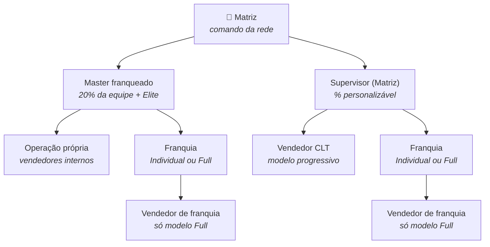
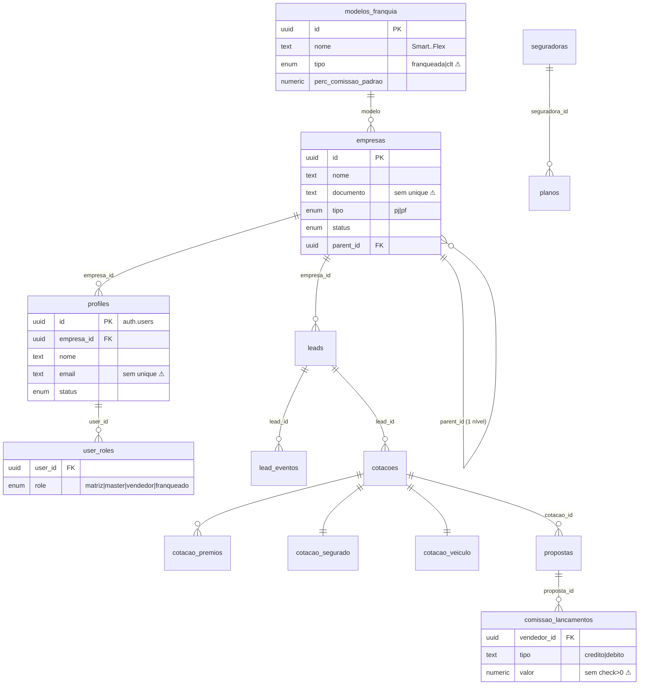
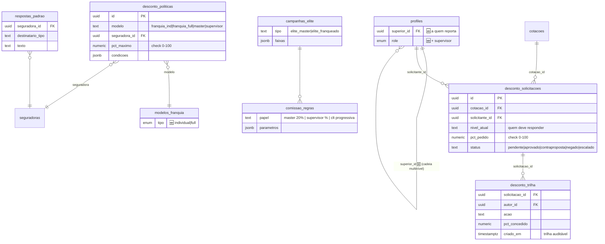
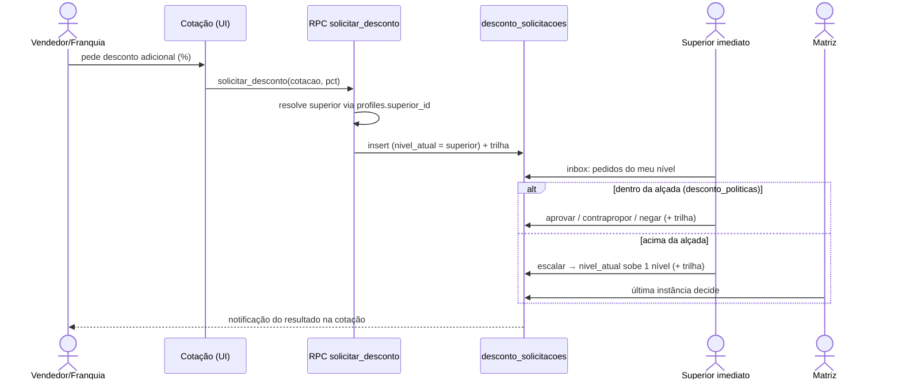
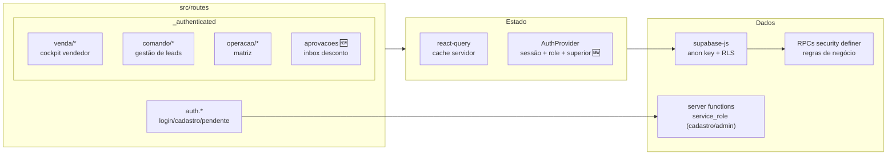
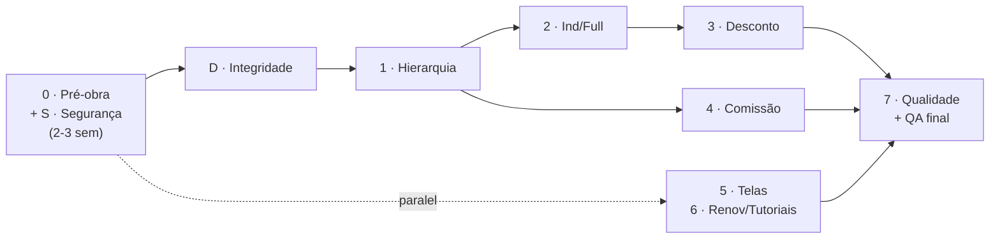

# Documentação Técnica — CoteCerto V10

Desenho de banco e front para executar o plano de tasks (`PLANO_TASKS_V10.md`). Diagramas em Mermaid (renderizam no GitHub/VS Code).

---

## 1. Hierarquia de usuários (alvo V10)

**Regra:** todo usuário tem `superior_id`. Franquia **Individual** (Smart, Conecta, Light, Link, Flex) = opera como vendedor, sem equipe. Franquia **Full** = gere equipe própria.

---

## 2. Banco de dados — estado atual (núcleo)

⚠ = pontos corrigidos nas listas S e D do plano.

---

## 3. Banco de dados — mudanças V10 (alvo)

**Novas migrations (numeração a partir de 040):**

> Desde 13/07/2026 as migrations são gerenciadas pela Supabase CLI em `supabase/migrations/` (as 000–039 foram importadas como baseline; `/migrations` é histórico read-only). Criar novas com `bun run db:new <nome>`; a numeração 040+ abaixo é a referência lógica de conteúdo.

| Migration | Conteúdo                                                        | Task                      |
| --------- | --------------------------------------------------------------- | ------------------------- | ---- |
| 040       | `security_invoker` nas views + fechar policies permissivas      | S1–S4                     |
| 041       | Checks de tamanho/faixa + normalização e unique de documentos   | D1–D3                     |
| 042       | Enum `perfil` + `'supervisor'`; `profiles.superior_id`; índices | G1.1                      |
| 043       | `empresas_visiveis()` multinível + policies revisadas           | G1.2–G1.3                 |
| 044       | `modelos_franquia.tipo` → `individual                           | full` + migração de dados | G2.1 |
| 045       | Tabelas de desconto (4) + RLS por nível                         | G3.1                      |
| 046       | RPCs de desconto (solicitar/aprovar/contrapropor/negar/escalar) | G3.2                      |
| 047       | `comissao_regras` + `campanhas_elite` + motores (RPC/trigger)   | G4.1–G4.4                 |
| 048       | Premiações (modelo de dados)                                    | G5.1                      |
| 049       | Renovações: cron de avisos                                      | G6.1                      |

---

## 4. Fluxo do desconto multinível

**Caminhos de aprovação:** Vendedor CLT → Supervisor → Matriz · Franquia Individual → Master/Supervisor → Matriz · Vendedor de franquia → Franqueado Full → Master → Matriz.

**Regra de ouro:** `alcada_for(modelo, seguradora)` e a decisão "aprova × escala" são validadas **na RPC (servidor)** — o front apenas exibe.

---

## 5. Arquitetura do front

### Regras de navegação por perfil (alvo)

| Perfil                  | Grupos de menu                                   | Observação                     |
| ----------------------- | ------------------------------------------------ | ------------------------------ |
| Matriz                  | comando + operacao + aprovacoes                  | vê tudo; última instância      |
| Master                  | venda própria + comando (rede dele) + aprovacoes | dashboards escopados (xdash)   |
| Supervisor 🆕           | comando (CLT + franquias diretas) + aprovacoes   | role novo                      |
| Franquia Full           | venda + equipe própria + aprovacoes              | com ranking de equipe          |
| Franquia Individual     | **só venda (cockpit vendedor)**                  | bifurcação `isFranqIndividual` |
| Vendedor (CLT/franquia) | venda                                            | solicita desconto, não aprova  |

### Convenções de implementação

1. **Gate por role no `app-shell.tsx` (`canSee`)** — estender para `supervisor` e para a bifurcação Individual/Full; nunca esconder só no menu: a RLS é a barreira real.
2. **Toda regra de dinheiro em RPC** — front não calcula comissão nem valida alçada.
3. **Formulário = zod schema espelhando constraint do banco** (lista D).
4. **Tipos gerados** (`supabase gen types`) — proibido `any` novo.
5. **Telas novas seguem o protótipo** `cotecerto_prototipo_v10.html` como especificação de UX (abrir no navegador; personas de teste na seção 6 do Handoff).
6. **Migrations numeradas sequencialmente** (040+), aplicadas via Supabase CLI, staging antes de produção, cada uma com teste de RLS.
7. **Tudo em Docker** (lista K do plano): front containerizado (Dockerfile multi-stage), `docker-compose` de dev e de produção (proxy + TLS + rate limit), compose do Supabase self-hosted versionado no repositório, imagem construída no CI e deploy com runbook de rollback.

---

## 6. Ordem de execução (visão macro)

Referências: `ANALISE_LACUNAS_V10.md` (o quê e por quê) · `PLANO_TASKS_V10.md` + `clickup_tasks_v10.csv` (tasks) · `MAPA_PROTOTIPO_PERFIS.md` (comportamento exato por perfil: navegação, escopo de dados, campos condicionais, tutoriais) · Handoff TI V10 (recomendações de produção).
