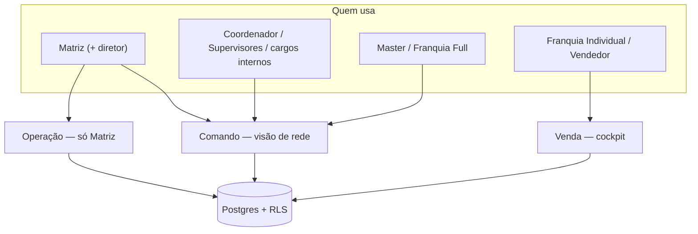
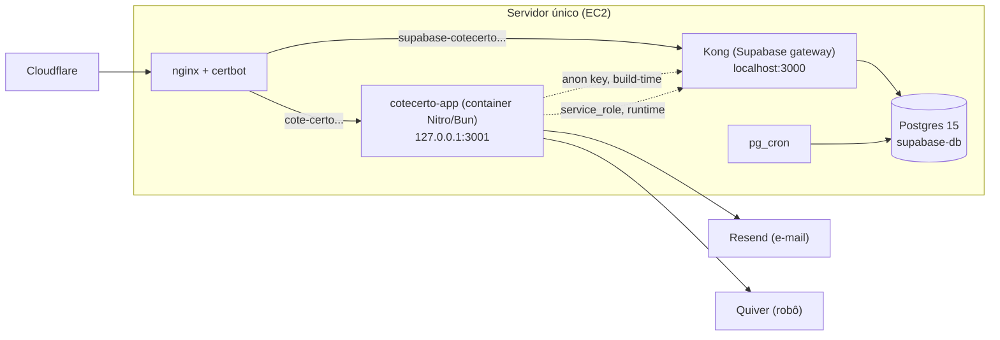
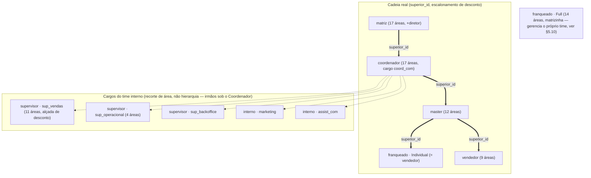

# Documentação Técnica — CoteCerto V11

> Documento vivo, atualizado em 12/08/2026. Cobre arquitetura, frontend,
> domínios de negócio, testes e deploy; o capítulo final referencia a fonte
> canônica do banco, `docs/DOC_BANCO_V11.md`. Para o histórico de decisões por frente, ver os
> `docs/PLANO_*_V11.md` e `docs/PLANO_TASKS_V11.md`. Para as 10 regras não
> negociáveis do repositório, ver `AGENTS.md`.

**Resumo:** SaaS de gestão de vendas de seguros (auto), multi-tenant por
franquia, com hierarquia de 7 perfis + 7 cargos, 62 tabelas + 5 views no
Postgres, RLS em quase tudo, e front React 19/TanStack Start servido por um
único container Nitro/Bun atrás de nginx.

## Sumário

1. [Visão geral](#1-visão-geral)
2. [Stack e arquitetura](#2-stack-e-arquitetura)
3. [Modelo de perfis, cargos e hierarquia](#3-modelo-de-perfis-cargos-e-hierarquia)
4. [Estrutura do frontend](#4-estrutura-do-frontend)
5. [Domínios de negócio e regras](#5-domínios-de-negócio-e-regras)
6. [Testes](#6-testes)
7. [Deploy e operação](#7-deploy-e-operação)
8. [Convenções e regras não negociáveis](#8-convenções-e-regras-não-negociáveis)
9. [Mapa de referências](#9-mapa-de-referências)
10. [Banco de dados](#10-banco-de-dados) (ponte para a fonte canônica)

---

## 1. Visão geral

O CoteCerto é o sistema interno da Cote Certo Seguros (corretora de seguro
auto) para cotar, vender, acompanhar e comissionar apólices — desde o lead até
o pagamento da comissão, passando por toda a hierarquia de quem vende: a
Matriz (a corretora), Masters e franquias que revendem sob a marca, e os
vendedores de cada um.

Três experiências cobrem toda a base de usuários:

- **Comando** (Matriz, Coordenador, Supervisores, Master, Franquia Full): visão
  de rede, distribuição de leads, aprovações, comissão, relatórios — quem
  **gerencia** gente e números, não vende diretamente.
- **Operação** (só Matriz): configurações globais, acessos e permissões,
  cadastros, governança — telas exclusivas de quem administra o sistema
  inteiro.
- **Venda** (Vendedor, Franquia Individual): cockpit de vendas — leads,
  cotação, pipeline, propostas, extrato — quem **vende**.

Essas três pastas (`comando/`, `operacao/`, `venda/`) existem literalmente
como grupos de rotas no frontend (§4) e espelham a divisão de responsabilidade
do negócio.



---

## 2. Stack e arquitetura

| Camada               | Tecnologia                                                                                                                                      |
| -------------------- | ----------------------------------------------------------------------------------------------------------------------------------------------- |
| Frontend             | React 19, TanStack Start (SSR) + TanStack Router (file-based), Tailwind v4, shadcn/radix-ui, `@tanstack/react-query`, `react-hook-form` + `zod` |
| Build/runtime        | Vite 8, Bun (dev e runtime do servidor), TypeScript 5                                                                                           |
| Backend              | Supabase self-hosted: Postgres 15, PostgREST, GoTrue (auth), Realtime, Storage, Kong (gateway), `pg_cron`                                       |
| Testes               | Vitest (unitário + integração de banco), Playwright (E2E)                                                                                       |
| Infra                | Docker (imagem validada em PR e publicada no GHCR em push de `main`/tag), nginx + certbot, AWS EC2 único, Cloudflare na frente                  |
| Integrações externas | Resend (e-mail transacional), Quiver (robô de emissão), WhatsApp via `wa.me` (sem API oficial ainda)                                            |

### 2.1 Como o app fala com o banco

- **Cliente (browser):** `@supabase/supabase-js` com `VITE_SUPABASE_URL` +
  `VITE_SUPABASE_ANON_KEY`, embutidas em build-time. A chave `anon` não é
  segredo — vai para o browser por design; quem protege o dado é a RLS.
- **Servidor (server functions do TanStack Start, ex.:
  `admin-users.functions.ts`, `email.functions.ts`, `quiver.functions.ts`):**
  usam `SELF_SUPABASE_URL`/`SELF_SUPABASE_SERVICE_ROLE_KEY` em runtime — a
  `service_role`, que nunca vai para o build nem para o browser. É a única
  forma de bypassar RLS no sistema, e só roda no servidor.

### 2.2 Topologia de produção

Um único servidor (AWS EC2, atrás de Cloudflare) roda três coisas lado a
lado, sem stack paralela:



Detalhe completo do procedimento de deploy (rebuild de banco, subida do
container, nginx, rollback, gotchas conhecidos) em `docs/RUNBOOK_DEPLOY.md`.
Setup de ambiente local em `docs/SETUP_DEV.md`.

---

## 3. Modelo de perfis, cargos e hierarquia

O sistema tem **dois eixos** de controle de acesso, resolvidos juntos mas
conceitualmente separados:

1. **Perfil** (`enum perfil`, coluna `profiles.perfil` — indiretamente via
   `has_role()`/`user_roles`): `matriz`, `master`, `vendedor`, `franqueado`,
   `supervisor`, `coordenador`, `interno`. É o nível estrutural — decide a
   forma geral de acesso (RLS, menus de alto nível).
2. **Cargo** (tabela `cargos`, coluna `profiles.cargo_id`): 7 presets
   (`matriz_total`, `coord_com`, `sup_vendas`, `sup_operacional`,
   `sup_backoffice`, `assist_com`, `marketing`) que recortam **áreas** — o
   menu efetivo de quem tem perfil `coordenador`, `supervisor` ou `interno`.
   `fn_areas_do_usuario` resolve: override em `profile_areas` se existir,
   senão o preset do cargo (`cargo_areas`), sem cargo = vendedor/franqueado
   direto.

Franquia **bifurca** dentro do perfil `franqueado`: o modelo contratado
(`modelos_franquia.modalidade`) decide se ela é **Individual** (mesma
experiência do vendedor — cockpit próprio) ou **Full** (gestão do próprio
time — "matrizinha", com autonomia sobre o próprio comissionamento e régua,
Frente 5/5b). `useGroupScope().isFranqFull` é quem resolve isso no front —
não existe um valor de enum "franqueado_full".



Pontos que geram confusão e vale fixar:

- **O gate visual não é segurança** (regra 7 do `AGENTS.md`). `app-shell.tsx`
  decide o que aparece no menu (`canSee`/`fn_tem_area`); a RLS decide o que o
  banco de fato entrega. As duas mudam juntas, mas nunca uma sem a outra.
- **`empresas_visiveis(auth.uid())`** é a função central de isolamento por
  rede — Matriz e Coordenador veem tudo; os demais veem a subárvore que
  reporta a eles via `profiles.superior_id`.
- **Franquia Full tem 14 áreas**, não 15 nem 16 — número que mudou 2 vezes
  durante a Frente 5 (ver nota em `docs/PLANO_HIERARQUIA_V11.md`); fonte da
  verdade hoje é `AREAS_FORA_DA_FULL` em `src/lib/nav-experience.ts`.
- **Diretor não é perfil nem cargo** — é uma marcação (`profiles.diretor`,
  mínimo 2 sempre) exclusiva de quem é `matriz`, usada só para o gate de senha
  em telas de governança (§5.10). Uma Franquia Full **nunca** é diretora — é
  por isso que ela tem RPCs próprias sem senha para editar os próprios dados
  (gate por identidade, não por senha).

Detalhe completo (H1–H10, decisão enum-vs-cargo, riscos de backfill) em
`docs/PLANO_HIERARQUIA_V11.md`.

---

## 4. Estrutura do frontend

### 4.1 Árvore de rotas

TanStack Router é **file-based** — cada arquivo em `src/routes/` é uma rota.
`_authenticated/route.tsx` é o guard de sessão (redireciona pra `/auth` se
não logado); `routes/index.tsx` decide, já autenticado, para qual home cada
perfil cai.

```
src/routes/
├── index.tsx                      → home por perfil (redirect)
├── __root.tsx                     → shell raiz (providers, error boundary)
├── auth.index.tsx                 → login + "Quero falar com a Cote Certo"
├── auth.pendente.tsx              → aguardando aprovação
├── auth.criar-senha.tsx           → link de recovery (48h)
├── auth.esqueci-senha.tsx         → solicita recuperação sem enumerar contas
├── auth.redefinir-senha.tsx       → valida recovery e troca a senha
├── auth.contato.tsx               → formulário de contato público
├── convite.$token.tsx             → cadastro por convite (pré-preenchido)
└── _authenticated/
    ├── route.tsx                  → guard de sessão
    ├── inicio.tsx                 → cockpit do vendedor/Individual
    ├── comando/                   → visão de rede (Matriz/Coordenador/Sup/Master/Full)
    │   ├── visao-geral.tsx        → dashboard, 9 KPIs, período único, alertas
    │   ├── leads.tsx               → Central de leads (Full/interno têm visão própria)
    │   └── distribuicao.tsx       → distribuição manual/automática
    ├── operacao/                   → exclusivo Matriz (+ Full em telas específicas)
    │   ├── acessos.tsx             → Acessos e permissões (Matriz) — pendentes, cadastros
    │   ├── xacessos.tsx            → Acessos da equipe (Master/Full) — próprio time
    │   ├── aprovacoes.tsx          → aprovação/negociação de desconto
    │   ├── comissoes.tsx           → fechamento de comissão por competência
    │   ├── configuracoes.tsx      → configurações globais, perfis e usuários
    │   ├── estornos.tsx           → vendas canceladas, prêmio/comissão revertidos
    │   ├── franquias.*.tsx        → cadastro/detalhe de franquias
    │   ├── mensagens.tsx           → biblioteca de mensagens prontas (admin)
    │   ├── perdas.tsx               → motivos/submotivos de perda
    │   ├── pipeline-geral.tsx     → kanban da rede inteira
    │   ├── premiacoes.tsx          → campanhas e lançamentos manuais
    │   ├── relatorios.tsx          → 7 relatórios (PDF/Excel)
    │   ├── renovacoes.tsx          → apólices a vencer, iniciar renovação
    │   ├── supervisao.tsx          → caça-gargalos, comparativo de vendedores
    │   ├── vendas.tsx               → vendas da rede
    │   └── vendedores.*.tsx       → detalhe de vendedor
    └── venda/                       → cockpit do vendedor/Individual
        ├── novo-lead.tsx            → wizard de cotação (6 etapas)
        ├── cotacoes.*.tsx           → lista + detalhe de cotação
        ├── pipeline.tsx             → kanban pessoal
        ├── propostas.tsx           → propostas geradas
        ├── aceite.tsx                → aceite & transmissão
        ├── extrato.tsx               → extrato de vendas/comissão
        └── mensagens-prontas.tsx  → biblioteca (consumo)
```

### 4.2 Organização de `components/` e `lib/`

`components/` espelha as 3 experiências (`comando/`, `operacao/`, `venda/`) +
`acessos/` (painéis de configuração/governança reusados por várias telas),
`auth/`, `tutorial/` (onboarding guiado) e `ui/` (primitivos shadcn/radix).

`lib/` concentra a lógica que não é puramente visual:

| Arquivo             | Papel                                                                                                                                                             |
| ------------------- | ----------------------------------------------------------------------------------------------------------------------------------------------------------------- |
| `require-role.tsx`  | Guards client-side de defesa em profundidade (`useRequireRole`, `useRequireMatrizOuFranquiaFull`) — nunca a única proteção, sempre em conjunto com RLS            |
| `group-scope.ts`    | `useGroupScope()` — resolve `isFranqFull`/`isFranqIndividual`/`isGroupView` a partir do perfil + modalidade da franquia                                           |
| `cargo-perfil.ts`   | `perfilDoCargo()` — de qual perfil de RLS um cargo deriva (mapa único, usado por aprovação e reclassificação)                                                     |
| `nav-experience.ts` | Recorte de área por experiência (`AREAS_FORA_DA_FULL`, `ehAreaDaFull`)                                                                                            |
| `nav-badges.ts`     | Contadores/badges do menu (pendências, notificações)                                                                                                              |
| `use-areas.ts`      | Hook de leitura de `fn_areas_do_usuario` no client                                                                                                                |
| `*.functions.ts`    | Server functions do TanStack Start (rodam no servidor, usam `service_role` quando precisam bypassar RLS — convites, e-mail, admin de usuários, webhook da Quiver) |
| `schemas/`          | Zod, espelhando as constraints do banco (regra 5 do `AGENTS.md`)                                                                                                  |
| `dashboard-*.ts`    | Alertas e período da Visão geral                                                                                                                                  |
| `masks.ts`          | Máscaras de CPF/CNPJ/celular/CEP/placa/moeda                                                                                                                      |
| `relatorios/`       | Registro e geração dos 7 relatórios (PDF/Excel)                                                                                                                   |

Tipos do banco (`src/integrations/supabase/database.types.ts`) são
**gerados**, nunca editados à mão — `bun run db:types` após qualquer migration
nova, seguido de `eslint --fix` (o codegen bruto sai sem `;`/formatação
consistente).

---

## 5. Domínios de negócio e regras

Cada subseção resume o que o domínio faz e aponta para o plano de frente que
o detalha por completo — decisões, riscos e a sequência de implementação.

### 5.1 Convite e ciclo de vida de cadastro

Único caminho de entrada é **convite** (token único, escopo embutido —
Master/Full têm o vínculo forçado pelo servidor, não pela tela) ou **cadastro
manual** pela Matriz (excepcional, com log e selo amarelo). O autocadastro
espontâneo saiu de produção em 03/08/2026 — não existe mais link "criar
conta" na tela de login. Saída (desligamento) é sempre solicitação →
aprovação, com motivo obrigatório e trava se houver time abaixo.

Referência: `docs/PLANO_CONVITE_V11.md`, `docs/PLANO_CADASTROS_V11.md`.

### 5.2 Filas de aprovação e e-mail

Duas filas paralelas — **time interno** (Matriz aprova) e **rede externa**
(Matriz ou a própria Franquia Full aprova o vendedor dela, sem passar pela
Matriz). `fn_destino_pedido`/`fn_pode_aprovar_pedido` decidem no banco, não na
tela. E-mail transacional (boas-vindas, pendência, recusa e criar senha) usa
Resend pela aplicação. Recuperação de senha usa o SMTP do Resend configurado
no GoTrue. Em 12/08/2026 os dois caminhos e os callbacks públicos foram
comprovados operacionalmente em produção; essa evidência datada não substitui
novo smoke test após alteração de DNS, SMTP, GoTrue, domínio ou imagem.

Referência: `docs/PLANO_FILAS_V11.md`.

### 5.3 Comercial — leads, cotação e pipeline

Lead nasce de um canal (`canais` — taxonomia única: captação paga, entrada
manual, ou nascido de dentro do sistema como renovação), passa por
qualificação, gera uma ou mais cotações (wizard de 6 etapas: Segurado →
Seguro → Veículo → Perfil → Coberturas → Cálculo, uma tabela por etapa —
`cotacao_segurado`/`cotacao_seguro`/`cotacao_veiculo`/`cotacao_perfil`/
`cotacao_coberturas`/`cotacao_premios`), e transita por um pipeline com
estágios configuráveis (`pipeline_stages`). Perda é sempre motivo + submotivo
(`perda_motivos`/`perda_submotivos`), nunca free-text solto.

### 5.4 Vendas e propostas

Da cotação nasce a proposta; a proposta tem versões (`proposta_versoes` —
negociação de desconto pode gerar uma nova versão) e um ciclo de vida
transmitida → pendente da seguradora → emitida → (cancelada). A fórmula
canônica de "pendente da seguradora" é `transmitida_em is not null and
emitida_em is null and cancelada_em is null` (`esta_pendente_seguradora`,
V11.7.5) — tratar `status = 'gerada'` como pendência é a heurística errada que
a V11 corrigiu em dois lugares (`visao-geral.tsx` e `operacao/vendas.tsx`).

### 5.5 Comissão, metas e premiação (G4/G5)

Comissão fecha por competência (`fechar_comissao_competencia`), com fator
pela média do vendedor, override de base descontando royalties, e bônus Elite
trimestral (`campanhas_elite`) entrando **sobre** a comissão, não substituindo
ela. Comissão por origem do lead (V11.5.8) diferencia canal próprio da Full
de canal repassado pela Matriz — regra definida pela Matriz, não pela
franquia. Premiação (G5) é sempre **manual** e só a Matriz lança
(`premiacao_lancamentos`), com status pago/a pagar; grupo só vê as da própria
rede.

### 5.6 Desconto e alçada (G3)

Solicitação de desconto sobe pela cadeia hierárquica quando fora da alçada do
solicitante; sem política definida num nível, escala até a Matriz. Aprovar
**atualiza o prêmio** automaticamente; contraproposta volta ao solicitante;
escalar sobe um nível. Alçada é exclusiva do cargo Supervisor de Vendas
(estrutural, não acidental — Supervisor Operacional nunca aprova, por
topologia da cadeia, sem regra extra).

### 5.7 Renovação (G6)

Apólice a 60 dias do vencimento gera lead **manual** (nunca automático) que
entra na **distribuição padrão** — não vai direto para o vendedor original.
Apólice vencida sem ação vira perda automaticamente.

### 5.8 Distribuição e SLA

`distribuicao_config` era singleton global (3 min); a V11.5.3 introduziu
`sla_empresa_config` para permitir SLA por empresa — lead repassado pela
Matriz segue o SLA dela, lead próprio da Full segue o SLA da Full. Lead
repassado que estoura SLA ou vira perda **cruza a fronteira** de volta como
Devolvido/Perda da Matriz (V11.5.7).

### 5.9 Régua de performance

Classificação Ativo/Atenção/Travado por **bloco** (`interno`/`rede`/`full`),
recalculada por job diário (`pg_cron`) sobre uma janela deslizante (não
mês-calendário). Travado com pausa ativa sai da distribuição automática;
reativar exige registro de quem revisou. O bloco `interno`/`rede` só é
editável pela Matriz com senha de diretor; o bloco `full` é **uma linha
compartilhada entre todas as Franquias Full**, editável por qualquer uma
delas sem senha (gate por identidade) — decisão consciente da Frente 5b.

Referência: `docs/PLANO_REGUA_V11.md`.

### 5.10 Franquia Full como "matrizinha"

A Franquia Full gerencia o próprio time com autonomia real: aprova o próprio
vendedor sem a Matriz, tem menu de 14 áreas (quase espelho da Matriz, sem
Franquias/Configurações globais/Mensagens), Central de leads/SLA/canais
próprios, e — desde a Frente 5b — Personalização geral (Modelo CLT só
leitura + "Complementos do time": comissão de venda/renovação, bônus, meta) e
Performance (a própria régua) e Histórico, todos com **gate por identidade**
(é a dona da própria empresa + modalidade Full), nunca senha de diretor —
porque Full nunca é diretora.

Referência: `docs/PLANO_FRANQUIA_FULL_V11.md`.

### 5.11 Governança, diretor e histórico

Nove botões "Salvar política" na numeração original do Handoff (na prática, 4 hoje) exigem senha de
diretor antes de gravar — o gate é **no banco** (RPC + revoke da escrita
direta), não só no front. Incluir/remover diretor exige **dupla aprovação**
(propor → confirmar, quem confirma ≠ quem propôs, nunca menos de 2
diretores). Toda alteração de política grava em `historico_alteracoes`,
append-only de verdade (trigger bloqueia `UPDATE`/`DELETE`, e `TRUNCATE`
também foi revogado do `service_role` — o `ALL` default do Postgres inclui
`TRUNCATE`, que não dispara trigger `for each row`).

Referência: `docs/PLANO_GOVERNANCA_V11.md`.

### 5.12 Escopo de leitura do time de apoio

Marketing e Assistente Comercial (`perfil = 'interno'`) enxergam **só a
operação própria da Matriz** (nunca dado de nenhuma franquia — Master,
Individual ou Full), sem escrita alguma além do que o preset do cargo já
dava. `fn_empresa_matriz()` resolve a empresa com `tipo='matriz'`; as
policies de SELECT afetadas foram estendidas (não substituídas) para incluir
esse caso, sem tocar nas policies de escrita.

Referência: `docs/PLANO_ESCOPO_INTERNO_V11.md`.

### 5.13 Visão geral e alertas

Todos os widgets da Visão geral leem a mesma janela de período (dia / semana
/ quinzena / mês / personalizado, resolvida no servidor por
`normalizar_periodo_visao_geral`) — não mais 4 opções mensais soltas por
widget. 8 alertas clicáveis, todos derivados de estado real persistido:
pendência da seguradora, franquia abaixo da meta no período, vendedor em
atenção/travado (via régua), e os 5 originais (sem-atendimento, SLA
estourado, vendas não pagas, estornos, renovações).

Referência: `docs/PLANO_VISAO_GERAL_V11.md`.

---

## 6. Testes

Três suítes, cada uma com um papel diferente — nenhuma substitui a outra:

| Suíte    | Ferramenta                              | O que cobre                                                 | Onde                                      |
| -------- | --------------------------------------- | ----------------------------------------------------------- | ----------------------------------------- |
| Banco    | Vitest + client autenticado por persona | RLS positivo/negativo, RPCs, constraints, triggers          | `tests/db/` (67 arquivos em 12/08/2026)   |
| Unitário | Vitest                                  | Lógica pura de front (cálculos, formatação, hooks isolados) | `tests/unit/` (34 arquivos em 12/08/2026) |
| E2E      | Playwright                              | Fluxo completo no navegador, por perfil                     | `tests/e2e/` (16 specs em 12/08/2026)     |

Padrão de teste de RLS (skill `teste-rls`): sempre par positivo/negativo —
"quem deveria conseguir, consegue" e "quem não deveria, é bloqueado pela
policy, não só escondido na tela". `tests/e2e/provision.ts` centraliza a
criação/limpeza de personas de teste (inclusive helpers para réguas/SLA que
são singletons compartilhados — precisam de snapshot-and-restore para não
vazar estado entre specs paralelos).

Antes de qualquer commit/push/PR: `bun run lint && bun run typecheck` e os
testes proporcionais à mudança (regra 5 do `AGENTS.md`).

---

## 7. Deploy e operação

Resumo — procedimento completo, incluindo rebuild de banco do zero, gotchas
conhecidos (grants de `pg_cron`, incompatibilidade do `pg_dump` do cliente
PG17 com o Postgres 15 do servidor, mapeamento do `GOTRUE_MAILER_OTP_EXP`) e
rollback, em `docs/RUNBOOK_DEPLOY.md`:

1. O workflow Docker constrói a imagem em PR e publica no GHCR em push de
   `main` ou tag (`ghcr.io/.../cotecerto33:sha-<commit>`) — nunca `:latest`
   como referência de rollback.
2. Migrations novas aplicam **antes** do app (schema primeiro, código depois).
3. Deploy do app via `deploy/deploy.sh` (pull, recria container, health check com retry, instruções de rollback se falhar).
4. Smoke test manual pós-deploy: aprovar um acesso, confirmar e-mail único,
   criar senha e entrar; testar também `/auth/esqueci-senha` →
   `/auth/redefinir-senha`. Produção só é considerada comprovada quando esse
   procedimento é executado no ambiente publicado e sua evidência é registrada.

---

## 8. Convenções e regras não negociáveis

Do `AGENTS.md` (fonte da verdade — resumo aqui, não substitui a leitura):

1. Nunca editar migrations antigas — migration nova via `bun run db:new`.
2. Regra de dinheiro/alçada roda no servidor (RPC `security definer`), nunca no front.
3. Toda tabela nova nasce com RLS + policies escopadas + checks de tamanho/faixa.
4. Views novas sempre `security_invoker = true`.
5. Formulários usam zod espelhando as constraints do banco; tipos do banco são gerados, nunca editados à mão.
6. Visual usa as classes existentes de `src/styles/proto.css` — sem estilos paralelos.
7. Gate visual (`app-shell.tsx`) não é segurança — a policy é.
8. Segredos vêm de env; `service_role` só em server functions.
9. Arquivos grandes: extrair componentes/hooks em vez de crescer.
10. `src/data/proto-pages.json`/`ProtoPage` são resíduo do protótipo — não usar em telas novas.

Fluxo de agentes (quando aplicável): `planejador` → especialista da stack
(`banco`/`front`/`infra`/`testes`) → `testes` → `revisor`, com aprovação
explícita do usuário antes de qualquer implementação e do `revisor` antes de
qualquer commit/PR.

---

## 9. Mapa de referências

| Documento                          | Cobre                                                          |
| ---------------------------------- | -------------------------------------------------------------- |
| `docs/PLANO_TASKS_V11.md`          | Tasks da V11 por frente, status atual                          |
| `docs/PLANO_HIERARQUIA_V11.md`     | Perfis, cargos, áreas — decisão enum vs. cargo                 |
| `docs/PLANO_CONVITE_V11.md`        | Convite Supper                                                 |
| `docs/PLANO_CADASTROS_V11.md`      | Cadastro manual, ciclo de vida, desligamento                   |
| `docs/PLANO_FILAS_V11.md`          | Roteamento de aprovação                                        |
| `docs/PLANO_REGUA_V11.md`          | Régua de performance                                           |
| `docs/PLANO_GOVERNANCA_V11.md`     | Senha de diretor, dupla aprovação, histórico                   |
| `docs/PLANO_FRANQUIA_FULL_V11.md`  | Franquia Full como matrizinha                                  |
| `docs/PLANO_ESCOPO_INTERNO_V11.md` | Escopo de leitura do time de apoio                             |
| `docs/PLANO_VISAO_GERAL_V11.md`    | Período único e alertas                                        |
| `docs/Q4_ROTEIRO_QA_MANUAL.md`     | Roteiro de QA manual por perfil                                |
| `docs/RUNBOOK_DEPLOY.md`           | Deploy e operação de produção                                  |
| `docs/SETUP_DEV.md`                | Ambiente de desenvolvimento local                              |
| `docs/DOC_BANCO_V11.md`            | Fonte canônica do inventário e dos contratos do banco de dados |
| `AGENTS.md`                        | Regras não negociáveis e fluxo de agentes                      |

---

## 10. Banco de dados

O inventário canônico e atualizado do schema está em
[`DOC_BANCO_V11.md`](DOC_BANCO_V11.md). A duplicação integral que existia neste
capítulo foi removida para evitar divergência entre duas cópias do mesmo
conteúdo.

No snapshot versionado de 12/08/2026, a fonte canônica registra **149
migrations, 62 tabelas, 5 views, 117 policies RLS, 152 funções (RPCs e funções
internas), 8 enums e 3 jobs `pg_cron`**. Essas contagens descrevem o checkout;
não constituem evidência de aplicação ou configuração em produção.
