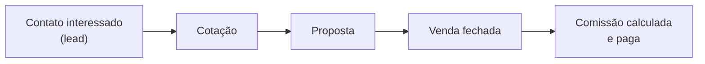

# CoteCerto — Guia do Sistema

> Guia de apresentação, escrito em linguagem simples para quem usa e gerencia
> o CoteCerto no dia a dia — sem termos técnicos de programação. Para a
> documentação técnica completa (arquitetura, banco de dados, testes), ver
> `docs/DOC_TECNICA_V11.md`.

**Resumo:** O CoteCerto é o sistema que a Cote Certo Seguros usa para
transformar um contato interessado em seguro auto numa venda fechada e
comissionada — passando por cotação, proposta, aprovação e acompanhamento —
com uma tela adequada para cada papel: quem vende, quem gerencia uma equipe,
e quem administra o negócio inteiro.

## Sumário

1. [O que o sistema faz](#1-o-que-o-sistema-faz)
2. [Quem usa o sistema](#2-quem-usa-o-sistema)
3. [A jornada de uma venda](#3-a-jornada-de-uma-venda)
4. [Gestão de equipe e comissão](#4-gestão-de-equipe-e-comissão)
5. [Descontos, quando algo sai do padrão](#5-descontos-quando-algo-sai-do-padrão)
6. [Renovação de apólices](#6-renovação-de-apólices)
7. [A Franquia Full — sua própria "matriz"](#7-a-franquia-full--sua-própria-matriz)
8. [Segurança e controle](#8-segurança-e-controle)
9. [Comunicação com a equipe](#9-comunicação-com-a-equipe)
10. [Visão gerencial e relatórios](#10-visão-gerencial-e-relatórios)
11. [Integrações de captação](#11-integrações-de-captação)

---

## 1. O que o sistema faz

O CoteCerto acompanha uma venda de seguro do início ao fim:

**Contato interessado → Cotação → Proposta → Venda fechada → Comissão paga**

Em cada etapa, o sistema guarda o histórico, calcula os números automaticamente
(prêmio, comissão, prazos) e mostra pra cada pessoa só o que ela precisa ver —
um vendedor não vê a comissão de outro vendedor; uma franquia não vê os dados
de outra franquia.

Três "portas de entrada" diferentes, dependendo de quem está logando:

- Quem **vende** cai direto na tela de trabalho do dia (leads, cotação,
  propostas).
- Quem **gerencia uma equipe ou rede** (uma franquia, um grupo de vendedores)
  cai numa visão de números e acompanhamento — não vende diretamente.
- Quem **administra o negócio inteiro** (a Matriz) tem acesso a
  configurações, aprovações e aos números de toda a operação.

---

## 2. Quem usa o sistema

| Quem                                             | O que faz no sistema                                                                                                                                   |
| ------------------------------------------------ | ------------------------------------------------------------------------------------------------------------------------------------------------------ |
| **Matriz**                                       | Administra o negócio inteiro: configurações, aprovações finais, todos os relatórios                                                                    |
| **Diretor** (marcação especial dentro da Matriz) | As poucas ações mais sensíveis (mudar uma regra de comissão, por exemplo) pedem a senha de um diretor, como uma segunda confirmação                    |
| **Coordenador Comercial**                        | Ajuda a Matriz a administrar o dia a dia, sem poder mudar as regras mais sensíveis                                                                     |
| **Supervisor de Vendas**                         | Comanda o time comercial: acompanha vendedores, aprova descontos dentro do limite dele                                                                 |
| **Supervisor Operacional**                       | Foco em leads e distribuição — não aprova desconto                                                                                                     |
| **Marketing / Assistente Comercial**             | Acompanham leads, campanhas e vendas da operação própria da Matriz, sem poder editar                                                                   |
| **Master**                                       | Gerencia um grupo de franquias/vendedores — vê os números da própria rede                                                                              |
| **Franquia Full**                                | Uma franquia com autonomia própria: gerencia o próprio time, a própria comissão e a própria régua de performance, quase como uma "matrizinha" (ver §7) |
| **Franquia Individual**                          | Vende como se fosse uma vendedora — sem gerenciar equipe                                                                                               |
| **Vendedor**                                     | Atende leads, cota, vende e acompanha a própria comissão                                                                                               |

Cada pessoa só é cadastrada por **convite** (um link que já vem com o papel
dela definida) ou, em casos excepcionais, por cadastro direto da Matriz — não
existe mais uma tela pública de "criar minha conta".

---

## 3. A jornada de uma venda

1. **Lead chega** — de uma campanha, de indicação, ou de um cliente antigo
   voltando pra renovar. O sistema já sabe de onde cada lead veio (o "canal")
   e distribui automaticamente para o vendedor certo, dentro de um tempo
   máximo combinado (o "prazo de atendimento").
2. **Cotação** — o vendedor preenche os dados do segurado, do veículo e das
   coberturas desejadas num formulário guiado, passo a passo. O sistema
   calcula o valor em cada seguradora.
3. **Proposta** — a cotação escolhida vira uma proposta formal, que pode ser
   negociada (por exemplo, com desconto — ver §5) antes de seguir.
4. **Aceite e emissão** — a proposta é enviada à seguradora; o sistema
   acompanha se está pendente, emitida, ou se algo deu errado.
5. **Comissão** — quando a venda vira uma apólice de fato paga, a comissão do
   vendedor (e de quem está acima dele na hierarquia, quando aplicável) é
   calculada automaticamente no fechamento do período.

Se o negócio não avançar, o vendedor registra o **motivo da perda** (sempre
com um motivo e, se fizer sentido, um submotivo) — isso alimenta os
relatórios de "por que estamos perdendo vendas".

---

## 4. Gestão de equipe e comissão

Quem gerencia um time (Master, Supervisor de Vendas, Franquia Full, ou a
própria Matriz) acompanha:

- **O funil da equipe** — quantos leads, cotações, propostas e vendas em
  cada etapa, e quem está atrasado.
- **Comissão por competência** — o fechamento mensal calcula o quanto cada
  vendedor ganhou, com o fator combinado (por exemplo, quem vende mais tem um
  fator melhor) e os bônus de campanha quando aplicável.
- **Premiações** — campanhas especiais, lançadas manualmente pela Matriz
  quando alguém bate uma meta específica.
- **Metas** — acompanhamento se cada vendedor/franquia está dentro do
  esperado no período.

---

## 5. Descontos, quando algo sai do padrão

Quando um vendedor precisa oferecer um desconto maior do que ele pode decidir
por conta própria, o pedido sobe automaticamente para quem tem essa
autoridade — o Supervisor de Vendas dele, e se ninguém no caminho tiver essa
autoridade configurada, sobe até a Matriz. Quem recebe o pedido pode:

- **Aprovar** — o valor da proposta já é atualizado sozinho.
- **Fazer uma contraproposta** — volta pro vendedor decidir se aceita.
- **Escalar** — sobe mais um nível, pra alguém com mais autoridade decidir.
- **Negar.**

Só quem tem essa autoridade especificamente designada consegue decidir —
mesmo alguém em outro cargo de liderança, se não tiver essa autoridade
configurada, não vê o pedido.

---

## 6. Renovação de apólices

60 dias antes de uma apólice vencer, o sistema cria automaticamente um novo
lead de renovação — sempre indo pra fila normal de distribuição (não
necessariamente pro mesmo vendedor de antes, salvo se ele for o próximo da
fila). Se a apólice vencer sem nenhuma ação, ela é marcada como perdida
automaticamente, pra não passar batido.

---

## 7. A Franquia Full — sua própria "matriz"

Algumas franquias contratam um modelo mais autônomo, chamado **Full** — na
prática, uma "matrizinha" dentro do próprio negócio dela:

- Aprova os próprios vendedores sem precisar da Matriz.
- Tem sua própria central de leads, com prazo de atendimento e canais
  de captação próprios, separados dos leads que a Matriz repassa pra ela.
- Define a própria comissão de venda e renovação, bônus de campanha e meta
  da equipe.
- Acompanha (e ajusta) a própria régua de desempenho — quando um vendedor
  dela está "em atenção" ou "travado" por baixa performance.
- Tem um histórico próprio de tudo que ela mesma configurou.

Um lead que a Matriz **repassa** pra uma Full continua "pertencendo" à
Matriz nesse sentido: se ele não for atendido no prazo ou virar perda, ele
volta automaticamente pra fila da Matriz, não fica perdido dentro da
franquia.

---

## 8. Segurança e controle

- **Cada pessoa só vê o que é dela.** Um Master não vê a rede de outro
  Master; uma franquia não vê dados de outra franquia. Isso é garantido no
  próprio sistema, não depende de ninguém "esconder" um botão na tela.
- **Mudanças importantes pedem uma segunda confirmação.** Regras sensíveis
  (por exemplo, mudar a comissão padrão de toda a rede) só podem ser salvas
  por alguém marcado como **diretor**, com a senha dele — e é preciso ter
  sempre pelo menos 2 diretores, nunca 1 só.
- **Tudo fica registrado.** Toda alteração importante (quem mudou, o quê,
  quando, o valor antes e depois) fica guardada num histórico que **ninguém
  consegue editar ou apagar** — nem por engano, nem de propósito.
- **Incluir ou remover um diretor exige duas pessoas.** Uma propõe, outra
  diferente precisa confirmar — nunca uma decisão desse tamanho na mão de
  uma pessoa só.

---

## 9. Comunicação com a equipe

- **Convite** — toda entrada nova no sistema é por um link de convite (ou
  exceção registrada pela Matriz), com e-mail de boas-vindas automático.
- **E-mails automáticos** — aprovação, recusa, e o link para criar a senha
  (que expira em 48 horas, por segurança).
- **Reenvio do primeiro acesso** — enquanto a conta ainda não foi ativada, quem
  administra Acessos pode enviar um novo link; o link anterior deixa de valer.
- **Recuperação de senha** — a tela de login permite solicitar um link seguro para
  redefinir a senha, sem revelar se determinado e-mail está cadastrado.
- **"Quero falar com a Cote Certo"** — um botão na tela de login para quem
  ainda não tem conta e quer ser contatado, sem precisar criar nada.
- **WhatsApp** — convites e mensagens prontas podem ser enviados direto por
  WhatsApp, hoje de forma manual (sem integração automática ainda).

---

## 10. Visão gerencial e relatórios

A tela de Visão geral (para quem gerencia) mostra, no período escolhido (dia,
semana, quinzena, mês, ou um período personalizado):

- Os principais números do negócio (vendas, comissão, funil).
- Alertas que já apontam pra onde olhar: vendas paradas há muito tempo,
  prazo de atendimento estourado, vendas ainda não pagas, franquias abaixo da
  meta, vendedores em queda de performance, e mais.
- 7 relatórios completos, exportáveis em PDF ou Excel.

---

## 11. Integrações de captação

O sistema recebe leads de aplicações externas, incluindo o **Captação Movida**. Esses
leads entram na fila global, ainda sem vendedor, para seguirem a distribuição normal.
O mesmo evento não cria o lead duas vezes, e falhas de validação não deixam um cadastro
parcial. A equipe com a área de **Distribuição** liberada pode redistribuir, puxar um
lead de volta e executar a distribuição automática; essa permissão acompanha a área da
pessoa, não apenas o nome do cargo.

---

## Onde saber mais

Este guia é a versão resumida. A documentação técnica completa (para quem
desenvolve ou mantém o sistema) está em `docs/DOC_TECNICA_V11.md`, e cobre
arquitetura, banco de dados, testes e as regras técnicas de cada tela.
